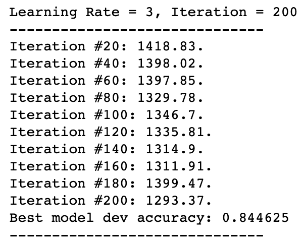
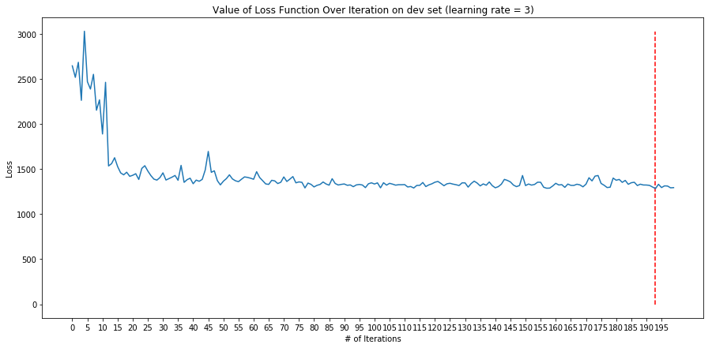
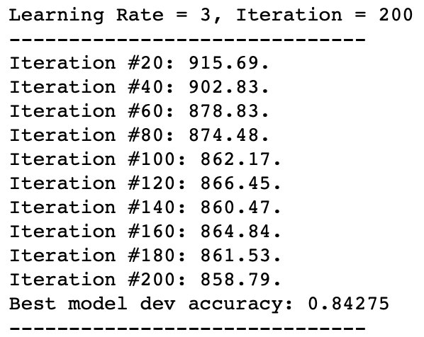
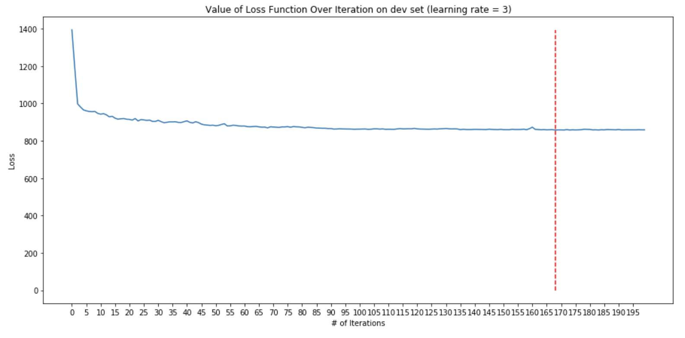
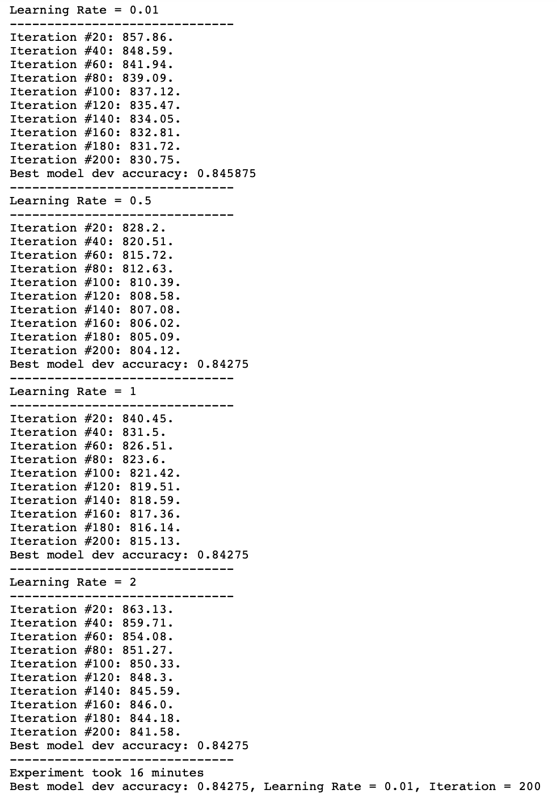
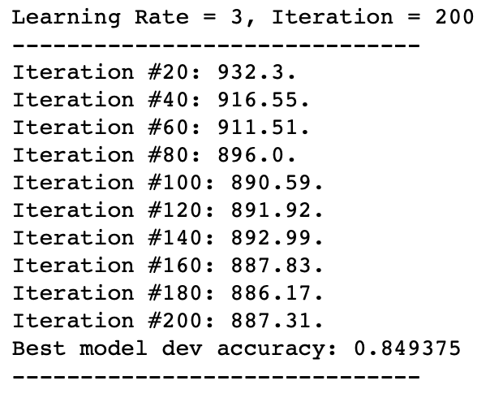
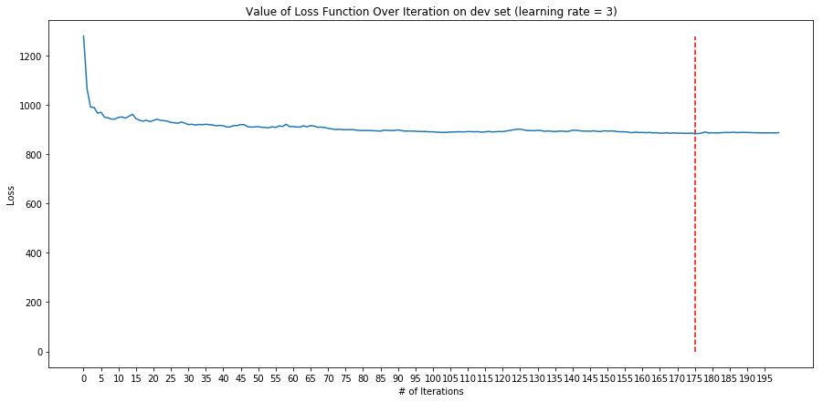
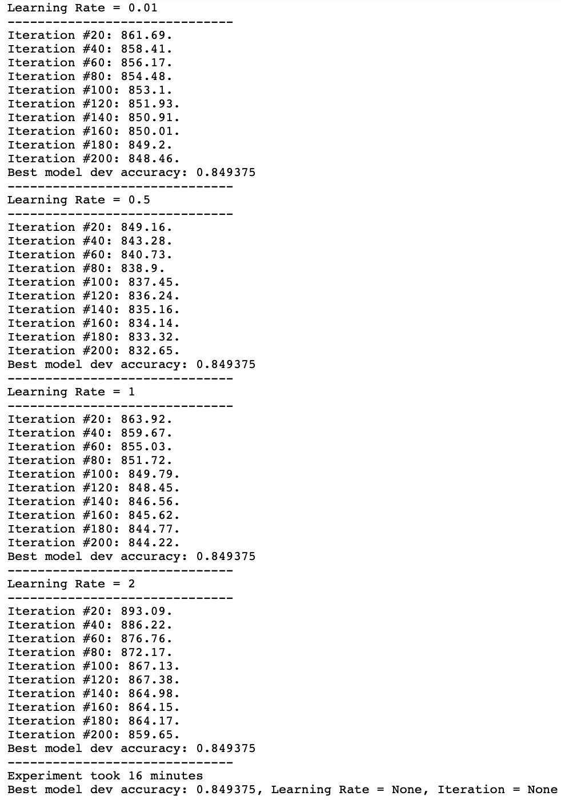

# CSC 446, HW#3, Kefu Zhu

## 1. Use of `dev` dataset

In this assignment, I used the `dev` dataset to tune the values of the following hyperparameters

- Number of iterations
- Learning Rate
- Number of neurons in the single hidden layer

Based on the mechanics of SGD, I choose to first use a larger learning rate to find the proper range for the number of iterations and drastically decrease the loss to a reasonable range. 

And then continue training the current model while performing a grid search for 

- Different value of smaller learning rate: $lr = [0.01,0.5,1,2]$
- Different number of neurons in the hidden layer: $hidden\_dim = [3,5,25]$
- Number of additional iterations: $iterations = range(0,200)$

## 2. Experiment 

In order to fix the initialization of matrix, I added an additional seed parameter to the `args` and also modified the `init_model` for the Stage 1 of my experiment (use large learning rate to find proper number of iterations).

```python
weights_group.add_argument('--seed', type=int, default=123, help='Seed for randomization.')
```
```python
def init_model(args):
    w1 = None
    w2 = None

    if args.weights_files:
        with open(args.weights_files[0], 'r') as f1:
            w1 = np.loadtxt(f1)
        with open(args.weights_files[1], 'r') as f2:
            w2 = np.loadtxt(f2)
            w2 = w2.reshape(1,len(w2))
    else:
        #TODO (optional): If you want, you can experiment with a different random initialization. As-is, each weight is uniformly sampled from [-0.5,0.5).
        np.random.seed(args.seed)
        w1 = np.random.rand(args.hidden_dim, NUM_FEATURES) #bias included in NUM_FEATURES
        w2 = np.random.rand(1, args.hidden_dim + 1) #add bias column

    #At this point, w1 has shape (hidden_dim, NUM_FEATURES) and w2 has shape (1, hidden_dim + 1). In both, the last column is the bias weights.

    #TODO: Replace this with whatever you want to use to represent the network; you could use use a tuple of (w1,w2), make a class, etc.
    model = (w1,w2)

    return model
```

### 1. Number of Neurons in Hidden Layer = 25

<center>

</center>



The first experiment used $learning\ rate = 3$ and $25$ neurons for the hidden layer (not including the bias term). As shown in the graph above, the value of loss function fluctuate violently and roughly converges near $200$ iterations.

So I decide to decrease the size of hidden layer and perform the next experiment.

### 2. Number of Neurons in Hidden Layer = 5

<center>

</center>



The second experiment still used $learning\ rate = 3$ but changed the number of neurons in the hidden layer to $5$ (not including the bias term). As shown in the graph above, the value of loss function is smaller and also converges much smoother than before.

Based on the accuracy test on the `dev` dataset, the best model came from iteration #169 with a loss value of $857.53$ and accuracy of $0.84275$.

Next, I extract the model from iteration #169 and continue training with different learning rate as well as number of iterations.



The best model from all combinations of learning rate and number of iterations is the one with $learning\ rate = 0.01$ and $iteration = 200$


Visualizing the value of loss function from both stages, we can see after a immediate decline at the beginning, the loss value is gradually decreasing in general but seems to be able to continue decreasing if we add more iterations to the training

The final model has a loss value of $830.75$ and the accuracy of $0.84275$

### 3. Number of Neurons in Hidden Layer = 3

<center>

</center>



In the third experiment, I still used $learning\ rate = 3$ but changed the number of neurons in the hidden layer to only $3$ (not including the bias term). As shown in the graph above, the value of loss function converges at similar number of iterations.

Based on the accuracy test on the `dev` dataset, the best model came from iteration #175 with a loss value of $883.42$ and accuracy of $0.849375$.

Similar to the second experiment, I extract the model from iteration #175 and continue training with different learning rate as well as number of iterations.



The result turns out that additional training does not yield better model. The best accuracy on the `dev` dataset is still $0.859375$ and the best values for learning rate and number of iterations remain `None` and have not been changed.

The reason for this might be that due to a less complex model (3 neurons vs 5 neurons), the model converges faster.