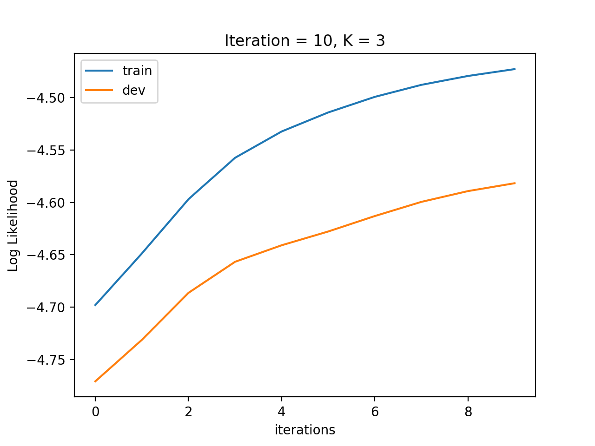
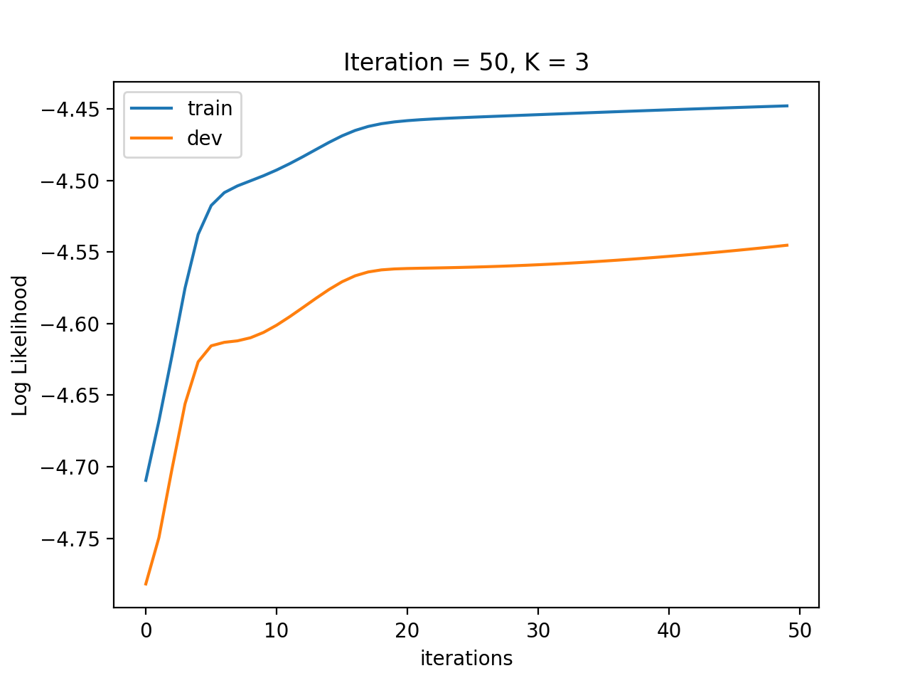
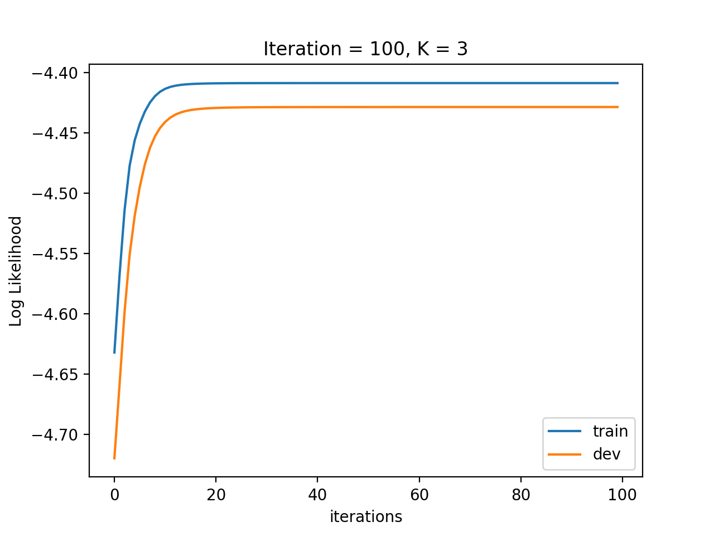
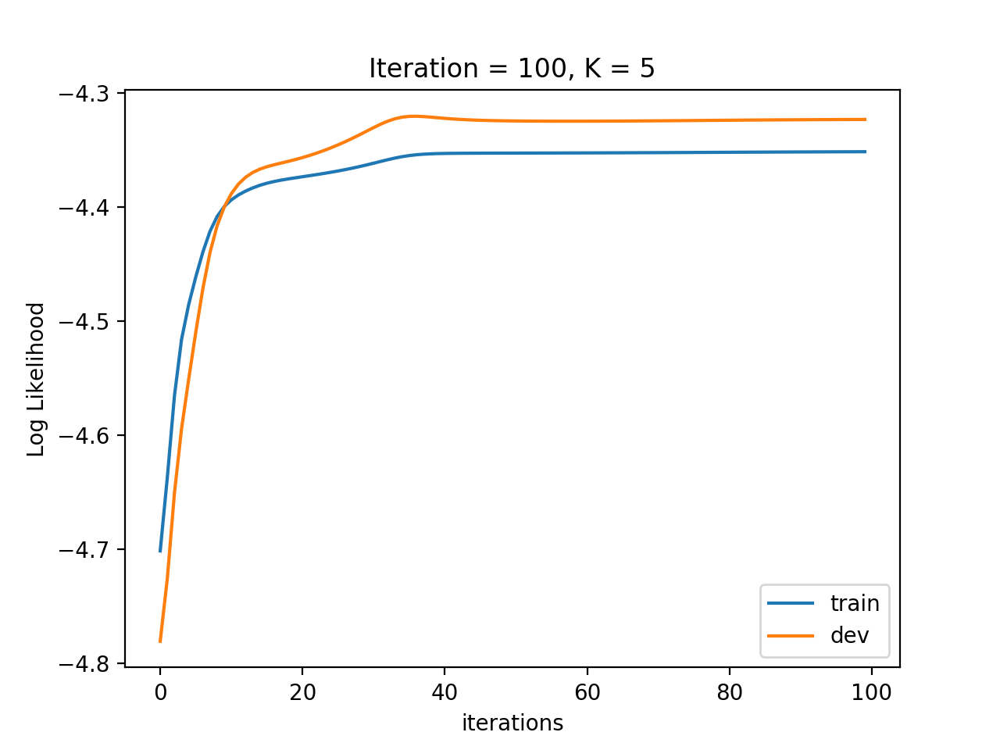
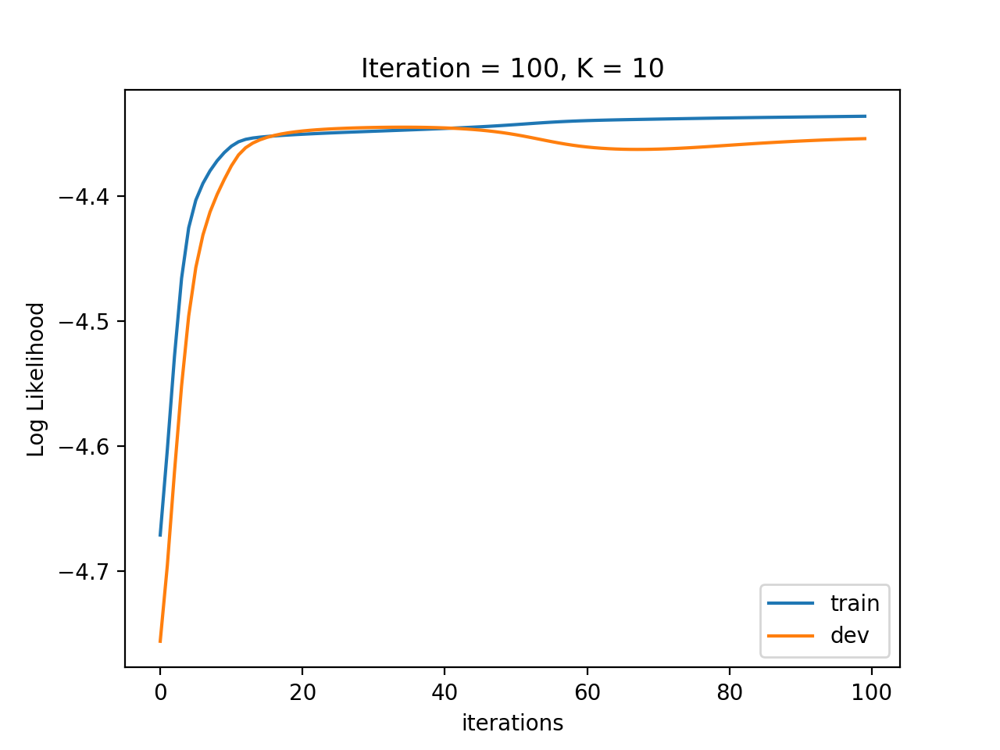

# CSC 446, HW#7, Kefu Zhu

## Tuning of `--iterations`

To tune the optimal number of iterations, I first pick the `--cluster_num` to be $3$ and try training the model with different number of iterations (`--iterations`)

### Iteration = 10

**Note**: We can clearly see the log likelihood has not converged yet. So we add the iterations number to $50$ in the next experiment

### Iteration = 50

**Note**: We see the log likelihood is converging roughly after $20$ iterations. But to be same, we train the model again using $100$ iterations to see the trend

### Iteration = 100

**Note**: From the graph above, it is reasonable to say that the model is converged after $100$ iterations

## Tuning of `--cluster_num`

After knowing that $100$ iterations is enough to have the model converge under the assumption that $K = 3$, where $K$ denotes the the number of clusters, I then tried different values for `--cluster_num` to see how many clusters is suitable for our dataset

## K = 3

## K = 5

## K = 10

**Note**:

From the $3$ experiments above, using $K = 3,5,10$, we can clearly see when $K=5$, the model has the best performance.

- Although model with `K = 3` is not overfitting, it does not achieve better performance compared to model with `K = 5`
- model with `K = 5` has highest log likelihood among the three
- model with `K = 10` is clearly overfitting on the training dataset, resulting in the decline of log likelihood in the `dev` dataset

## Conclusion

Based on the experiments above, model with $100$ iterations and $5$ number of clusters has the best performance among the others