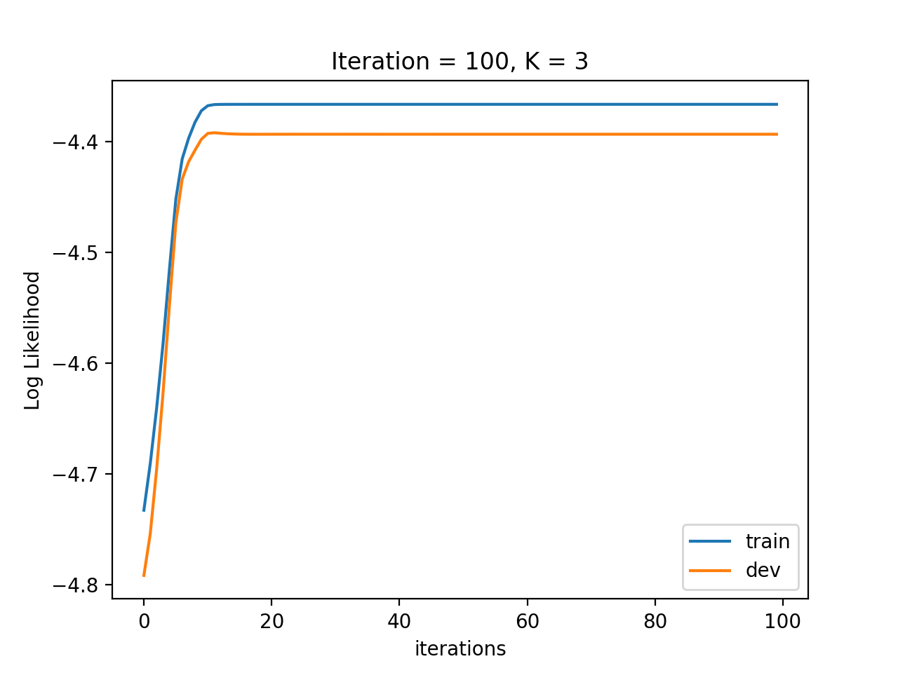
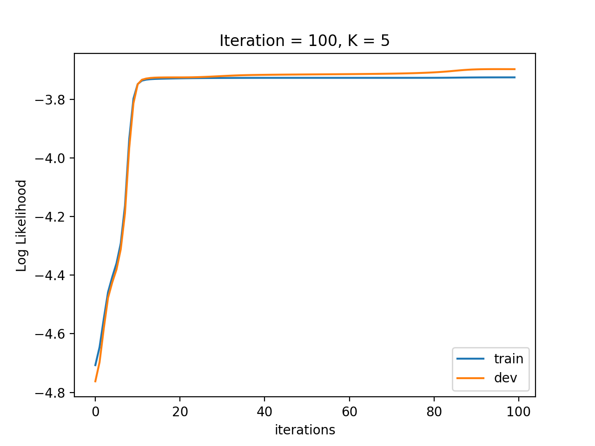
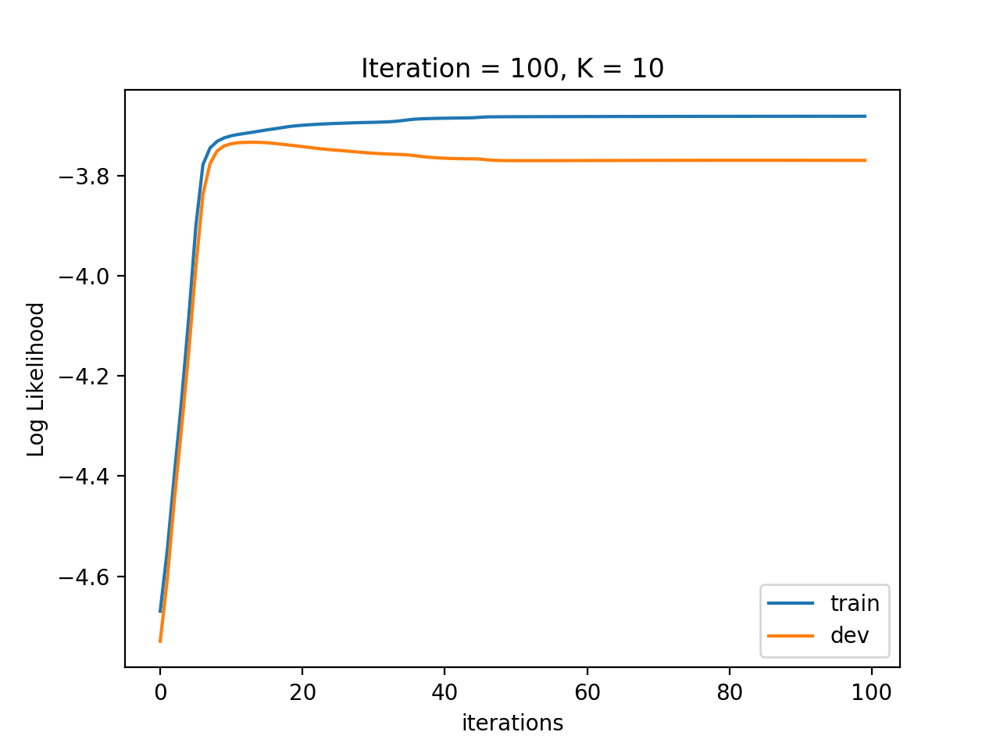

# CSC 446, HW#8, Kefu Zhu

**Note**: In order to compare with previous homework. I used the same value of `--iterations 100` and `--cluster_num 3,5,10` for experiment.

## Tuning of `--cluster_num`

## K = 3

## K = 5

## K = 10

**Note**:

From the $3$ experiments above, similar to the experiment in previous homework for GMM, we can clearly see when $K=5$, the model has the best performance.

- Although model with `K = 3` is not overfitting, it does not achieve better performance compared to model with `K = 5`
- model with `K = 5` has highest log likelihood among the three
- model with `K = 10` is clearly overfitting on the training dataset, resulting in the decline of log likelihood in the `dev` dataset

### Does the HMM model the data better than the original non-sequence model? 

#### GMM model with K = 5

#### HMM model with K = 5

By comparing the log likelihood, we can conclude that HMM model is better than the GMM model (non-sequence model)

### What is the best number of states?

Among the experiments above, the best number of states is $5$