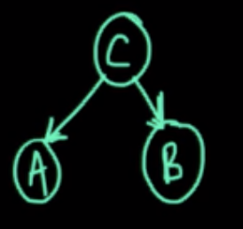
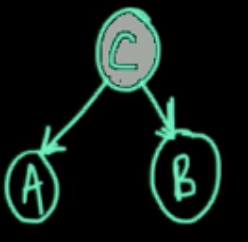
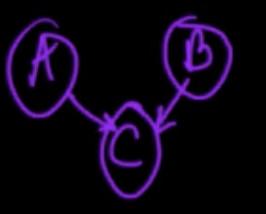
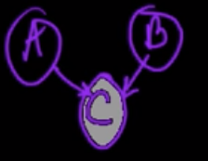
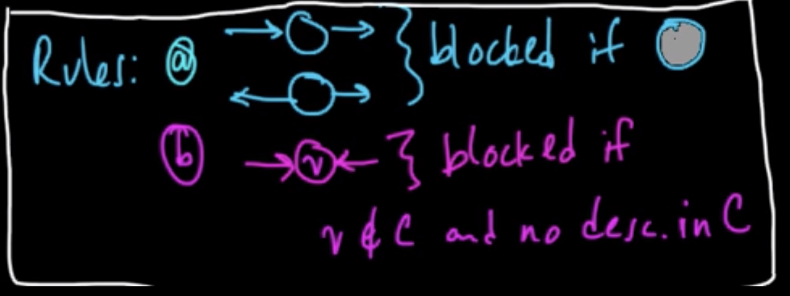

# Lecture 10, Wednesday, 02/20

### Topics: 
- Graphical Model
	- Directed (Bayes Net/Belif Net)
		- D-separation (Not from course material) 
	- Undirected

## Directed Graphical Model

**Definition**: A directed graphical model, also known as a Bayes net, is a joint distribution over several variables specified in terms of a conditional distribution for each variable:

<center>
$P(X_1,X_2,...,X_N) = \prod_{n=1}^N P(X_n|Parents(X_n))$
</center>

### Conditionally Independence

**Case 1 (Tail-Tail)**

Consider a graph like this

<center>


$P(A,B,C) = P(A|C)P(B|C)P(C)$
</center>

If we condition on $C$, which means $C$ is observed

<center>


$P(A,B|C) = \frac{P(A,B,C)}{P(C)} = \frac{P(A|C)P(B|C)P(C)}{P(C)} = P(A|C)P(B|C)$
</center>

$\therefore A \perp\!\!\!\perp B | C$

**Case 2 (Head-Head)**

<center>


$P(A,B,C) = P(A)P(B)P(C|A,B)$
</center>

$\because P(A,B) = \sum_C P(A,B,C) = \sum_C P(A)P(B)P(C|A,B) =  P(A)P(B)\sum_C P(C|A,B) = P(A)P(B)$

$\therefore A \perp\!\!\!\perp B$

If we condition on $C$, which means $C$ is observed

<center>


$P(A,B|C) = \frac{P(A,B,C)}{P(C)} = \frac{P(A)P(B)P(C|A,B)}{P(C)} \ne P(A|C)P(B|C)$
</center>

$\therefore A \not\!\perp\!\!\!\perp B | C$

- **Intuitive Example**: 

	Suppose $A,B$ ~ $Bernoulli(0.5)$, such as event of flipping two coins independently
	
	Define $C$ such as 
	$C=
	\begin{cases}
	1, if\ A = B \\
	0, otherwise
	\end{cases}
	$
	
	Then observing that $C = 1$ implies that $A = B$, so $A$ and $B$ are not independent
	
### D-Separation

**Definition A**

A path between two vertices is **blocked with respect to $C$** if it passes through a vertex $V$ such that either of the following two condition is met

- $V \in C$: the arrows are head-tail or tail-tail
- $V \notin C$ AND $descendent(V) \notin C$: the arrows are head-head

**Definition B**

Suppose we have $G$, which is a DAG (Directed Acyclic Graph). $A,B,C$ are disjoint subsets of vertices in $G$

$A$ and $B$ are **d-separated** by $C$ if all paths from a vertex of $A$ to a vertex of $B$ are blocked with respect to $C$

**Theorem**:

If $A$ and $B$ are deseparated by $C$, then $A \perp\!\!\!\perp B|C$

<center>

</center>

## Undirected Graphical Model

**Definition**: A undirected graphical model is a distribution specified in terms of a set of functions of specific variables:

<center>
$P(X_1,X_2,...,X_N) = \frac{1}{Z} \prod_m f_m(\vec{X_m})$, where $\vec{X_m} \in \{X_1,X_2,...,X_N\}$
</center>

**Note:** $Z$ is the normalization constant where $Z = \sum_{X_1,...,X_N} \prod_m f_m (\vec{X_m})$

```
# Turn Directed Graph (G) to Factor Graph

# For each variable in G
For each Xi in G
	# Create factor
	fi(Xi, Parents(Xi))
```