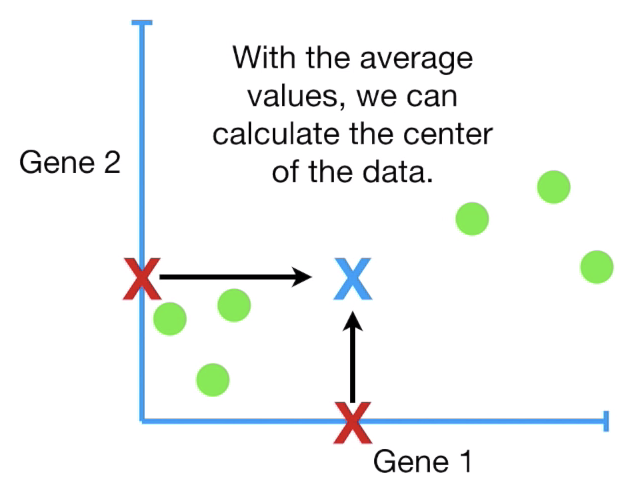
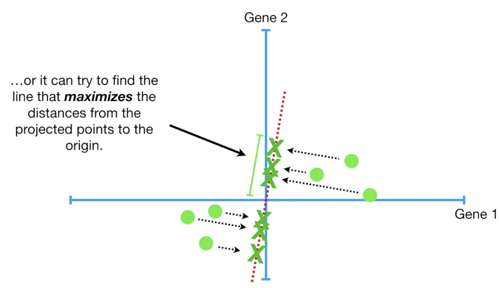
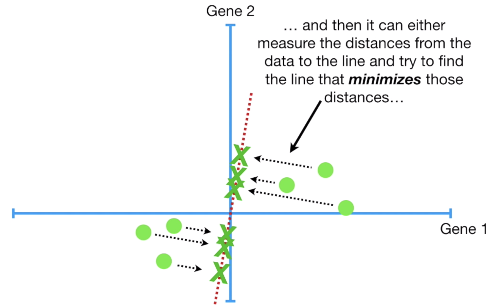
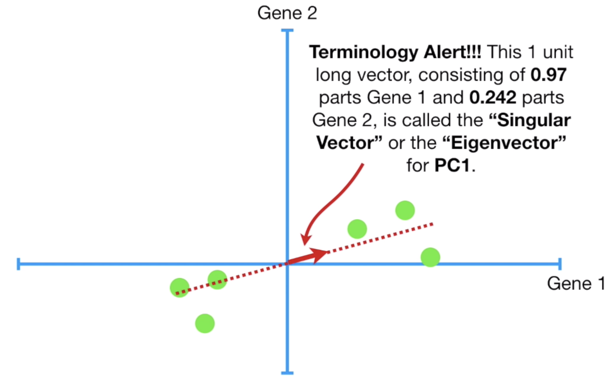
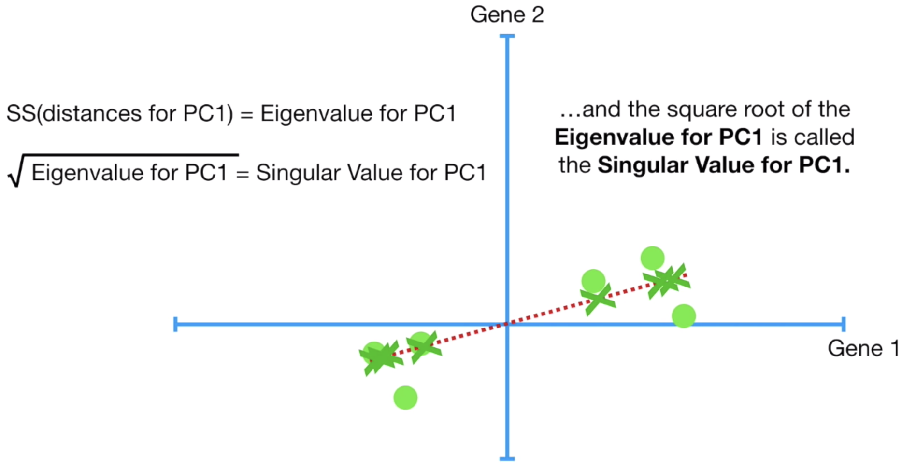

# Lecture 21, Monday, 04/22

### Topics

- PCA (Principle Component Analysis)

PCA is a technique that is widely used for applications such as

- Dimensionality reduction
- Lossy data compression
- Feature extraction
- Data visualization

## Preprocessing

## Construction of PCA component

Consider a 2D case, in order to construct the PCA space, we compute the mean of two features and make it as our new origin.

**Note**: Shifting the data doesn't change how the data points are positioned relative to each other

PCA can be defined as 

- The orthogonal projection of the data onto a lower dimensional linear space, known as the **principal subspace**, such that the **variance of the projected data is maximized**

$\Leftrightarrow$ Equivalently

- The linear projection that **minimizes the average projection cost**, defined as the mean squared distance between the data points and their projections.

**Note**: Intuitively, it makes sense the minimize the average projection cost, the distance from the point to the line. But it's actually easier to calculate the variance of the projected data, the distance from the projected point to origin.

### Eigenvector

### Eigenvalue

