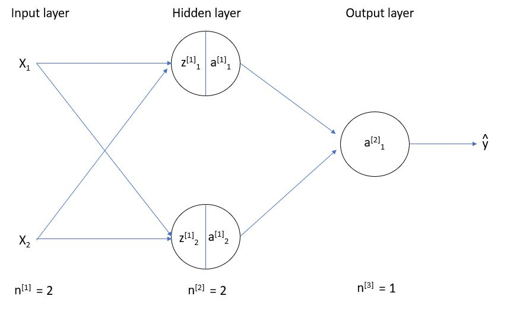
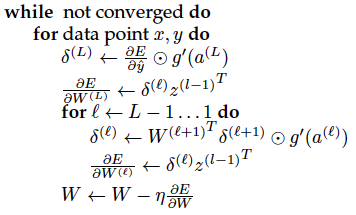

# Lecture 3, Monday, 01/28

### Topics: 
- Backpropagation
- SGD
- Regularization

## 1. Backpropagation

**Define**

- $E = $ Error
	- **Least Squares**: $E = (\widehat{y} - y)^2$
	- **Cross Entropy**: $E = - \sum_i [y_i \cdot log(\widehat{y}_i) + (1-y_i) \cdot log(1-\widehat{y}_i)]$

- $g = $ Activation Function

- $z_j^{(l)} = $ The value coming into hidden neuron $j$ in layer $l$
	- $z_j^{(l)} = \sum_i w_{ij}^{(l)} \cdot a_i^{(l-1)}$

- $a_i^{(l)} = $ The value coming out of hidden neuron $i$ in layer $l$
	- $a_i^{(l)} = g(z_i^{(l)})$

- $w_{ij}^{(l)} = $ The weight connects $a_i^{(l-1)}$ with $z_j^{(l)}$ 

 

#### Example

Consider a neural network with 

- **2 inputs**
- **1 hidden layer with 2 neurons**

**(1)**

$\frac{\partial E}{\partial w_1^{(2)}} = \frac{\partial E}{\partial \widehat{y}} \cdot \frac{\partial \widehat{y}}{\partial w_1^{(2)}}$, where 
$
\begin{cases}
\widehat{y} = a^{(2)} = g(z^{(2)}) \\
z^{(2)} = w^{(2)} \cdot a^{(1)} = w_1^{(2)}a_1^{(1)} + w_2^{(2)}a_2^{(1)}
\end{cases}
$

- $\frac{\partial \widehat{y}}{\partial w_1^{(2)}} = \frac{\partial \widehat{y}}{\partial z^{(2)}} \cdot \frac{\partial z^{(2)}}{\partial w_1^{(2)}} = g'(z^{(2)}) \cdot a_1^{(1)}$ 

**(2)**

$\frac{\partial E}{\partial w_{11}^{(1)}} = \frac{\partial E}{\partial z_1^{(1)}} \cdot \frac{\partial z_1^{(1)}}{\partial w_{11}^{(1)}}$

$= \frac{\partial E}{\partial a_1^{(1)}} \cdot \frac{\partial a_1^{(1)}}{\partial z_1^{(1)}} \cdot a_1^{(0)}$

$= [\frac{\partial E}{\partial z^{(2)}} \cdot \frac{\partial z^{(2)}}{\partial a_1^{(1)}}] \cdot g'(z_1^{(1)}) \cdot a_1^{(0)}$

$= [\delta^{(2)} \cdot w_1^{(2)}] \cdot g'(z_1^{(1)}) \cdot a_1^{(0)}$, where $\delta^{(2)} = \frac{\partial E}{\partial z^{(2)}} = \frac{\partial E}{\partial \widehat{y}} \cdot \frac{\partial \widehat{y}}{\partial z^{(2)}}$

**Note:** Keep the table of $\delta_i^{(l)} = \frac{\partial E}{\partial z_i^{(l)}}$, dynamic programming + chain rule 

### Sudo-code

**Note**: $a$ and $z$ are flipped in the screenshot below (from lecture note)

## 2. Regularization

$\min_w E_w(x,y) + \lambda \cdot ||w||^2$

- preserve uncertainty
- ignore noisy features
- ignore strongly correlated features