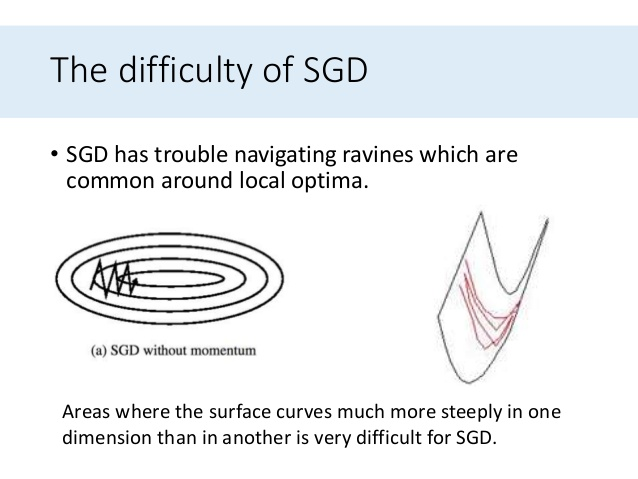

# Lecture 4, Wednesday, 01/30

### Topics: 
- Regularization
- Architecture

## 1. Dropout

During training, sample nodes and set $a_i$ to $0$

## 2. Max-norm

$
w = 
\begin{cases}
w,\ \mathrm{if}\ ||w|| \le c\\
\frac{c}{||w||_2} \cdot w,\ \mathrm{if}\ ||w|| > c
\end{cases}
$

## 3. Momentum

<center>

</center>

**Sudo-Code**

```
Repeat
	For n
		g = ∇fw(w)
		v = αv + (1-α)g
		w = w - ηv

```

