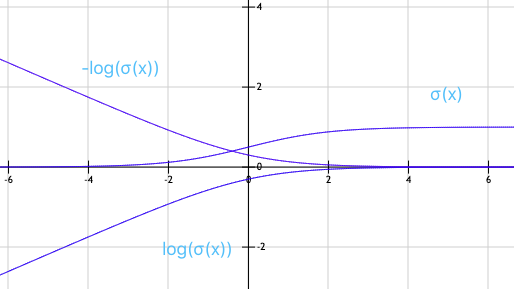

# Lecture 5, Monday, 02/04

### Topics: 
- Support Vector Machine

## Linear SVM

**Objective Function**

<center>
$\max_{w,b} M$ 

such that
$
\begin{cases}
y_n(w^Tx^{(n)} + b) \ge M \\
||w|| = w^Tw = 1
\end{cases}
$
</center>

By defining $w' = \frac{w}{m}$, we have $m = \frac{||w||}{||w'||} = \frac{1}{||w'||}$

The original objective function can then be transformed into

<center>
$\min_{w',b} \frac{1}{2}||w'||^2$

such that $y_n({w'}^T x^{(n)}+b) \ge 1$
</center>

<br>
For non-linearly separable dataset, define a slack variable $\xi_{x_i}$

$
\xi_{x_i} =
\begin{cases}
0,\ \mathrm{if\ data\ point\ is\ on\ the\ correct\ side} \\
\xi_{x_i},\ \mathrm{if\ data\ point\ is\ on\ the\ incorrect\ side}
\end{cases}
$

where $\xi_{x_i}$ is the distance from the margin

Then the modifed objective function is

<center>
$\min_{w,b,\xi} \frac{1}{2} ||w||^2 + C \cdot \sum_n \xi_n$ 

such that 
$
\begin{cases}
y_n(W^TX^{(n)} + b) \ge 1 - \xi_n \Rightarrow \xi_n \ge 1 - y_n(W^TX^{(n)} + b) \\
\xi_n \ge 0, \forall n 
\end{cases}
$
</center>

Because $\xi_n \ge 0$ for any $n$, $\xi_n = \max\{0, 1 - y_n(W^TX^{(n)} + b)\}$ 

**Note**: The parameter $C$ is tuned by using development set, which is the primal optimization problem for SVM

Substitue $\xi_n$ in the objective function, we now have

<center>
$\min_{w,b} \frac{1}{2} ||w||^2 + C \cdot \sum_{n=1}^N \max\{0, 1 - y_n(W^TX^{(n)} + b)\}$
</center>

Moving $\frac{1}{2} ||w||^2$ into the sum over all data points, the objective function becomes

<center>
$\min_{w,b} \sum_{n=1}^N  \frac{1}{2N} ||w||^2 + C \cdot \max\{0, 1 - y_n(W^TX^{(n)} + b)\}$
</center>

For data point $n$, the loss can be denoted as $\ f_n(w,b)$

<center>
$f_n(w,b) = \frac{1}{2N} ||w||^2 + C \cdot  \max\{0, 1 - y_n(W^TX^{(n)} + b)\}$
</center>

The gradient of the loss with respect to $w$ and $b$ are the following

$\frac{\partial f_n}{\partial w} = 
\begin{cases}
\frac{1}{N} \cdot w - C \cdot y_n X^{(n)},\ \mathrm{if}\ 1-y_n(W^TX^{(n)}+b) > 0 \\
\frac{1}{2N} \cdot w,\ \mathrm{otherwise}
\end{cases}
$

$\frac{f_n}{b} =
\begin{cases}
-C \cdot y_n,\ \mathrm{if}\ 1-y_n(W^TX^{(n)}+b) > 0 \\
0,\ \mathrm{otherwise}
\end{cases}
$


## SGD for SVM

```
Repeat
	For n from 1 to N
		if 1−yn(WTX(n)+b) > C
			w = w + α⋅C⋅ynX(n)
			b = b + α⋅C⋅yn
		w = w - (α⋅w)/2N
```

---

Logistic Regression 
$
\begin{cases}
\mathrm{sigmoid\ function} \rightarrow \mathrm{not\ convex}\\
-log(\mathrm{sigmoid\ function}) \rightarrow \mathrm{convex}
\end{cases}
$

**Note**: The advantage of using negative log transformation in logistic regression

- Computational Efficiency
	- Rather than compute the ratio of likelihood, we can compute the difference between the log likelihood 
	<center>
	$\frac{p(x|y = 0)}{p(x|y=1)} = log(p(x|y=0)) - log(p(x|y=1))$
	</center>
- Convert a concave objective function into a convex function

SVM $\rightarrow$ convex

<center>

</center>