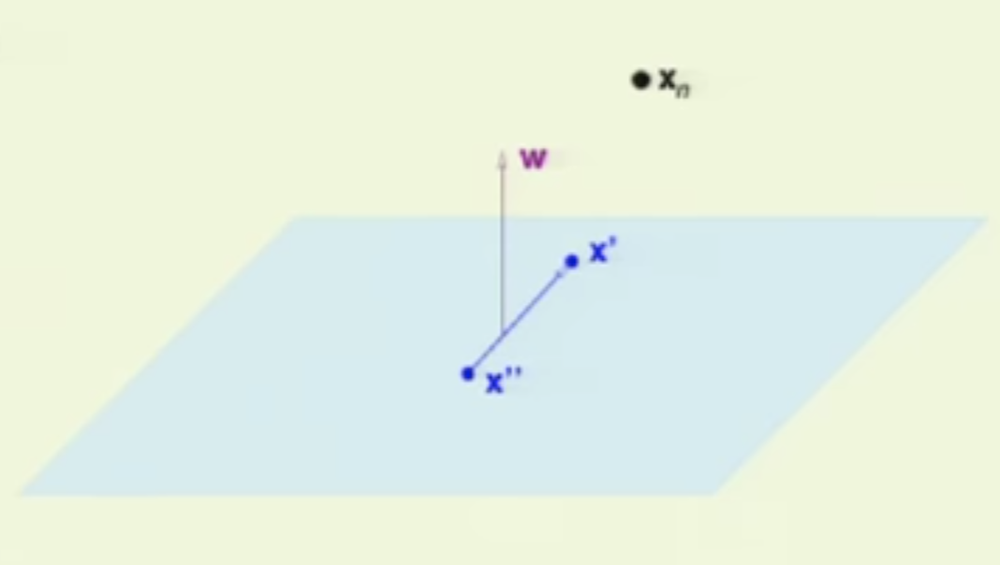
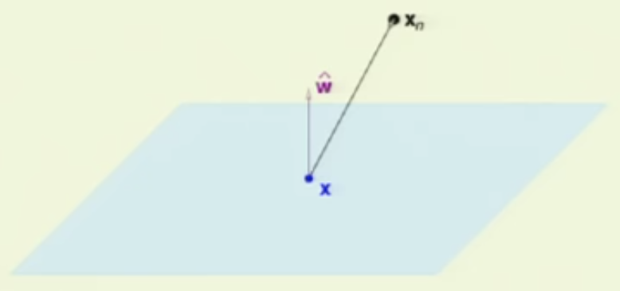
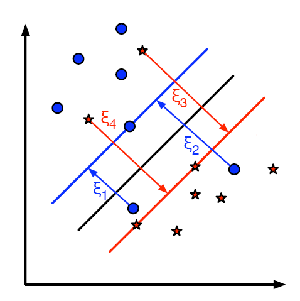

# Lecture 5, Monday, 02/04

### Topics: 
- Support Vector Machine

## Linearly Separable Cases (Hard-Margin SVM)

### Define Hyperplane and Margin ($M$)

**Normalize $\mathrm{w}$**

The hyperplane in the SVM is defined by $\mathrm{w}^T\mathrm{x} = 0$. 

Let $x_n$ to be the nearest data point to the hyperplane, then we know 

<center>
$|\mathrm{w}^T\mathrm{x_n}| > 0$
</center>

- Indeed, because in the case of Linear SVM, the data points are linearly separable, $\mathrm{w}^T\mathrm{x_n}$ will has the same sign as $y_n$

We want to relate $w$ with the margin $M$, but for now, if we multiply the vector $w$ by a million, we will still get the same hyperplane because $\mathrm{w}^T\mathrm{x} = 0 \Leftrightarrow 100000 \cdot \mathrm{w}^T\mathrm{x} = 0$ 

Therefore, we will divide the vector $\mathrm{w}$ that takes out the factor that does not affect our hyperplane to achieve scale-invariant. Among all representation of the same hyperplane, we pick the one that is

<center>
$|\mathrm{w}^T\mathrm{x_n}| = 1$
</center> 

**Pull out $w_0$**

We pull out the bias term from the vector $\mathrm{w}$ and denote it as $b$. 

Now $\mathrm{w} = (w_1,w_2,...,w_d)$

So the new hyperplane is defined by $\mathrm{w}^T\mathrm{x} + b= 0$ and for the nearest data point $x_n$, we have $|\mathrm{w}^T\mathrm{x_n} + b| = 1$

### Compute the Distance

We want to compute the distance between $\mathrm{x_n}$ and the hyperplane $\mathrm{w}^T\mathrm{x} + b = 0$, where $\mathrm{w}^T\mathrm{x_n} + b = 1$

First, we know the vector $\mathrm{w}$ is $\perp$ to the hyperplane in input space because consider two data points $x'$ and $x''$ on the hyperplane, we know

<center>
$\mathrm{w}^T\mathrm{x'} + b = 0$ and $\mathrm{w}^T\mathrm{x''} + b = 0 \Rightarrow \mathrm{w}^T(x'- x'') = 0$
</center>

Hence, $\mathrm{w} \perp$ hyperplane


<center>

</center>

To compute the distance between $\mathrm{x_n}$ and the hyperplane, we take any data point $\mathrm{x}$ on the hyperplane and get the projection of $\mathrm{x_n} - \mathrm{x}$ on $\mathrm{w}$

To do that, we first get the unit vector in the direction of $\mathrm{w}$

<center>
$\mathrm{w}' = \frac{\mathrm{w}}{||\mathrm{w}||}$
</center>

Then we perform the dot product to get the distance 

**Note**: We need the absolute value because $\mathrm{w}$ could be facing the other direction of $\mathrm{x_n} - \mathrm{x}$

<center>
Distance = $|\mathrm{w}'^T(\mathrm{x_n} - \mathrm{x})|$
</center>

<center>

</center>

We can simplify the formula for distance as the following

<center>
Distance = $|\mathrm{w}'^T(\mathrm{x_n} - \mathrm{x})| = \frac{1}{||\mathrm{w}||}|\mathrm{w}^T\mathrm{x_n} - \mathrm{w}^T\mathrm{x}| = \frac{1}{||\mathrm{w}||}|\mathrm{w}^T\mathrm{x_n} + b - \mathrm{w}^T\mathrm{x} - b|$ 
</center>

Because $\mathrm{x}$ is a data point on the hyperplane, so by definition, $\mathrm{w}^T\mathrm{x} + b= 0$. 

We also konw that if we pick the hyperplane that satisfies $|\mathrm{w}^T\mathrm{x_n} + b| = 1$ for the nearest data point $x_n$. 

Then the distance between $x_n$ and the hyperplane, which is the margin ($M$), will become

<center>
Distance = $M = \frac{1}{||\mathrm{w}||}$
</center>

### Objective Function

We know we want to maximize the margin with the constraint we set such as

<center>
$\max \frac{1}{||\mathrm{w}||}$ 

subject to $\min_{n=1,2,...,N} |\mathrm{w}^T\mathrm{x_n} + b| = 1$
</center>

Recall that since our data points are linearly separable, if we define $y_n \in \{-1,1\}$, then we know 

<center>
$|\mathrm{w}^T\mathrm{x_n} + b| = y_n(\mathrm{w}^T\mathrm{x_n} + b)$
</center>

Rather than maximizing the margin ($M$), we convert it into a problem of minimizing $M^{-1} \propto \frac{1}{2} \mathrm{w}^T\mathrm{w}$

<center>
$\min \frac{1}{2} \mathrm{w}^T\mathrm{w}$ 

subject to $y_n(\mathrm{w}^T\mathrm{x_n} + b) \ge 1, \forall n \in \{1,2,...,N\}$
</center>

To find the solution, we use the Lagrange formulation under inequality constraints, which is referred to as KKT

- **Step 1**: 

	$L(\mathrm{w},b,\alpha) = \frac{1}{2} \mathrm{w}^T\mathrm{w} -\sum_{n=1}^N \alpha_n \cdot (y_n(\mathrm{w}^T\mathrm{x_n} + b) - 1)$

- **Step 2**:

	$g(\alpha) = \min_{\mathrm{w}, b} L(\mathrm{w},b,\alpha)$

- **Step 3**

	$\frac{\partial L}{\partial \mathrm{w}} = \mathrm{w} - \sum_{n=1}^N \alpha_n y_n x_n = 0 \rightarrow \mathrm{w} = \sum_{n=1}^N \alpha_n y_n x_n$
	
	$\frac{\partial L}{\partial b} = - \sum_{n=1}^N \alpha_n y_n = 0$

- **Step 4**

	Dual function: $\max_{\alpha} g(\alpha) = - \frac{1}{2} \sum_{n=1}^N \sum_{m=1}^N y_ny_m \alpha_n\alpha_mx_n^Tx_m + \sum_{n=1}^N \alpha_n$
	
	subject to 
	$
	\begin{cases}
	\alpha_n \ge 0, \forall n \in \{1,2,...,N\} \\
	\sum_{n=1}^N \alpha_n y_n = 0
	\end{cases}
	$
	
Another important KKT condition

<center>
$\alpha_n(y_n(\mathrm{w}^T\mathrm{x}_n + b) - 1) = 0$
</center>

The equation aboves basically says two things

- When $\alpha_n > 0$, $(y_n(\mathrm{w}^T\mathrm{x}_n + b) - 1)$ must be $0$, which indicates data points on the margin, namely **support vectors**
- When $\alpha_n = 0$, $(y_n(\mathrm{w}^T\mathrm{x}_n + b) - 1)$ must be greater than $0$, which indicates interior data points, those are away from the margin

In practice, we will find that most of $\alpha_n$ are zeros and we only have few non-zero $\alpha_n$ which correponds to the data points that are support vectors.

Therefore, we are essentially computing only in $m$ dimension where $\alpha_m \ne 0$, rather than in $N$ dimension for $\alpha_1,\alpha_2,...,\alpha_N$

**Note**:

We can get the upper bound of the out-of-sample error using the in-sample quantity, support vectors

<center>
$E[\mathrm{Error_{out}}] = \frac{E[\mathrm{\#\ of\ Support\ Vectors}]}{N-1}$ 
</center>

## None-Linear Cases

### Method 1: Soft-Margin SVM

For non-linearly separable dataset, define a slack variable $\xi_{x_i}$

<center>
$
\xi_{x_i} =
\begin{cases}
0,\ \mathrm{if\ data\ point\ is\ on\ the\ correct\ side\ of\ the\ margin} \\
\xi_{x_i},\ \mathrm{if\ data\ point\ is\ on\ the\ incorrect\ side\ of\ the\ margin}
\end{cases}
$
</center>

where $\xi_{x_i}$ is the distance from the incorrectly placed data point to the margin

<center>

</center>

Then the modifed objective function is

<center>
$\min_{w,b,\xi} \frac{1}{2} ||w||^2 + C \cdot \sum_n \xi_n$ 

such that 
$
\begin{cases}
y_n(W^TX^{(n)} + b) \ge 1 - \xi_n \Rightarrow \xi_n \ge 1 - y_n(W^TX^{(n)} + b) \\
\xi_n \ge 0, \forall n 
\end{cases}
$
</center>

$\xi_n$ is defined to be non-negative because we do not want to give credit to data points that are already on the right side of margin so that allows other data points to violate the margin.

Because $\xi_n \ge 0$ for any $n$, $\xi_n = \max\{0, 1 - y_n(W^TX^{(n)} + b)\}$ 

**Note**: The parameter $C$ is tuned by using development set, which is the primal optimization problem for SVM

Substitue $\xi_n$ in the objective function, we now have

<center>
$\min_{w,b} \frac{1}{2} ||w||^2 + C \cdot \sum_{n=1}^N \max\{0, 1 - y_n(W^TX^{(n)} + b)\}$
</center>

Moving $\frac{1}{2} ||w||^2$ into the sum over all data points, the objective function becomes

<center>
$\min_{w,b} \sum_{n=1}^N  \frac{1}{2N} ||w||^2 + C \cdot \max\{0, 1 - y_n(W^TX^{(n)} + b)\}$
</center>

For data point $n$, the loss can be denoted as $\ f_n(w,b)$

<center>
$f_n(w,b) = \frac{1}{2N} ||w||^2 + C \cdot  \max\{0, 1 - y_n(W^TX^{(n)} + b)\}$
</center>

The gradient of the loss with respect to $w$ and $b$ are the following

$\frac{\partial f_n}{\partial w} = 
\begin{cases}
\frac{1}{N} \cdot w - C \cdot y_n X^{(n)},\ \mathrm{if}\ 1-y_n(W^TX^{(n)}+b) > 0 \\
\frac{1}{N} \cdot w,\ \mathrm{otherwise}
\end{cases}
$

$\frac{f_n}{b} =
\begin{cases}
-C \cdot y_n,\ \mathrm{if}\ 1-y_n(W^TX^{(n)}+b) > 0 \\
0,\ \mathrm{otherwise}
\end{cases}
$


## SGD for SVM

```
Repeat
	For n from 1 to N
		if 1−yn(WTX(n)+b) > 0
			w = w + α⋅C⋅ynX(n)
			b = b + α⋅C⋅yn
		w = w - (α⋅w)/N
```

---

Logistic Regression 
$
\begin{cases}
\mathrm{sigmoid\ function} \rightarrow \mathrm{not\ convex}\\
-log(\mathrm{sigmoid\ function}) \rightarrow \mathrm{convex}
\end{cases}
$

**Note**: The advantage of using negative log transformation in logistic regression

- Computational Efficiency
	- Rather than compute the ratio of likelihood, we can compute the difference between the log likelihood 
	<center>
	$\frac{p(x|y = 0)}{p(x|y=1)} = log(p(x|y=0)) - log(p(x|y=1))$
	</center>
- Convert a concave objective function into a convex function

<center>

</center>

Loss function of SVM is convex

