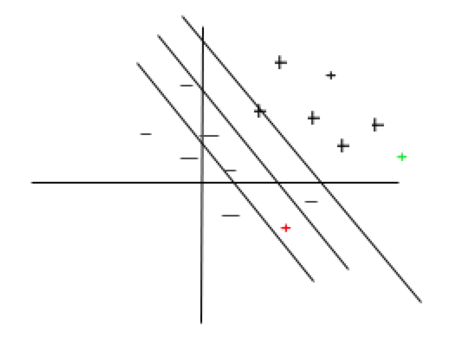

# Lecture 7, Monday, 02/11

### Topics

- SVM Optimization
- Kernel Methods

## None-Linear Cases
### Method 1: Soft-Margin SVM

$\min_{w,b} \frac{1}{2} ||w||^2 + C \cdot \sum_n \xi_n$

such that $\forall n$,
$
\begin{cases}
y_n (w^Tx^{(n)} + b) \ge 1 - \xi_n \\
\xi_n \ge 0
\end{cases}
$

$\Rightarrow
\begin{cases}
f_1(x) = 1 - \xi_n - y_n (w^Tx^{(n)} + b) \le 0  \\
f_2(x) = -\xi_n \le 0
\end{cases}
$

Suppose $\lambda_1 = \alpha_n$ and $\lambda_2 = \mu_n$

Using convex dual, we first write out the Lagrangian form of SVM optimization function

$L(w,b,\xi,\alpha,\mu) = \frac{1}{2} ||w||^2 + C \cdot \sum_n \xi_n + \sum_n^N \alpha_n (1 - \xi_n - y_n (w^Tx^{(n)} + b)) + \sum_n^N \mu_n (-\xi_n)$

Remove $w,b,\xi$ from the functino by taking the derivatives

$\frac{\partial L}{\partial w} = w - \sum_n^N \alpha_ny_nx^{(n)} = 0 \Rightarrow w = \sum_n^N \alpha_ny_nx^{(n)}$

$\frac{\partial L}{\partial b} = -\sum_n^N \alpha_n y_n = 0$

$\frac{\partial L}{\partial \xi_n} = C - \alpha_n - \mu_n = 0 \Rightarrow \alpha_n = C - \mu_n$

$\because \alpha_n \ge 0, \mu_n \ge 0$, $\ \therefore 0 \le \alpha_n \le C$

By substiting the values of $w,b,\xi_n$ with $\sum_n^N \alpha_ny_nx^{(n)},0,0$ in $L(w,b,\xi,\alpha,\mu)$, we have

$g(\alpha,\mu) = \frac{1}{2} ||\sum_n^N \alpha_ny_nx^{(n)}||^2 + \sum_n^N \alpha_n - \sum_n^N \alpha_n y_n(\sum_m^N \alpha_my_mx^{(m)})^Tx^{(n)}$

$= \frac{1}{2} (\sum_n^N \alpha_ny_nx^{(n)})^T(\sum_m^N \alpha_my_mx^{(m)}) + \sum_n^N \alpha_n -(\sum_n^N \alpha_ny_nx^{(n)})^T \sum_m \alpha_my_mx^{(m)}$

$= -\frac{1}{2} \sum_n^N \sum_m^N \alpha_n \alpha_m y_ny_mx^{(n)T}x^{(m)} + \sum_n^N \alpha_n$

Hence,

$\max g(\alpha)$ such that 
$
\begin{cases}
0 \le \alpha_n \le C \\
0 = \sum_n^N \alpha_ny_n
\end{cases}
$

The second constraint $\sum_n^N \alpha_ny_n = 0$ implies that no data point can be influential too much (no extreme penalty on wrongly calssified data point)

If we take some value out of $\alpha_i$, then we have to put it back into $\alpha_j$ to maintain $\sum_n^N \alpha_ny_n = 0$

As shown in the figure below 

Points on the right side but not on the margin contribute nothing because alpha equals to $0$ (The green point)

For points on the wrong side (The red point), alpha equals to $C$, and $\xi_n > 0$ so they along with points on the margin contribute to the vector, but no point is allowed to contribute more than $C$

### Method 2: Kernel

Recall the classification formula

$Sign(w^Tx) = Sign((\sum_n^N \alpha_ny_nx^{n})^Tx^m) = Sign(\sum_n^N \alpha_ny_n(x^{nT}x^m))$

Now we substitue $x^{nT}x^m$ with kernel $K(x^n,x^m)$, inner product for two data points in the input space

**For a kernel $K(x',x'')$, it is only valid if $K(x',x'') = \phi(x')^T \phi(x'')$**

**Examples of kernels**

1. $K(x',x'') = x'^T x''$, where $\phi(x) = x$ (This one does nothing)
2. $K(x',x'') = (x'^Tx'')^2$

	Suppose $x$ only has two dimensions, 
	$x = 
	\begin{bmatrix}
	x_1 \\
	x_2
	\end{bmatrix}
	$, then we can write $K(x',x'')$ as
	
	$K(x',x'') = (x'^Tx'')^2 = (x_1'x_1'' + x_2'x_2'')^2 = (x_1'^2x_1''^2 + 2x_1'x_1''x_2'x_2'' + x_2'^2x_2''^2)$
	
	which is the product of $\phi(x')$ and $\phi(x'')$, where
	
	$\phi(x') =
	\begin{bmatrix}
	x_1'^2 \\
	\sqrt{2} x_1'x_2' \\
	x_2'^2
	\end{bmatrix}
	$, 
	$\ \phi(x'') =
	\begin{bmatrix}
	x_1''^2 \\
	\sqrt{2} x_1''x_2'' \\
	x_2''^2
	\end{bmatrix}
	$
3. Gaussian Kernel: $K(x',x'') = e^{-c||x'-x''||^2}$
	
**Note**: If $K$ is valid for some $\phi$, when doing the computation, we can just work with $K$ using the Convex Dual. Do not have to work with complex $\phi$ directly