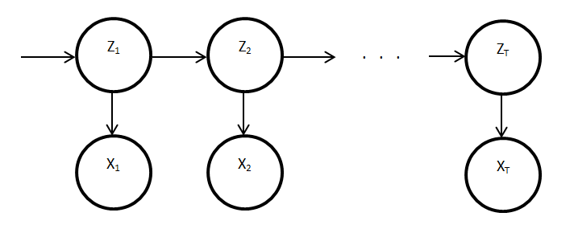

# Lecture 8, Wednesday, 02/13

### Topics: 
- Hidden Markov Model (HMM) 
	- Forward-Backward Algorithm 

### YouTube Resources

**mathmaticalmonk**

- [Hidden Markov Model - part 1](https://www.youtube.com/watch?v=TPRoLreU9lA&list=PLD0F06AA0D2E8FFBA&index=98)
- [Hidden Markov Model - part 2](https://www.youtube.com/watch?v=M_IIW0VYMEA&list=PLD0F06AA0D2E8FFBA&index=99)
- [Forward-Backward Algorithm](https://www.youtube.com/watch?v=7zDARfKVm7s)
- [Forward Algorithm](https://www.youtube.com/watch?v=M7afek1nEKM&index=101&list=PLD0F06AA0D2E8FFBA)
- [Backward Algorithm](https://www.youtube.com/watch?v=jwYuki9GgJo&list=PLD0F06AA0D2E8FFBA&index=103)

## Hidden Markov Model

- $Z_i = $ hidden states, $Z_i \in \{1,2,...,m\}$
- $X_i = $ observed values

$P(X_1,X_2,...,X_T,Z_1,Z_2,...,Z_T)$ 

$= P(Z_1)P(X_1|Z_1) \cdot P(Z_2|Z_1)P(X_2|Z_2) \ ... \ P(Z_T|Z_{T-1})P(X_T|Z_T)$

$= P(Z_1)P(X_1|Z_1) \prod_{t=2}^T P(Z_t|Z_{t-1})P(X_t|Z_t)$

**Parameters**

1. **Initial Distribution**: $\pi(i) = P(Z_1 = i), i \in \{1,2,...,m\}$
2. **Transition Probability (Matrix)**: $T(i,j) = P(Z_t = j\ |Z_{t-1} = i), i,j \in \{1,2,...,m\}$
3. **Emission Probability**: $\epsilon_i(x) = P(x|Z_t = i), i \in \{1,2,...,m\}$

Hence, we can write $P(X_1,X_2,...,X_T,Z_1,Z_2,...,Z_T)$ as

$P(X_1,X_2,...,X_T,Z_1,Z_2,...,Z_T) = \pi(i)\epsilon_{Z_1}(X_1) \prod_{t=2}^T T(Z_{t-1},Z_t) \epsilon_{Z_t}(X_t)$ 

### Forward-Backward Algorithm 

Assum the following parameters are known

- Initial Distribution: $P(Z_1)$
- Transition probability: $P(Z_t|Z_{t-1})$
- Emission probability: $P(X_t|Z_t)$

Define

- $X = \{X_1,X_2,...,X_T\}$
- $X_{i:j} = \{X_i, X_{i+1},...,X_j\}$

**Objective**: Compute $P(Z_t|X)$, where

$P(Z_t|X) \propto P(Z_t,X) = P(X_{t+1:T}|Z_t,X_{1:t})P(Z_t,X_{1:t}) = P(X_{t+1:T}|Z_t)P(Z_t,X_{1:t})$

T

#### (1) Backward Algorithm

Compute

$\beta(t,i) = P(X_{t+1:T}|Z_t = i)$

**Base case:** $t = T$

$\beta(T,i) = 1$

**Dynamic Programming (Recursion):** $t = T-1,T-2,...,1$

$\beta(t,i) = P(X_{t+1:T}|Z_t = i)$

$= \sum_{j} P(X_{t+1:T}, Z_{t+1} = j|Z_t = i)$

$= \sum_{j} P(X_{t+2:T}| Z_{t+1} = j, Z_t = i, X_{t+1}) P(X_{t+1}|Z_{t+1} = j, Z_t = i)P(Z_{t+1} = j|Z_t = i)$

$= \sum_{j} P(X_{t+2:T}| Z_{t+1} = j) P(X_{t+1}|Z_{t+1} = j)P(Z_{t+1} = j|Z_t = i)$

$= \beta(t+1,j) \cdot P(X_{t+1}|Z_{t+1} = j) \cdot P(Z_{t+1} = j|Z_t = i)$

where

- $P(X_{t+1}|Z_{t+1} = j)$ is known from the **emission probability**
- $P(Z_{t+1} = j|Z_t = i)$ is known from the **transition matrix**

#### (2) Forward Algorithm

Compute

$\alpha(t,i) = P(Z_t = i,X_{1:t})$

**Base case:** $t = 1$

$\alpha(1,i) = P(Z_1 = i,X_1) = P(Z_1 = i)P(X_1|Z_1 = i)$ 

where

- $P(Z_1 = i)$ is known from the **initial distribution**
- $P(X_1 | Z_1 = i)$ is known from the **emission probability**

**Dynamic Programming (Recursion)::** $t = 2,3,...,T$

$\alpha(t,i) = P(Z_t = i,X_{1:t})$ 

$= \sum_j P(Z_t = i,Z_{t-1} = j,X_{1:t})\ \ \ \ $ (Marginalization)

$= \sum_j P(X_t | Z_t = i, Z_{t-1} = j,X_{1:t-1}) P(Z_t = i|Z_{t-1} = j,X_{1:t-1})P(Z_{t-1} = j,X_{1:t-1})$

$= \sum_j P(X_t | Z_t = i) P(Z_t = i|Z_{t-1} = j)P(Z_{t-1} = j,X_{1:t-1}) \ \ \ \ $ (Markov Chain Property)

$= \sum_j P(X_t | Z_t = i) \cdot P(Z_t = i|Z_{t-1} = j) \cdot \alpha(t-1,j)$

where

- $P(X_t | Z_t = i)$ is known from the **emission probability**
- $P(Z_t = i|Z_{t-1} = j)$ is known from the **transition matrix**

### What we can do with HMM

1. **Inference**
	- Change detection: $P(Z_t \ne Z_{t+1}|X)$ 
2. **Estimation of Parameters**
	- Emission probability: $P(Z_1)$
	- Transition probability: $P(Z_t|Z_{t-1})$
	- Initial Distribution: $P(X_t|Z_t)$
3. **Sampling from Posterior Density**: Sample $Z$ given $X$

