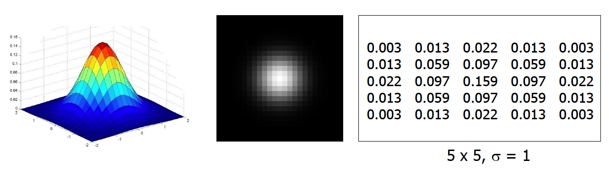

# CSC 449 Midterm Review

**1. Linear Filtering**

Linear filtering is filtering in which the value of an output pixel is a linear combination of the values of the pixels in the input pixel's neighborhood

**2. Correlation vs. Convolution**

- Filter kernel $H$ has size of $(2k+1) \times (2k+1)$
- Image $F$

	**(1) Correlation (Cross-Correlation)**: $G = H \otimes F$
	
	

	$G[i,j] = \sum_{u = -k}^k \sum_{v = -k}^k H[u,v]F[i+u,j+v]$
	

	**(2) Convolution**: $G = H * F$
	
	

	$G[i,j] = \sum_{u = -k}^k \sum_{v = -k}^k H[u,v]F[i-u,j-v]$
	

	
**Note**: Performing convolution is the same as performing correlation using the flipped filter kernel

**3. Gaussian Filter**

$H(u,v) = \frac{1}{2\pi\sigma^2}\exp(-\frac{u^2+v^2}{2\sigma^2})$

- Remove high-frequency components from the image (low-pass filter)
- Convolution with self is another Gaussian
	- So can smooth with small $\sigma$ kernel, repeat, and get same result as larger $\sigma$ kernel would have
	- Convolving two times with Gaussian kernel with $\sigma$ is same as convolving once with kernel with $\sigma\sqrt{2}$ 
- Separable kernel

$H(u,v) = \frac{1}{2\pi\sigma^2}\exp(-\frac{u^2+v^2}{2\sigma^2}) = [\frac{1}{\sigma\sqrt{2\pi}}\exp(-\frac{u^2}{2\sigma^2})][\frac{1}{\sigma\sqrt{2\pi}}\exp(-\frac{v^2}{2\sigma^2})]$

	**Discrete Example**:
	

	$
	\begin{bmatrix}
	1 & 2 & 1 \\
	2 & 4 & 2 \\
	1 & 2 & 1 \\
	\end{bmatrix} = 
	\begin{bmatrix}
	1 \\
	2 \\
	1 \\
	\end{bmatrix}
	\begin{bmatrix}
	1 & 2 & 1 
	\end{bmatrix}
	$
	

**4. Edge**