# CSC 449 Midterm Review

## 1. Linear Filtering

Linear filtering is filtering in which the value of an output pixel is a linear combination of the values of the pixels in the input pixel's neighborhood

## 2. Correlation vs. Convolution

- Filter kernel $H$ has size of $(2k+1) \times (2k+1)$
- Image $F$

	**(1) Correlation (Cross-Correlation)**: $G = H \otimes F$
	
	<center>
	$G[i,j] = \sum_{u = -k}^k \sum_{v = -k}^k H[u,v]F[i+u,j+v]$
	</center>

	**(2) Convolution**: $G = H * F$
	
	<center>
	$G[i,j] = \sum_{u = -k}^k \sum_{v = -k}^k H[u,v]F[i-u,j-v]$
	</center>
	
**Note**: Performing convolution is the same as performing correlation using the flipped filter kernel

## 3. Gaussian Filter

<center>
$H(u,v) = \frac{1}{2\pi\sigma^2}\exp(-\frac{u^2+v^2}{2\sigma^2})$

</center>

- Remove high-frequency components from the image (low-pass filter)
- Convolution with self is another Gaussian
	- So can smooth with small $\sigma$ kernel, repeat, and get same result as larger $\sigma$ kernel would have
	- Convolving two times with Gaussian kernel with $\sigma$ is same as convolving once with kernel with $\sigma\sqrt{2}$ 
- Separable kernel
<center>
$H(u,v) = \frac{1}{2\pi\sigma^2}\exp(-\frac{u^2+v^2}{2\sigma^2}) = [\frac{1}{\sigma\sqrt{2\pi}}\exp(-\frac{u^2}{2\sigma^2})][\frac{1}{\sigma\sqrt{2\pi}}\exp(-\frac{v^2}{2\sigma^2})]$
</center>

	**Discrete Example**:
	<center>
	$
	\begin{bmatrix}
	1 & 2 & 1 \\
	2 & 4 & 2 \\
	1 & 2 & 1 \\
	\end{bmatrix} = 
	\begin{bmatrix}
	1 \\
	2 \\
	1 \\
	\end{bmatrix}
	\begin{bmatrix}
	1 & 2 & 1 
	\end{bmatrix}
	$
	</center>

## 4. Edge

**(1) What is an edge?** An edge is a place of rapid change in the image intensity function

**(2) What causes an edge?**

<center>

</center>

- Refelectance change: appearance information, texture
- Depth discontinuity: object boundary
- Change in surface orientation: shape
- Cast shadows

**(3) How to extract edges from image?**

We can extract edges by computing the gradient of an image, 

<center>
$\nabla f = [\frac{\partial f}{\partial x}, \frac{\partial f}{\partial y}]$
</center>

Computing the derivative is the same as convolving the image with specific filters

<center>
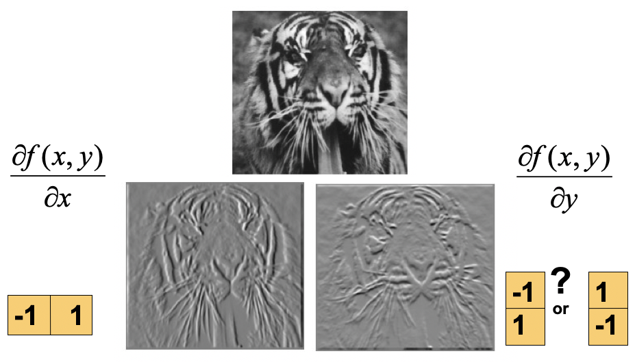
</center>

where the gradient points in the direction of most rapid increase in intensity, which is perpendicular to the direction of the edge.

<center>
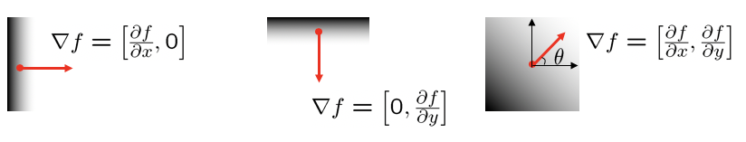
</center>

- The gradient direction is given by: $\theta = \tan^{-1}(\frac{\partial f}{\partial y}/\frac{\partial f}{\partial x})$
- The edge strength is given by the gradient magnitude: $||\nabla f|| = \sqrt{(\frac{\partial f}{\partial x})^2+(\frac{\partial f}{\partial y})^2}$

**(4) Gaussian Smoothing and Derivative Filter**

If the image has noises, it is hard to detect the real edge by only computing the gradient of the image. 

<center>
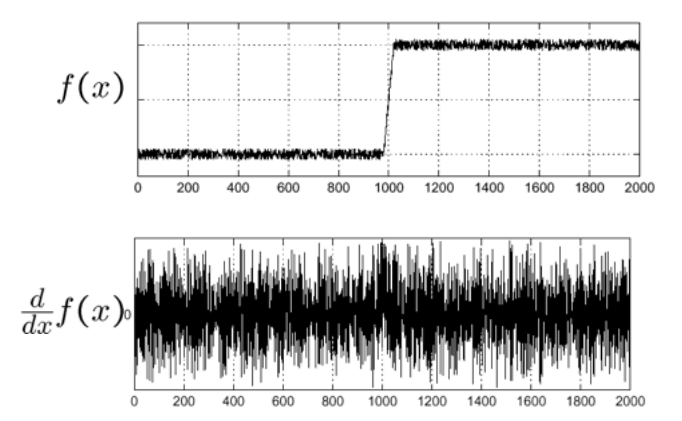
</center>

Therefore, we usually will perform smoothing on the image first and then take the gradient. The peak (maxima) of the $\frac{\partial}{\partial x}(h * f)$ corresponds to the edge. 

<center>
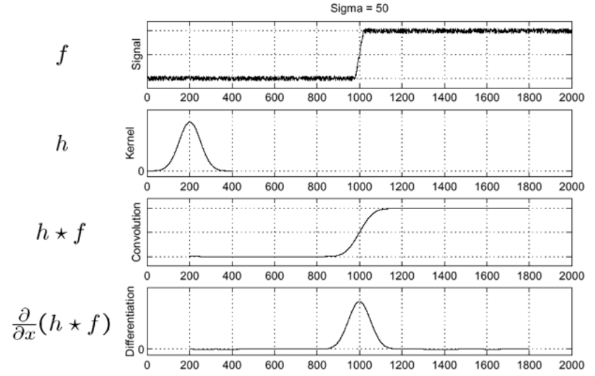
</center>

**Derivative theorem of convolution**

Because differentiation is convolution, and convolution is associative. We have:

By convolving the image with the derivative of filter directly, we save one step and improve efficency

<center>
$\frac{\partial}{\partial x}(h * f) = (\frac{\partial}{\partial x}h) * f$
</center>

<center>
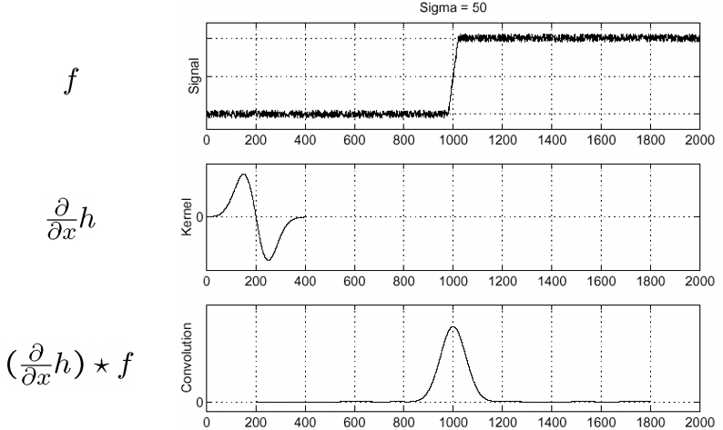
</center>

In 2-D image, the derivative of gaussian filter is different (rotate 90 degree) for $\mathrm{x}$ and $\mathrm{y}$ direction

<center>
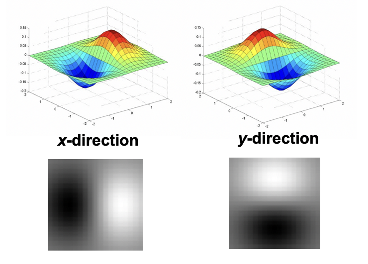
</center>

Rather than finding the maxima in the first derivative gaussian operator, we consider finding the zero-crossing of the convolving result between second derivative of gaussian operator (**Laplacian of Gaussian operator $\nabla^2$**) and the image

<center>
$\nabla^2f = \frac{\partial^2 f}{\partial x^2} + \frac{\partial^2 f}{\partial y^2} $
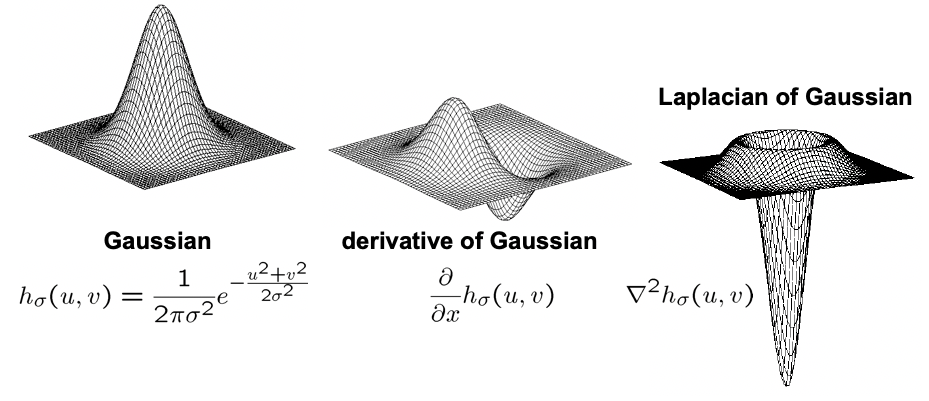
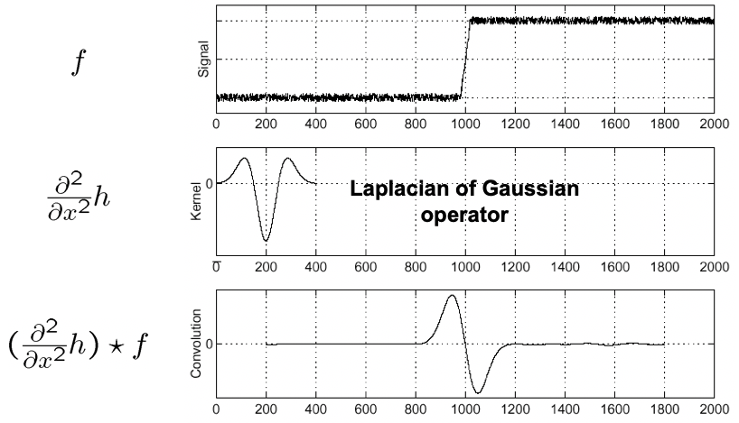
</center>


**Effect of Scale**: Tradeoff between detection and localization

**a. Detection**: responds to edges; does not respond to noise

**b. Localization**: maximum of convolution result is as near as possible to the true edge location

- Don't smooth (No Gaussian filter/Gaussian filter with small scale $\sigma$) 

	$\rightarrow$ **Lose accuracy of detection**: Detect too many edges (some are noises) 
- Smooth too much (Gaussian filter with large sacle $\sigma$)

	$\rightarrow$ **Lose localization**: Detect edges are fatter than they suppose to be / lose edges very close to each other 
	
<center>
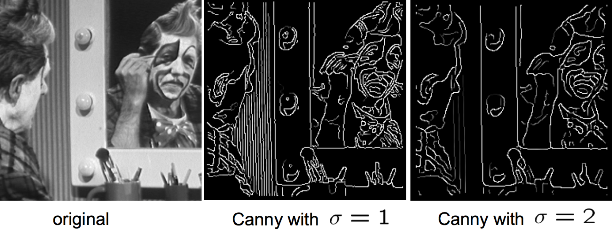
</center>

**Review: Smoothing vs. derivative filters**

- **Smoothing filters**
	- Gaussian: remove "high-frequency" components; "low-pass" filter
	- The values of a smoothing filter cannot be negative
	- The values of a smoothing filter sum to
		- **One**: Constant regions are not affected by the filter 
- **Derivative fitlers**
	- Derivatives of Gaussian 
	- The values of a derivative filter can be negative
	- The values of a derivative filter sum to
		- **Zero**: No response in constant regions
	- High absolute value at points of high contrast 

## 5. Corner

**(1) What is a corner (interest point) in image?**

If shifting a small window in **any direction** give a large change in internsity, a corner exists

<center>
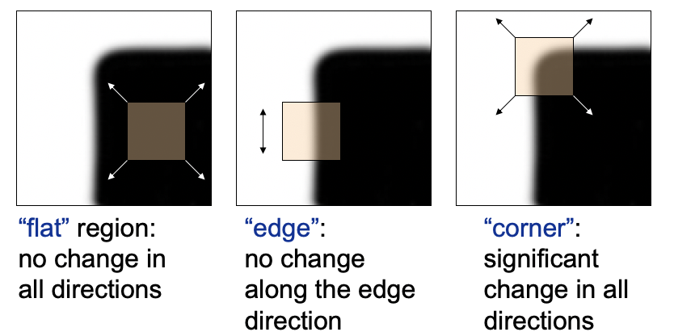
</center>

**(2) How to extract corners from image**

Compute the change in appearance of window $W$ for small shift $[u,v]$

<center>
$E(u,v) = \sum_{(x,y) \in W} [I(x+u,y+v) - I(x,y)]^2$
</center>

Because the first order Tyalor approximation of $I(x+u,y+v)$ is

<center>
$I(x+u,y+v) \approx I(x,y) + I_x(u) + I_y(v)$
</center>

Therefore the change in appearance can also be written as

<center>
$E(u,v) \approx \sum_{(x,y) \in W} [I(x,y) + I_x(u) + I_y(v) - I(x,y)]^2 = \sum_{(x,y) \in W} [I_x(u) + I_y(v)]^2 = \sum_{(x,y) \in W} I_x^2u^2 + 2I_xI_yuv + I_y^2v^2$
</center>

The quadratic approximation can be written as 

<center>
$E(u,v) \approx 
\begin{bmatrix}
u & v
\end{bmatrix}
M
\begin{bmatrix}
u \\ v
\end{bmatrix}
$, where 
$ M = 
\begin{bmatrix}
\sum_{x,y}I_x^2 & \sum_{x,y} I_xI_y \\ 
\sum_{x,y} I_xI_y & \sum_{x,y}I_y^2
\end{bmatrix}
$
</center>

Diagonalization of $M$ (**second moment matrix**): 
$M = R^{-1}
\begin{bmatrix}
\lambda_1 & 0 \\ 
0 & \lambda_2
\end{bmatrix}
R
$

<center>
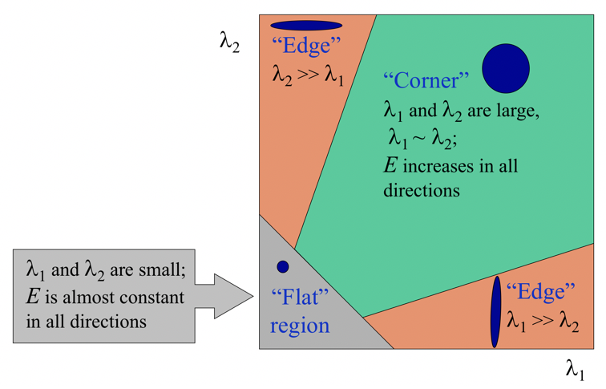
</center>

Since the decomposition of eigenvalue is expensive, we instead evaluate the determinant and trace of $M$

<center>
$R = \det(M) - \alpha \cdot \mathrm{trace}(M) = \lambda_1\lambda_2 - \alpha(\lambda_1+\lambda_2)^2$

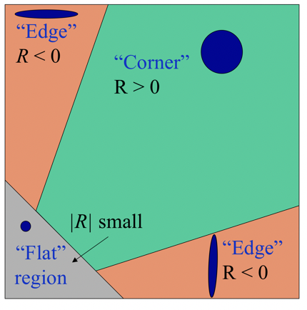
</center>

## 6. Invariant and Covariant Properties 

In corner detection, we want corner locations to be **invariant** to photometric transformations and **covariant** to geometric transformations

- **Invariance**: Image is transformed and corner locations do not change
- **Covariance**: If we have two transformed version of the same image, features should be detected in corresponding locations

**Note**:

Corner detection is

- **Partially invariant** with respect to affine intensity change

<center>
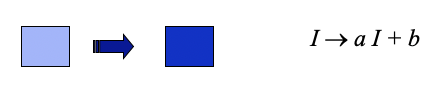
</center>

- **Covariant** with respect to translation

<center>
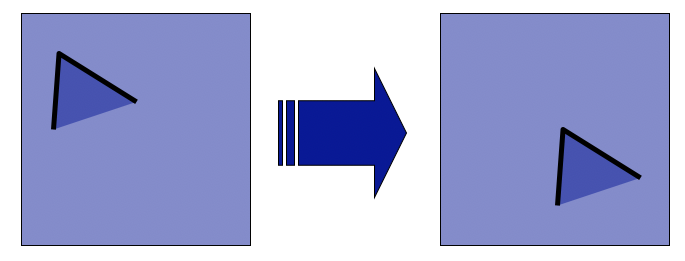
</center>

- **Covariant** with respect to rotation

<center>
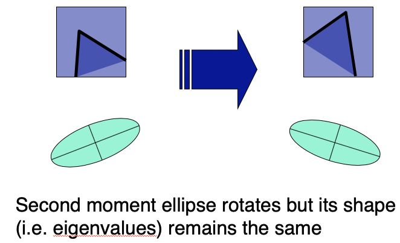
</center>

- **NOT covariant** with respect to scaling

<center>
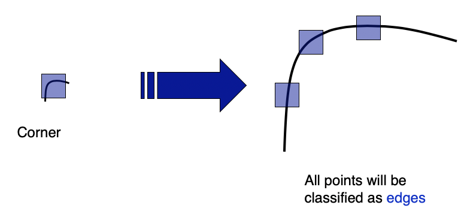
</center>

## 7. SIFT (Scale Invariant Feature Transform)

**(1) What is SIFT?**

Finding locally distinctive interest point that is invariant to the change of scales

**(2) Why do we need SIFT?**

Because some feature dectectors, such as Harris corner detector, is **not invariant** to the change of scale

**(3) What is scale space?**

The scale space is consisted of many response maps that result from convolving Laplacian-of-Gaussian filters in different scales ($\sigma$) on the image

**(4) How does SIFT handle feature detection, description, and matching? Where can we use it?**

- **Feature Detection**

	Convolve the image with Laplacian-of-Gaussian filters at multiple scales and look for extrema (minimum/maximum) of filter response in the resulting scale space

- **Feature Description**

	**a. Orientation Assignment**
	
	For each detected feature (interest point), we look at its neighborhood and compute the image gradient for each pixcel in the neighborhood. We then put the weighted gradient into a histogram (for example, a histogram with $36$ bins, where each bin represent $10$ degree). 
	
	Weights are
	
	- Gradient magnitudes
	- Away or far from the interest point (center)
	
	The bin with the highest value will be the dominant orientation of the interest point
	
	<center>
	
	</center>
	
	**Descriptor**
	
	Once we have the gradient orientation histograms, we can use that as our descriptor. 
	
	For example, if we are looking at a $8 \times 8$ neighborhood for $4 \times 4$ regions, we will result in $4$ histograms. If each histogram has $36$ bins, then the vector for the descriptor will be $144 \times 1$
	
	<center>
	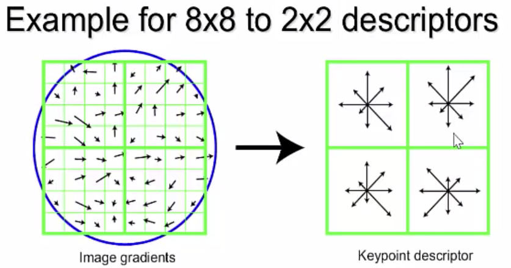
	</center>
	
	- **Normalization**
	
		By normalizing the descriptor vector to unit vector, we will make the descriptor partially invariant to illumination changes
		
		- Compute the Euclidean distance and select with certain threshold

			- Add robustness to matching: consider the ratio $\frac{\mathrm{dist.\ to\ best\ match}}{\mathrm{dist.\ to\ 2nd\ best\ match}}$
				- If the ratio is **low**, the first match is **good**
				- If the ratio is **high**, the first match could be a **ambiguous match**

- **Feature Matching**

	We match features (interest points) in different images by comparing the similarity of their descriptor vector
	
- **SIFT Properties**
	- Invariant to 
	- Partially invariant to
		- Illumination changes
			- Sometimes even day vs. night 
		- Camera viewpoint
			- Up to 60 degree out-of-plane rotation 
		- Occlusion, clutter  

- **Applications**
	- Feature points
		- Image alignment
		- 3D reconstruction
		- Motion tracking
		- Robot navigation
		- Indexing and database retrieval
		- Object recognition
	 
## 8. Fitting

**(1) What is fitting?**

Choose a parametric model to represent a set of features

**(2) Where do we need fitting?**

**(3) Least squares (LS) fit (Over constraint)**

Given data $(x_1,y_1),(x_2,y_2),...,(x_n,y_n)$, we try to fit a line $y = mx+b$, which minimize the sum of residuals

<center>
$E = \sum_{i=1}^n (y_i - mx_i - b)^2$
</center>

We can also write the loss function as 

$E = ||Y - XB||^2$, where 
$Y = 
\begin{bmatrix}
y_1 \\
\vdots \\
y_n
\end{bmatrix}
$,
$X = 
\begin{bmatrix}
x_1 \\
\vdots \\
x_n
\end{bmatrix}
$,
$B = 
\begin{bmatrix}
m \\
b
\end{bmatrix}
$

$\because E = (Y-XB)^T(Y-XB) = YY^T - 2(XB)^TY + (XB)^T(XB)$

$\therefore \frac{\partial E}{\partial B} = 0 = 2X^TXB - 2X^TY$

$\Rightarrow$ **Normal equation**: $X^TXB = X^TY$

Therefore, $B = (X^TX)^{-1}X^TY$

**Problems**

(a) Not rotation-invariant

(b) Fails completely for vertical lines (infinite value for slope)

**Solution: Total least squares**

- **Total least squares (TLS)**

	If $(a^2+b^2) = 1$, then
	
	the distance between point $(x_i,y_i)$ and line $ax+by+c=0$ is $|ax_i+by_i+c|$
	
	<center>
	
	</center>
	
	Therefore, we try to find $(a,b,c)$ to minimize the sum of squared perpendicular distances
	
	<center>
	$E = \sum_{i=1}^n (ax_i + by_i + c)^2$
	</center>

**(4) Robust fit**

Because least squares fit is really sensive to outliers, so instead, we minimize a more robust estimator ($\mu_i = ax_i+by_i+c$, the error w.r.t model)

<center>
$E = \sum_{i = 1}^n \rho(\mu_i; \sigma)$
</center>

where $\rho(\mu; \sigma) = \frac{\mu^2}{\sigma^2 + \mu^2}$, which favors small residuals and penalizes large residuals

<center>
$\sigma = 1$

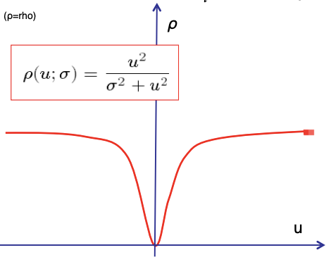
</center>

- When $\mu$ is large, $\rho$ saturates to $1$
- When $\mu$ is small, $\rho$ is a function of $\mu^2$

**Note:** The difference between the robust fit and least squares fit is that

- In least squares fit, each residual has the same weight toward the loss function. A presence of an outlier will dominate the loss function
- In robust fit, the scale parameter $\sigma$ regulates how much we give to potential outliers. In the graph above, an outlier may have very large value of $\mu$, but its influence on $\rho(\mu;\sigma)$ won't exceeds 1
	- We can control the strength of regulation by changing the value of $\sigma$

	<center>
	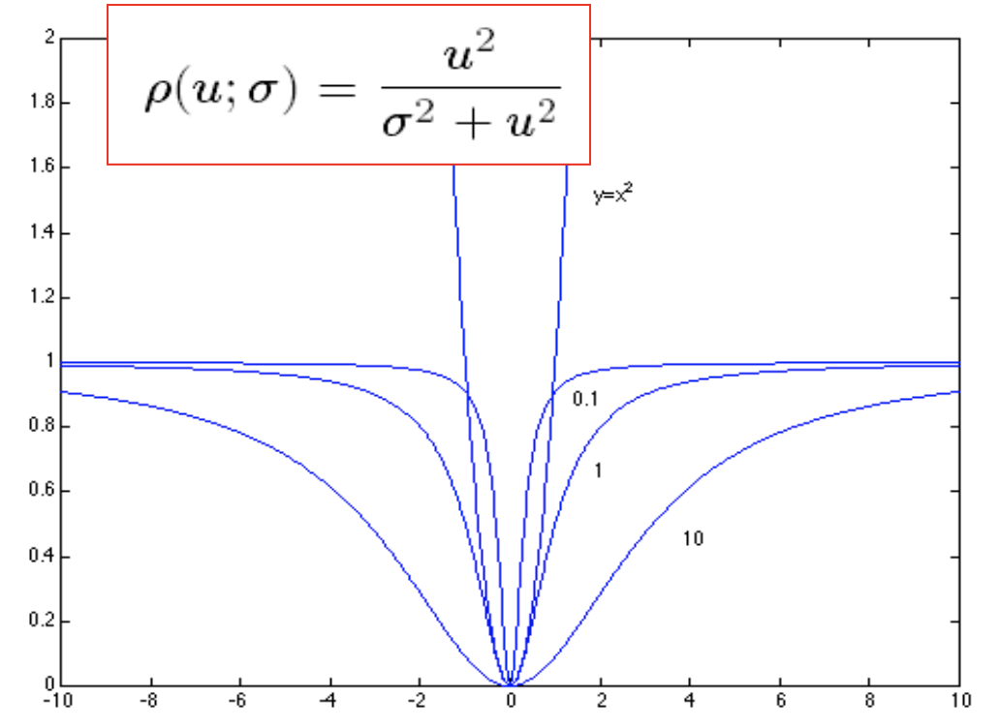
	</center>

**(5) RANSAC (Random Sampling Consensus) (Constraint)**

- Noisy data points will not vote consistently for any single model ("few outliers")
- There are enough data points to agree on a good model ("few" missing data)

```
Repeat N times:
	1. Draw s points uniformly random
	2. Fit line to these s points
	3. Find inliers to this line among the remaining points
		a. points whose distance from the line is less than t
	
	If there are d or more inliers: 
		accept the line and refit using all inliers
		return the refitted line
	else:
		reject the line
```

- **Determine $N$**

	- Choose $N$ so that, with probability $p$, at least one random sample is free from outliers
	- Let $e$ be the outlier ratio and assume that $s$ points are selected independently
	- $(1-e)^s$ is the probability that all $s$ points are inliers.
 $1 - (1-e)^s$ is the probability that at least one of the $s$ points is an outlier
 	- The probability that the algorithm never selects a set of $s$ points that all are inliers and it must be the same as $1 - p$. 

<center>
$(1-(1-e)^s)^N = 1 - p$ 

$\Rightarrow N = log(1-p)/log(1-(1-e)^s)$
</center>

- **Why RANSAC is free of outliers?**

	Because we pre-computed the value for $N$ to ensure that with probability $p$, at least one random sample is free from outliers.
	
- **Pros**
	- Simple and easily implementable
	- Applicable to many different problems
	- Often works well in practice
- **Cons**
	- Many parameters to tune
	- Doesn't work well for low inlier ratios (too many iterations, or can fail completely)
	- Cannot always get a good initialization of the model based on the minimum number of sample
	
**(6) Hough transform (Under Constraint)**

General outline

- Discretize parameter space into bins
- For each feature point in the image, put a vote in every bin in the parameter space that could have generated this point
- Find bins that have the most votes

**Dealing with noise**

- Choose a good grid / discretization
	- Too coarse: large votes obtained when too many different lines correspond to a single bucket
	- Too fine: miss lines because some points that are not exactly collinear cast votes for different buckets
- Increment neighboring bins (smoothing in accumulator array)
- Try to get rid of irrelevant features 
	- E.g., take only edge points with significant gradient magnitude


- **What are the parameter spaces for common shapes?**

<center>
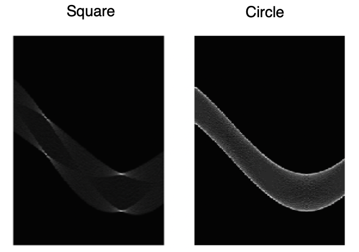
</center>

- Parameter space for circle
	- $(a,b)$: the center of the circle
	- $r$: the radius 

- **Pros**
	- All points are processed independently, so can cope with occlusion/outliers
	- Can detect multiple instances of a model
	- Some robustness to noise: noise points unlikely to contribute consistently to any single cell

- **Cons**
	- Complexity of search time increases exponentially with the number of model parameters
	- Spurious peaks due to uniform noise or non-target shapes
	- Trade-off noise-grid size (Hard to pick a good grid size)


**(7) Where can we use different fitting methods?**

- Line detection
- Estimating an homographic transformation
- Fitting a 3D object model

- RANSAC: Estimate homographic transformation
- Hough transform: Lane detection

## 9. Alignment

**(1) What is alignment**

<center>
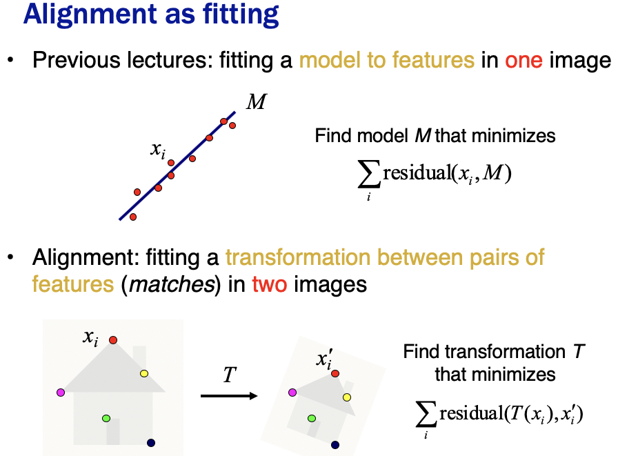
</center>

<center>


In general, we have

$
\begin{bmatrix}
 & & ... \\
x_i & y_i & 0 & 0 & 1 & 0 \\
0 & 0 & x_i & y_i & 0 & 1 \\
 & & ...
\end{bmatrix}
$
$
\begin{bmatrix}
m_1 \\
m_2 \\
m_3 \\
m_4 \\
t_1 \\
t_2
\end{bmatrix}
$ = 
$
\begin{bmatrix}
... \\zz
x_i^{'} \\
y_i^{'} \\
...
\end{bmatrix}
$
</center>


- Linear system with six unknowns. 
- Each match gives us two linearly independent equations. 
- How many pairs of features do we need?
	- need at least three to solve for the transformation parameters

**(2) What are different image geometric transformations?**

- Translation
- Rotation
- Aspect
- Affine
	- Affine transformation is combinations of linear transformation and translation 
- Perspective

**(3) What geometric properties are preserved under different transformations?**

- Translation
- Rotation
- Aspect
- Affine
	- Parallel lines remain parallel
- Perspective

**(4) How can RANSAC be used to perform robust image alignment?**

Because RANSAC is robust to outliers, and outliers can hurt the quality of our parameter estimates. For example

- an erroneous pair of **matching points** from two images
- Analogues to: an **edge point** that is noise, doesn't belong to the line we are fitting

We may have a set of putative mathces contains a very high percentage of outliers

**RANSAC loop**
 
1. Randomly select a *seed* group of matches
2. Compute transformation from seed group
3. Find *inliers* to this transformation
4. If the number of inliers is sufficiently large, re-compute least-squares estimate of transformation on all of the inliers

- Then keep the transformation with the largest number of inliers

## 10. Motion

What is motion in image?

**(2) What is optical flow?**

**Definition:** Optical flow is the **apparent** motion of brightness patterns in the image


**(3) What are optical flow assumptions?**

We estimate pixel motion from image $H$ to image $I$ by solving pixel correspondence problem

- given a pixel in $H$, look for **nearby** pixels of the same color in $I$

<center>
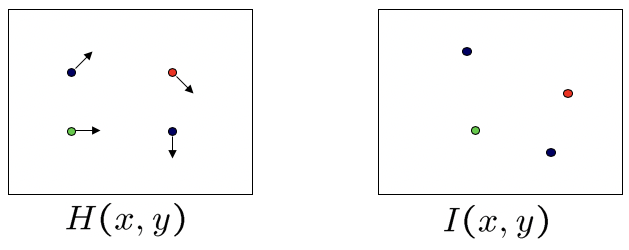
</center>

- **color constancy**: a point in $H$ looks the same in $I$
	- For grayscales images, this is **brightness constancy**

<center>
$H(x,y) = I(x+u,y+v)$
</center>
 
- **small motion**: points do not move very far

<center>
$I(x+u,y+v) = I(x,y) + \frac{\partial I}{\partial x}u + \frac{\partial I}{\partial y}v +$ higher order terms

$\approx I(x,y) + \frac{\partial I}{\partial x}u + \frac{\partial I}{\partial y}v$
</center>

**(4) What is aperture problem? How do Lucas & Kanade solve it?**

## 11. Segmentation

**Goal**:

- Separate image into coherent “objects”
- Group together similar-looking pixels for efficiency of further processing

**Top down vs. bottom up**

- **Top down**: pixels belong together because they are from the same object
- **Bottom up**: pixels belong together because they look similar

**(1) What are the Gestalt factors lead to grouping?**

- Proximity
- Similarity
- Common Fate
- Common Region
- Parallelism
- Symmetry
- Continuity
- Closure

<center>
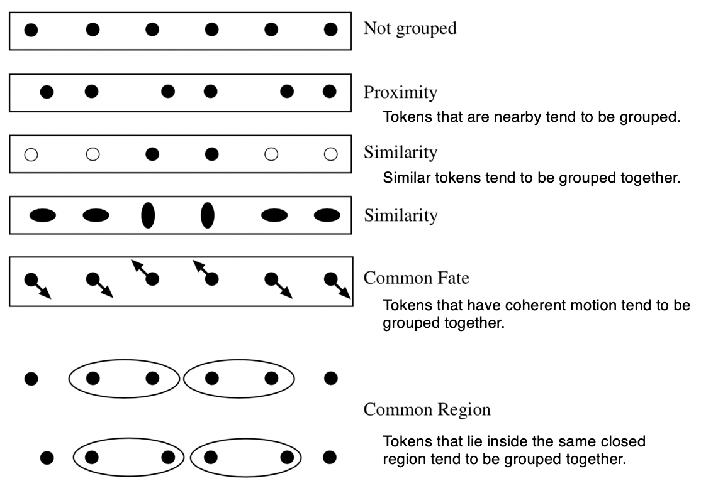
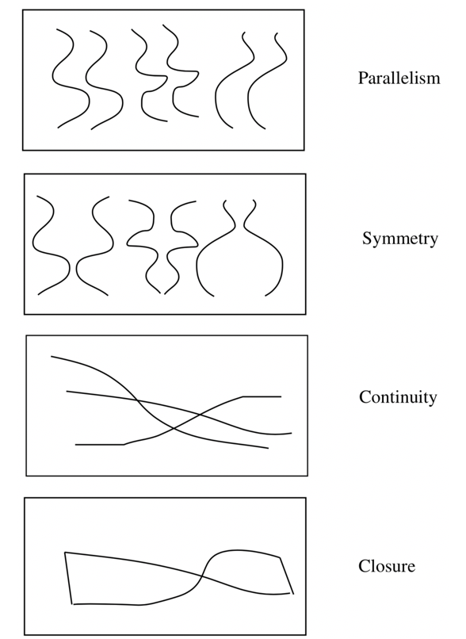
</center>

### Bottom-up (Mode finding and mean shift)

**(2) K-means**

- **Pros**
	- Simple, fast to compute
	- Converges to local minimum of within-cluster squared error
- **Cons**
	- Need to determine value of $k$
	- Sensitive to initialization
	- Sensitive to outliers
	- Can only detect spherical clusters

**(3) Mean-shift**

**Steps for segmentation**

- Find features (color, gradients, texture, etc)
- Initialize windows at individual feature points
- Perform mean shift for each window until convergence
- Merge windows that end up near the same “peak” or mode


- **Pros**
	- Does not assume shape on clusters
	- One parameter choice (window size, aka “bandwidth”)
	- Generic technique
	- Find multiple modes
- **Cons** 
	- Selection of window size
	- Does not scale well with dimension of feature space

**(4) SLIC (Simple Linear Iterative Clustering)**

???

### Bottom-up (Graph-based)

**Problem Formulation**

For a graph $G = (V,E)$

- $V$ is a set of nodes (i.e. pixels)
- $E$ is a set of undirected edges between pairs of pixels
- $w(v_i, v_j)$ is the weight of edge between $v_i$ and $v_j$

**Normalized cuts**

- Penalizes creating really small segments
- Normalize for the size of segments

<center>
$Ncut\ (A,B) = \frac{cut\ (A,B)}{volume\ (A)} + \frac{cut\ (A,B)}{volume\ (B)}$
</center>

where $volume\ (A) = $ sum of costs of all edges that touch A, in other words, how well connected are the points within $A$

- **Pros**
	- Generic framework, can be used with many different features and affinity
formulations
	- Provides regular segments
- **Cons**
	- Need to chose number of segments
	- High storage requirement and time complexity
	- Bias towards partitioning into equal segments
- **Usage**: Used for oversegmentation when you want regular segments

## 12. CNN, RNN, LSTM

**(1) CNN**

Convolutional neural network (CNN, or ConvNet) is a class of deep neural networks, most commonly applied to analyzing visual imagery

A convolutional neural network consists of an input and an output layer, as well as multiple hidden layers. The hidden layers of a CNN typically consist of convolutional layers, RELU layer i.e. activation function, pooling layers, fully connected layers and normalization layers.

- image classification
- feature extraction

**(2) RNN**

A recurrent neural network (RNN) is a class of artificial neural network where connections between nodes form a directed graph along a **temporal sequence**. This allows it to exhibit temporal dynamic behavior. Unlike feedforward neural networks, RNNs can use their internal state (memory) to process **sequences of inputs**. This makes them applicable to tasks such as unsegmented, connected handwriting recognition[1] or speech recognition

- image captioning
- In NLP, given a character/word/sentence/paragraph, predict the next possible character/word/sentence/paragraph
- speech recognition

<center>
$h_t = f_W(h_{t-1},x_t)$

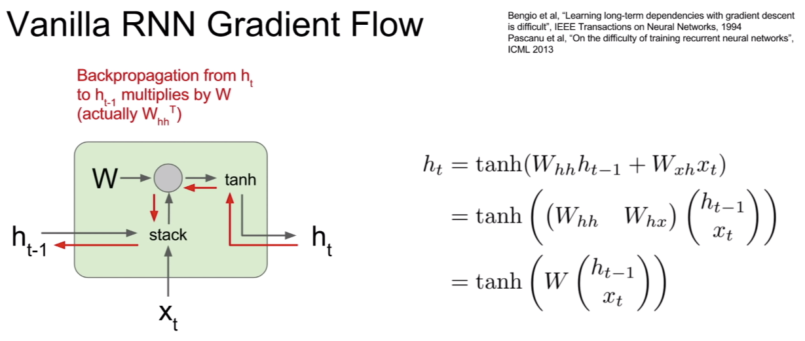
</center>


**(3) Vanilla RNN vs. LSTM (Long Short Term Memory)**

<center>
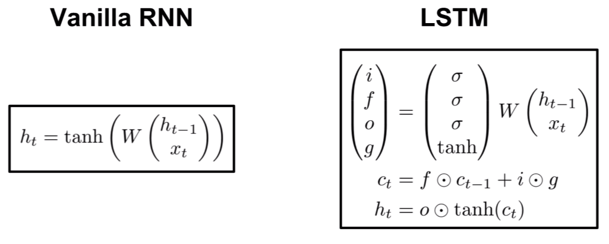

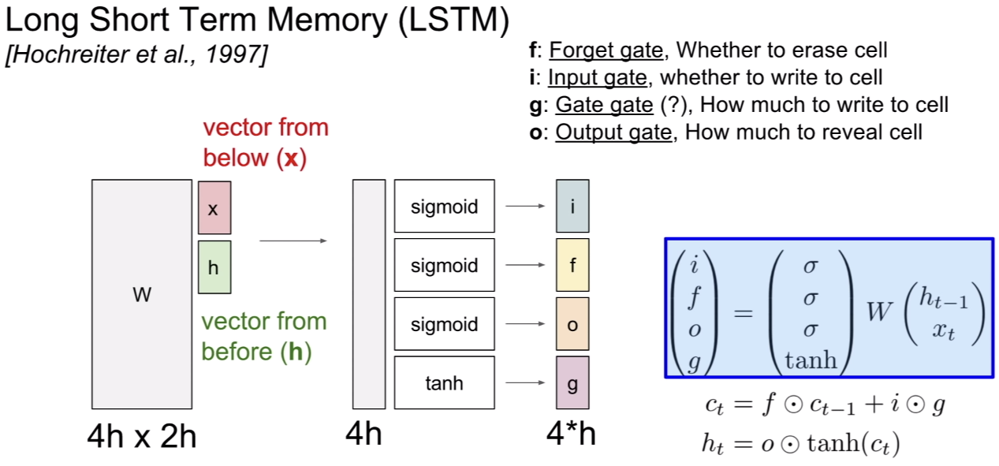


</center>

- **RNN**: backpropagate the gradient involves multiple matrix multiplication because
<center>
$h_t = \tanh (W_{hh} \cdot h_{t-1} + W_hx \cdot x_t)$
</center>
	- Largest singular value > $1$: **Exploding gradient**
	- Largest singular value < $1$: **Vanishing gradient**

- **LSTM**: upstream gradient only gets **multiplied element-wise** by the **forget gate $(f)$**, which is guaranteed between $0$ and $1$ due to the sigmoid function


## Questions

**1. Application of RANSAC (stanford slide)**: Estimate homographic transformation

**3. Does extracting multiple keypoints for multiple local maxima in scale space help recall or precision during feature matching?**