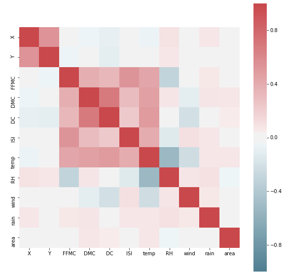
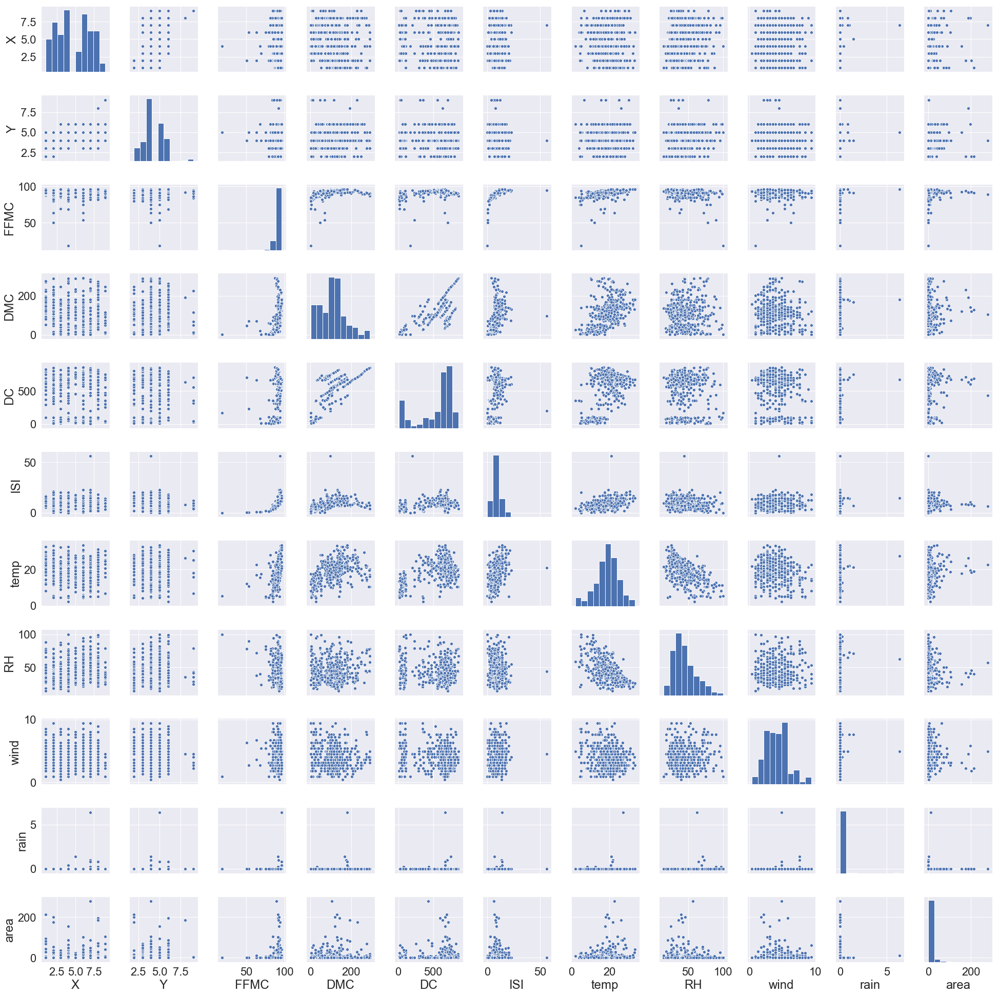

# DSC 440, HW#1

## Kefu Zhu

### Part I

#### 1.1 What is *data mining*? In your answer address the following:

**(a)** Is it another hype?

**Answer**: No it is not. As we are living in an age that is full of data and information, data mining meets the need since it can turns a large collection of data into knowledge. In other words, data mining can be viewed as a result of the natural evolution of information technology.

**(b)** Is it a simple transformation or application of technology developed from *databases*, *statistics*, *machine learning*, and *pattern recognition*?

**Answer**: 

No. Data mining is the process of discovering interesting patterns and knowledge from large amounts of data. And in order to achieve this goal, data mining involves many techniques, such as machine learning, statistics, information retrieval from database, rather than a simple transformation of them.

**(c)** We have presented a view that data mining is the result of the evolution of *database technology*. Do you think that data mining is also the result of the evolution of *machine learning research*? Can you present such views based on the historical progrss of this discipline? Address the same for the fields of *statistics* and *pattern recognition*

**Answer**: 

**(d)** Describe the steps involved in data mining when viewed as a process of knowledge discovery

- **Data cleaning**: remove noise and inconsistent data
- **Data integration**: combine multiple data sources
- **Data selection**: retrieve relevant data for the analysis task
- **Data transformation**: transforme and consolidate data into forms appropriate for mining by performing summary or aggregation operations
- **Data mining**: an essential process where intelligent methods are applied to extract data patterns
- **Pattern evaluation**: identify the truly interesting patterns representing knowledge based on interestingness measures
- **Knowledge presentation**: where visualization and knowledge representation techniques are used to present mined knowledge to users

#### 1.2 How is a *data warehouse* different from a *database*? How are they similar?

**Answer**: A **database** is a collection of interrelated data, and a **data warehouse** is a repository of information collected from multiple sources, stored under a unified schema, and usually residing at a single site. Although both **database** and **data warehouse** are designed to store information, **database** oftentime serves as a place to store initial raw data, while **data warehouse** tends to be place to store information after some data processing such as data cleaning, data integration and etc, aiming at facilitating some decision making or analysis. A constuction of **data warehouse** could involve some operations on multiple **databases**

#### 1.4 Present an example where data mining is crucial to the success of a business. What data mining functionalities does this business need (e.g., think of the kinds of patterns that could be mined)? Can such patterns be generated alternatively by data query processing or simple statistical analysis?

**Answer**: In credit risk management, a bank/financial institute needs to evaluate the risk of each customer when he/she applies for a credit card or loan. In order to have a better evaluation of the credit of a customer and to capture as many potential risks as possible, a deep and thorough data mining is crucial for the sucess of the business. Oftentimes, it requires integration of multiple data sources (Credit Bureau information of that customer, payment ability, debt amount and etc.), building predictive modeling on estimation of the risk, discovering pattern based on historical data on credit card/loan applications, and more. 

Such patterns or hidden information cannot be retreived only through data query processing or simple statistical analysis.

#### 1.5 Explain the difference and similarity between discrimination and classification, between characterization and clustering, and between classification and regression.

**Answer**: 

- **Discrimination vs. Classification**
	- **Discrimination** is a comparison of the general features of the target class data objects against the general features of objects from one or multiple contrasting classes, while **classification** is the process of finding a model (or function) that describes and distinguishes data classes or concepts. They are similar in a sense that both of them deal with the class data objects.
- **Characterization vs. Clustering**:
	- **Characterization** is a summarization of the general characteristics or features of a target class of data, while **clustering** analyzes data objects without consulting class labels. They are similar in a sense that both of them work with groups of data objects that are similar to each other within group and different from each other across groups.
- **Classification vs. Regression**:
	- **Classification** is the process of finding a model (or function) that describes and distinguishes data classes or concepts, while **regression** models continuous-valued functions. They are similar in a sense that both of them are predicting/estimating the unknown.

#### 1.7 Outliers are often discarded as noise. However, one person’s garbage could be another’s treasure. For example, exceptions in credit card transactions can help us detect the fraudulent use of credit cards. Using fraudulence detection as an example, propose two methods that can be used to detect outliers and discuss which one is more reliable.

**Answer**: 

- **Classfication**: Build a classification model to predict the outlier based on past fraudulent transactions.
- **Clustering**: Cluster trasactions into groups and identify the ones that aare not in any group as outliers.

If we only speak of reliability, the clustering method might be more reliable since it is an unsupervised method and makes no assumptions. However, not every outlier is a fraudulent transaction. So if we stand from a business perspective, by building a model based on the pattern/behavior of past fraudulent transactions, we may be able to identify the actual fraudulent transactions better rather than only knowing some "outliers" which do not necessarilly provide direct actual value to the business.

#### 1.9 What are the major challenges of mining a huge amount of data (e.g., billions of tuples) in comparison with mining a small amount of data (e.g., data set of a few hundred tuple)?


**Answer**: Two main challenges can often be encountered in a process of mining huge amount of data: **efficiency** and **scalability**. 

- **Efficiency**: Once the data size grows dramatically, being able to extract the information in an efficienit way is crucial. If the cost of mining the data exceeds the value that the extracted information can provides, it is pointless to do any data mining.
- **Scalability**: When mining small data source, we often do not need to worry about the issue of scalability since the size of data is relatively limited. But when we try to mine data from a much larger and potentially growing source, having algorithms that can scale as the data source grows is very important for continuously generating useful information in the future.

### Part II

**Data Source**: Forest Fires Data Set from the UCI Machine Learning Repository: [https://archive.ics.uci.edu/ml/datasets/Forest+Fires](https://archive.ics.uci.edu/ml/datasets/Forest+Fires)

#### Summary Statistics

<center>

</center>

**Observation**: 

If we look closely to the target variable, `area`, we can notice that the maximum value is way larger than the 75-percentile. It may indicate possible extreme value/outlier.

Largest top 10 values for the `area` variable: `[105.66, 154.88, 174.63, 185.76, 196.48, 200.94, 212.88, 278.53, 746.28, 1090.84]`

After a closer look, we do see two records with extremely large values compared to others, `746.28` and `1090.84`. Hence, we exclude those two records in the following explorative data analysis. These records should be treated separately in any future potential modeling process.

#### Correlation Heat Map

<center>

</center>

**Observation**:

1. All index values from the FWI (Fire Weather Index) system have strong correlation with each other, which makes sense since all of them are trying to measure the same object.
2. `temp` and `RH (relative humidity)` has a negative correlation which is also align with our commen sense.
3. Our main target, `area`, does not seem to have any directly clear correlation with any other variables in this dataset.

#### Pairwise Plots

<center>

</center>

```python
# Number of unique coordinates
len(np.unique([[x,y] for x,y in zip(forest_data_sub.X,forest_data_sub.Y)], axis = 0))
```
```
36
```
```python
# Number of the events with zero burned area
print('{} records ({:.2f}%) have zero burned area'.format(sum(forest_data_sub.area == 0), 
                                                      100 * sum(forest_data_sub.area == 0)/forest_data_sub.shape[0]))
```
```
247 records (47.96%) have zero burned area
```

**Observation**:
    
1. Although we have `517` different forest fire events recorded, they only happen in `36` different locations
2. Most of the events happen with zero or very little raining
3. Nearly half (`47.96%`) of the events have zero burned area, which should be considered when try to model the target variable