# DSC 440, HW2
## Kefu Zhu


**Answer**:

Based on the formula 

<center>
$median = L_1 + (\frac{N/2 - (\sum freq)_l}{freq_{median}}) \cdot width$
</center>


The approximate median value is $21 + (\frac{3192/2 - (200+450+300)}{1500}) \cdot 30 \approx 33.51$


**Answer**:

(a)

$Euclidean\ distance = \sqrt{(22-20)^2 + (1-0)^2 + (42-36)^2 + (10-8)^2} \approx 6.7082$

(b)

$Manhattan\ distance = 2 + 1 + 6 + 2 = 11$

(c)

$Minkowski\ distance\ (q=3) = (|22-20|^3 + |1-0|^3 + |42-36|^3 + |10-8|^3)^{1/3} \approx 6.1534$

(d)

$supremum\ distance = \max_f^p |x_{if} - x_{jf}| = 6$


**Answer**:

I propose and compare two differeent methods for median approximation here: **median of the medians** and **estimate by interpolation**

- **median of the medians**: 

	Breaking the entire list to sublists of 5 items will take $O(n)$. Sort each sublist and determine the median for each sublist. Since every sublist is short (only have 5 items), it takes $O(n)$. We then reecursively determine the median of the set of medians generated from sublists. The total complexity of this approach on average is $O(n)$
- **estimate by interpolation**: 
<center>
$median = L_1 + (\frac{N/2 - (\sum freq)_l}{freq_{median}}) \cdot width$
</center>

	To create the equal-width bins, we need to sort the data first, which on averege has complexity of $O(n\ logn)$. Putting items into the correct bin takes $O(n)$, which can also be done along the sorting process. Extracting the median bin and count the number of items in there takes $O(width)$. Computing the number of items in bins that are lower than the median bin takes $O(n)$. Since $O(width) < O(n) < O(n\ logn)$, the total complexity is $O(n\ logn)$.

To gain more efficiency, rather than dividing into sublists of 5 items, we could divide the entire list into somewhat larger sublists (e.g. 11 items) with fewer number of sublists in total. That way we can do less recursive operations later on in the sacrifice of some accuracy.

Similarly, since the complexity of **estimate by interpolation** comes mainly from sorting process, we can adapt the concept of diving entire list into sublists idea. That will result in faster sorting time overall and also loses some accuracy on the other hand.


**Answer**:

**(a)**

|  | $A_1$ | $A_2$ | Euclidean | Manhattan | supremum | cosine similarity |
|:-----:|:-----:|:-----:|:---------:|:---------:|:--------:|:-----------------:|
| $x_1$ | 1.5 | 1.7 | 1 | 1 | 1 | 1 |
| $x_2$ | 2 | 1.9 | 5 | 5 | 2 | 4 |
| $x_3$ | 1.6 | 1.8 | 3 | 3 | 4 | 2 |
| $x_4$ | 1.2 | 1.5 | 2 | 2 | 4 | 3 |
| $x_5$ | 1.5 | 1.0 | 4 | 4 | 2 | 5 |

**(b)**

After normalization, the new data point, $x = (0.4667, 0.5333)$

|  | $A_1$ | $A_2$ | Euclidean |
|:-----:|:------:|:------:|:---------:|
| $x_1$ | 0.4688 | 0.5312 | 1 |
| $x_2$ | 0.5128 | 0.4872 | 4 |
| $x_3$ | 0.4706 | 0.5294 | 2 |
| $x_4$ | 0.4444 | 0.5556 | 3 |
| $x_5$ | 0.6 | 0.4 | 5 |

**Note**: The ranking based on normalized data is the same with cosine similarity now

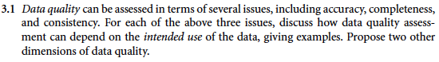

**Answer**:

- **Accuracy**: 

	Different users of the data may have different definition for what is "accurate". A data scientist may consider a dataset as inaccurate if 20% of the data are outdated or missing, while a business analyst may not think of it the same way since with the rest 80% accurate data, he can already draw an accurate conclusion of the overall market situation.
	
- **Completeness**:

	Facing the same dataset, users with different intent will have different feedback on the completeness of the data. For some users, maybe they do not need some of the features in the dataset that are missing to conduct their anaylsis and they feel the dataset is complete (They never realize some features are missing since they only work with a portion of the dataset).
	
	On the other hand, some other people will have completely opposite feedback about the completeness of the data if they work with the entire dataset or need information from features that have missing values.

- **Consistency**:

	Different users may have their own way on working with the same feature in a dataset. For people who work with transformed values such as percentage, the inconsistent use of unit have zero influence on them, which will have huge impact on users who work directly with the raw value.
	
Some other dimentions that can be used to measure the quality of data include **timeliness** and **interpretability**.

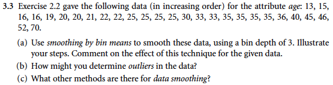

**Answer**:

**(a)**:

Steps:

1. Group every 3 data points together in a bin
2. Replace each value in a bin with the mean value of the bin

Applying the smoothing by bin means can remove some noise in the data

**(b)**:

Outliers exist if any bins (usually the first or the last bin) have extremely lower/higher bin values compared to their neighbors

**(c)**: We could also smooth the data by fitting some reegressions or removing outliers by clustering

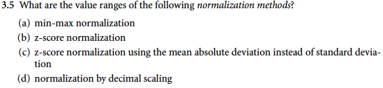

**Answer**:

**(a) min-max normalization**: $[-\infty, +\infty]$, the range can be defined by users based on different intents

**(b) z-score normalization**: $[-\infty, +\infty]$

**(c) z-score normalization using the mean absolute deviation**: $[-\infty, +\infty]$

**(d) normalization by decimal scaling**: $[-1.0, 1.0]$

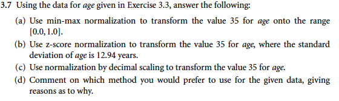

**Answer**:

**(a)**: min=max normalization

$v_i^{'} = \frac{v_i -\min(A)}{max(A) - min(A)} (new\_max_A - new\_min_A) + new\_min_A = \frac{35-13}{70-13}*1 + 0 \approx 0.3860$

**(b)**: z-score normalization

$v_i^{'} = \frac{v_i -\bar{A}}{\sigma_A} = \frac{35 - 29.96}{12.94} \approx 0.3893$

**(c)**: Normalize value $35$ by decimal scaling will results in $0.35$

**(d)**: I would prefer using the z-score normalization because it does not suffer from "out-of-bound" problem like min-max normalization does, and also preserves the original distribution of data better than the decimal scaling

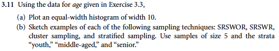

**Answer**:

**(a)**

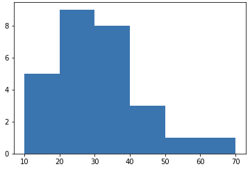

**(b)**

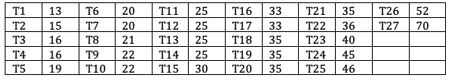

- SRSWOR: [40, 35, 70, 25, 36]
- SRSWR: [22, 16, 40, 16, 30]
- Cluster sampling: Each column can be considered a cluster, we pick s = 2

<center>
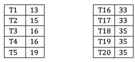
</center>

- Stratified sampling: 

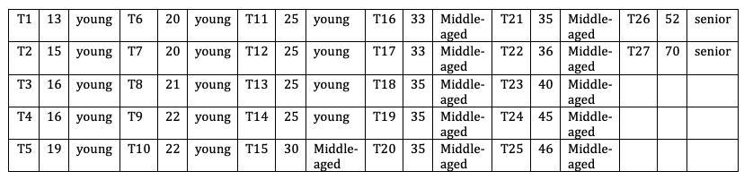

<center>
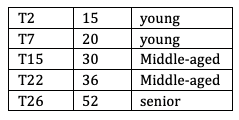
</center>


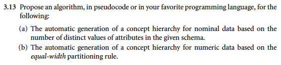

**Answer**:

**(a)**

```
begin

// Initialize a dictionary to store, Attribute:Unique_Counts
concept_hierarchy = {}

// Loop over all attributes and 
// count number of unique values within each attribute
for each attribute 'X' in schema:
	'X'_unique = count distinct 'X' values
	concept_hierarchy['X'] = 'X'_unique

// Rank the hierarchy based on number of unique values of attributes
sort concept_hierarchy by values in ascending order

end
```

**(b)**

```
begin

// Initialize a dictionary to store, Attribute:Unique_Counts
concept_hierarchy = {}

// For each level of hierarchy (different attributes)
for each attribute 'X' in schema:	
	// User defined width 
	width_'X' = USER INPUT
	// User defined min and max for binning
	_min_'X' = USER INPUT
	_max_'X' = USER INPUT
	// Compute the number of bins (steps) for each level of hierarchy
	steps_'X' = (_max_'X' - _min_'X')/width_'X'
	
// First level of hierarchy (X1: first attribute)
for i from 1 to steps_'X1':
	// 'Current' key stores the values for each bin 
	// in the first level of hierarachy
	concept_hierarchy[i] = {'Current': []}
	// Second level of hierarchy (X2: second attribute)
	for j from 1 to steps_'X2':
		// 'Current' key stores the values for each bin 
		// in the first level of hierarachy
		concept_hierarchy[i][j] = {'Current': []}
		// More for loops if have more levels of hierarchy
		for ...

// 1. Rank data based on first level of hierarchy

// Initialize the min and max bound for binning
cur_min_'X1' = _min_'X1'
cur_max_'X1' = cur_min_'X1' + width_'X1'
// Iterate over all bins
for i from 1 to steps_'X1':
	// For every value in the first attribute
	for m in 'X1':
		# If the value falls into the current bin
		if m >= cur_min_'X1' and m < cur_max_'X1':
			# Put the data into the bin
			concept_hierarchy[i]['Current'] = m
	
	// One step forward (Change bin)
	cur_min_'X1' = cur_max_'X1'
	cur_max_'X1' = cur_min_'X1' + width_'X1'
			
// 2. For each data point in the first level of hierarchy
//	   rank data based on second level of hierarchy

// For each bin of first level hierarchy
for i from 1 to steps_'X1':
	// Find their values for second attribute
	'X2'_sub
	
	// Set min and max bound binning in level 2 hierarchy
	cur_min_'X2' = _min_'X2'
	cur_max_'X2' = cur_min_'X2' + width_'X2'
	// Iterate over all bins in level 2 hierarchy
	for j from 1 to steps_'X2':
		// For every value in the second attribute
		for n in 'X2'_sub:
			# If the value falls into the current bin
			if n >= cur_min_'X2' and n < cur_max_'X2':
				# Put the data into the bin
				concept_hierarchy[i][j]['Current'] = n
		
		// One step forward (Change bin)
		cur_min_'X2' = cur_max_'X2'
		cur_max_'X2' = cur_min_'X2' + width_'X2'
		
// More loops if have more levels of hierarchy
...

```