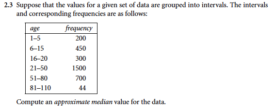
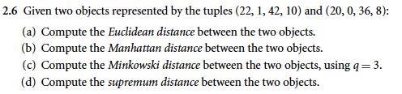
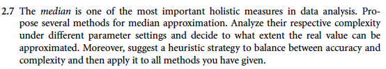
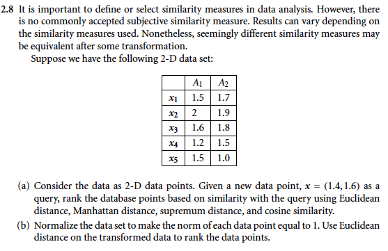

# DSC 440, HW2
## Kefu Zhu

**Answer**:

Based on the formula 

$median = L_1 + (\frac{N/2 - (\sum freq)_l}{freq_{median}}) \cdot width$

The approximate median value is $21 + (\frac{3192/2 - (200+350+300)}{1500}) \cdot 30 = 35.92$

**Answer**

(a)

$Euclidean\ distance = \sqrt{(22-20)^2 + (1-0)^2 + (42-36)^2 + (10-8)^2} \approx 6.7082$

(b)

$Manhattan\ distance = 2 + 1 + 6 + 2 = 11$

(c)

$Minkowski\ distance\ (q=3) = (|22-20|^3 + |1-0|^3 + |42-36|^3 + |10-8|^3)^{1/3} \approx 6.1534$

(d)

$supremum\ distance =$

**Answer**

**Answer**

**Answer**

### 3.1

### 3.3

### 3.5

### 3.7

### 3.11

###  3.13