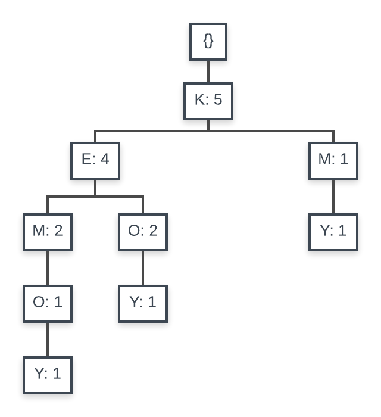

# DSC 440, HW3

## Kefu Zhu

### 6.1 Suppose you have the set C of all frequent closed itemsets on a data set D, as well as the support count for each frequent closed itemset. Describe an algorithm to determine whether a given itemset X is frequent or not, and the support of X if it is frequent.

**Answer**:

- **Determine if $X$ is frequent**
	- If $X \in C$, then $X$ is frequent.
	- If $X \subset m$, for any $m \in C$, then $X$ is frequent.

- **Determine the support of $X$**
	- If $X \in C$, then we know the support of $X$ since we know the support count for each item in set $C$
	- If $X \subset m$, then the support of $X$ is at least the support of $m$
	- If $X \subset m$ and $X\subset n$, for $m \in C$ and $n \in C$, then the support of $X$ is at least the $\max\{support(m),\ support(n)\}$

### 6.3 The Apriori algorithm makes use of prior knowledge of subset support properties.

**(a) Prove that all nonempty subsets of a frequent itemset must also be frequent.**

**Answer**:

Suppose $X$ is a frequent itemset in dataset $D$ where the minimum number of support required to be frequent is $minsup$. Then we have

$support(X) \ge minsup$

Hence, $\forall\ Y \subset X$, and $Y \ne \emptyset$, we have

$support(Y) \ge support(X) \ge minsup$

Therefore, $\forall\ Y \subset X$, and $Y \ne \emptyset$, $Y$ is also a frequent itemset

**(b) Prove that the support of any nonempty subset $s'$ of itemset $s$ must be at least as great as the support of $s$.**

**Answer**:

For any transaction $T$ in dataset $D$,

$\{T \in D : s \subset T\} \subset \{T \in D : s' \subset T\}$

Therefore,

$support(s') = |\{T \in D : s' \subset T\}| \ge |\{T \in D : s \subset T\}| = support(s)$

$\Rightarrow support(s') \ge support(s)$

**(c) Given frequent itemset $l$ and subset $s$ of $l$, prove that the confidence of the rule “$s' \Rightarrow (l-s')$” cannot be more than the confidence of “$s \Rightarrow (l-s),$” where $s'$ is
a subset of $s$.**

**Answer**:

We have 

1. confidence of the rule "$s' \Rightarrow (l-s')$" $= \frac{|T \in D\ :\ s' \in T, (l-s') \in T|}{|\{T \in D\ :\ s' \in T\}|}$
2. confidence of the rule "$s \Rightarrow (l-s)$" $= \frac{|T \in D\ :\ s \in T, (l-s) \in T|}{|\{T \in D\ :\ s \in T\}|}$

$\because |T \in D:s' \in T, (l-s') \in T| = |T \in D:s \in T, (l-s) \in T|$

$\because |\{T \in D\ :\ s' \in T\}| \ge |\{T \in D\ :\ s \in T\}|$

$\therefore \frac{|T \in D\ :\ s' \in T, (l-s') \in T|}{|\{T \in D\ :\ s' \in T\}|} \le \frac{|T \in D\ :\ s \in T, (l-s) \in T|}{|\{T \in D\ :\ s \in T\}|}$

Hence, the confidence of the rule "$s' \Rightarrow (l-s')$" is no more than the confidence of the rule "$s \Rightarrow (l-s)$"

**(d) A partitioning variation of Apriori subdivides the transactions of a database $D$ into $n$ nonoverlapping partitions. Prove that any itemset that is frequent in $D$ must be frequent in at least one partition of $D$.**

**Answer**:

Define 

- $minsup = $ minimum support in percentage
- $n$ nonoverlapping partitions of $D$ are $D_1, D_2, D_3, ..., D_n$, where $\cup_{i=1}^n D_i = D$
- $S$ is an itemset that is frequent in $D$.

We know $support(S) \ge minsup \times |D|$. If we can prove that when $S$ is not frequent in any $D_i$, $support(S) \ge minsup \times |D|$ cannot be true. We then successfully prove this question by contradiction. In other words, if $support(S) \ge minsup \times |D|$ is true, $S$ must be frequent in at least one $D_i$

Denote $c_1, c_2, ..., c_n$ the support of $S$ in $D_1, D_2, ..., D_n$. By assumption, $S$ is not frequent in any of $D_i$, which means

$c_1 < minsup \times |D_1|$

$c_2 < minsup \times |D_2|$

...

$c_n < minsup \times |D_n|$

By summing up the equations above, we have

$support(S) = \sum_{i=1}^n c_i < minsup \times |D|$

which contradicts to the fact that $support(S) \ge minsup \times |D|$.

Therefore, if $support(S) \ge minsup \times |D|$ is true, $S$ must be frequent in at least one $D_i$

### 6.4 Let $c$ be a candidate itemset in $C_k$ generated by the Apriori algorithm. How many length $(k-1)$ subsets do we need to check in the prune step? Per your previous answer, can you give an improved version of procedure has infrequent subset in Figure 6.4

**Answer**:

In Apriori algorithm, when generate $C_k$ from $L_{k-1}$, we need to check $k \choose k-1$ $= k$ subsets of length-$(k-1)$ in the prune step.

One way to improve the `has_infrequent_subset()` procedure is by reducing the number of subset $s$ for checking. 

We know 

- $l_1$ and $l_2$ are frequent itemset from $L_{k-1}$
- $l_1$ and $l_2$ only differ by the last item
	- $l_1[1] = l_2[1], l_1[2] = l_2[2], ..., l_1[k-2] = l_2[k-2]$
	- $l_1[k-1] \ne l_2[k-1]$
- $C_k$ is the union of two length-$(k-1)$ itemsets $l_1$ and $l_2$ 
	- $C_k = \{l_1[1],l_1[2],...,l_1[k-2],l_1[k-1], l_2[k-1]\}$

Originally, we are checking all length-$(k-1)$ itemsets for each candidate from $C_k$ for infrequent patterns. However, since we already know two length-$(k-1)$ itemsets are frequent, which are $l_1$ and $l_2$ from $L_{k-1}$, we do not need to check them again.

In other words, we only check length-$(k-1)$ itemset from $C_k$ if it contains both $l_1[k-1]$ and $l_2[k-1]$. Because if a length-$(k-1)$ itemset contains only one of $l_1[k-1]$ and $l_2[k-1]$, then such itemset must be either $l_1$ or $l_2$. 

By doing so, we will be able to reduce the number of length-$(k-1)$ itemset to check (scanning the entier $L_{k-1}$) for each candidate in $C_k$

### 6.5 Section 6.2.2 describes a method for generating association rules from frequent itemsets. Propose a more efficient method. Explain why it is more efficient than the one proposed there. (*Hint*: Consider incorporating the properties of Exercises 6.3(b), (c) into your design.)

**Answer**:

Suppose we have threshold for $min\_sup$ and $\min\_conf$. We can modify the method describe in section 6.2.2 as following:

1. For each frequent itemset $l$, generate all nonempty subsets of $l$
2. Rather than computing the confidence for every nonempty subset $s$, we eliminate some of them by the following criterion:
	- If the confidence of $s \Rightarrow (l-s)$ is less than $min\_conf$, then we do not need to generate $s' \Rightarrow (l-s')$ for all $s'$, where $s'$ is subset of $s$

The reason we can reduce the number of computation and have a more efficient algorithm is that from 6.3(b) and 6.3(c), we know

- The support of any nonempty subset $s'$ of itemset $s$ must be at least as great as the support of $s$
- For any given frequent itemset $l$ and subset $s$ of $l$, the confidence of the rule “$s' \Rightarrow (l-s')$” cannot be more than the confidence of “$s \Rightarrow (l-s),$” where $s'$ is
a subset of $s$

### 6.6 A database has five transactions. Let $min\_sup = 60\%$ and $min\_conf = 80\%$.

| $TID$ | $items\_bought$ |
|:------:|:---------------|
| $T100$ | $[M,O,N,K,E,Y]$ |
| $T200$ | $[D,O,N,K,E,Y]$ |
| $T300$ | $[M,A,K,E]$ |
| $T400$ | $[M,U,C,K,Y]$ |
| $T500$ | $[C,O,O,K,I,E]$ |

**(a) Find all frequent itemsets using Apriori and FP-growth, respectively. Compare the efficiency of the two mining processes**

- **Apriori**

First scan $\rightarrow C_1$: 

| Itemset | Support |
|:-------:|:-------:|
| M | 3 |
| O | 3 |
| N | 2 |
| K | 5 |
| E | 4 |
| Y | 3 |
| D | 1 |
| A | 1 |
| U | 1 |
| C | 2 |
| I | 1 |

$C_1 \rightarrow L_1$:

| Itemset | Support |
|:-------:|:-------:|
| M | 3 |
| O | 3 |
| K | 5 |
| E | 4 |
| Y | 3 |

$L_1 \rightarrow C_2$ (Second Scan):

| Itemset | Support |
|:-------:|:-------:|
| MO | 1 |
| MK | 3 |
| ME | 2 |
| MY | 2 |
| OK | 3 |
| OE | 3 |
| OY | 2 |
| KE | 4 |
| KY | 3 |
| EY | 2 |

$C_2 \rightarrow L_2$:

| Itemset | Support |
|:-------:|:-------:|
| MK | 3 |
| OK | 3 |
| OE | 3 |
| KE | 4 |
| KY | 3 |

$L_2 \rightarrow C_3$:

| Itemset |
|:-------:|
| OKE |

$C_3 \rightarrow L_3$ (Third Scan):

| Itemset | Support |
|:-------:|:-------:|
| OKE | 3 |

- **FP-growth**

First scan $\rightarrow$ **Header Table**:

| Item | Frequency |
|:-------:|:-------:|
| K | 5 |
| E | 4 |
| M | 3 |
| O | 3 |
| Y | 3 |

Second scan $\rightarrow$ FP-tree:

Then we construct conditional pattern base:

| Item | Conditional Pattern Base | Conditional FP-tree | Frequent Patterns |
|:----:|:-----------------------------------------:|:-------------------:|:---------------------------------:|
| Y | $\{\{K,E,M,O:1\},\{K,E,O:1\},\{K,M:1\}\}$ | $<K:3>$ | $\{K,Y:3\}$ |
| O | $\{\{K,E,M:1\},\{K,E:2\}\}$ | $<K:3,\ E:3>$ | $\{K,O:3\},\{E,O:3\},\{K,E,O:3\}$ |
| M | $\{\{K,E:2\},\{K:1\}\}$ | $<K:3>$ | $\{K,M:3\}$ |
| E | $\{\{K:4\}\}$ | $<K:4>$ | $\{K,E:4\}$ |

**Conclusion**:

Compared to FP-growth, Apiori scans the whole database many more times, which apparently leads to a lower efficiency. In addition, unlike Apiori, FP-growth does not need to generate candidate itemsets but instead it creates FP-tree which is faster.

Therefore, FP-growth is more efficient than Apiori

**(b) List all the *strong* association rules (with support $s$ and confidence $c$) matching the following metarule, where $X$ is a variable representing customers, and $item_i$ denotes variables representing items (e.g., “$A$,” “$B$,”):**

$\forall x \in transaction,\ buys(X,item_1) \land buys(X, item_2) \Rightarrow buys(X,item_3)\ \ \ [s,c]$

**Answer**:

- $K, O \rightarrow E\ (60\%, 100\%)$
- $O, E \rightarrow K\ (60\%, 100\%)$

### 6.11 Most frequent pattern mining algorithms consider only distinct items in a transaction. However, multiple occurrences of an item in the same shopping basket, such as four cakes and three jugs of milk, can be important in transactional data analysis. How can one mine frequent itemsets efficiently considering multiple occurrences of items? Propose modifications to the well-known algorithms, such as Apriori and FP-growth, to adapt to such a situation.

**Answer**:

For a single transaction, the current Apriori and FP-growth only care whether an item appears in it or not. To adapt to the situation mentioned in the question, a natural modification of both algorithm is to consider both the existence of an item as well as its number of occurence within each transaction.

For example, in the transactional table in 6.6, for item $O$, it will be treated differently for $T200$ and $T500$. We will extract things like $(O,1)$ and $(O,2)$ from those two transactions respectively. Hence, the computation within Apriori and FP-growth will also change accordingly.