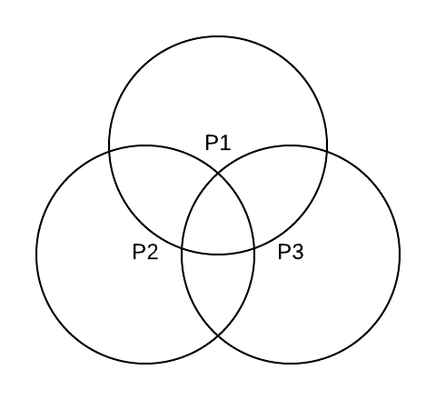
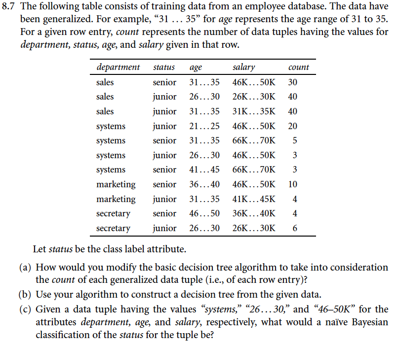
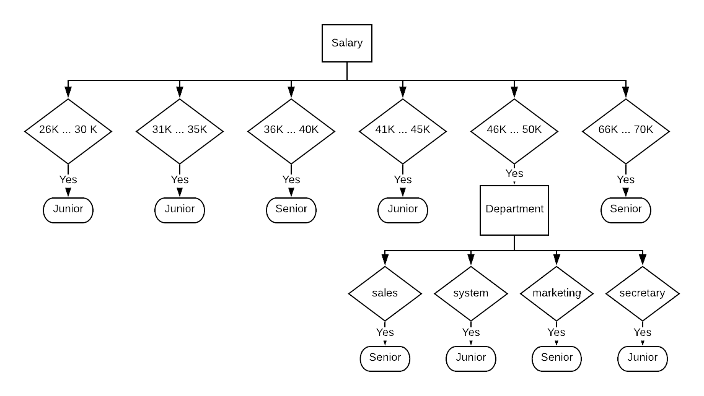
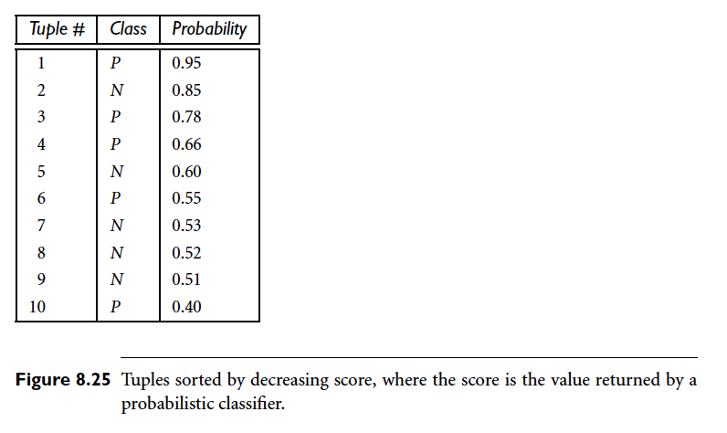
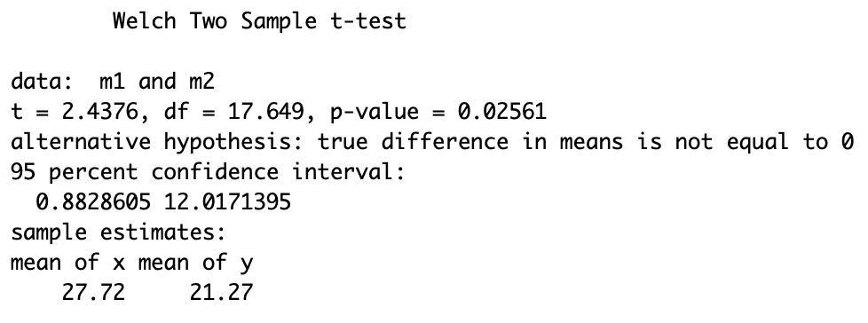

# DSC 440, HW4
## Kefu Zhu

### 7.5

Section 7.2.4 presented various ways of defining negatively correlated patterns. Consider Definition 7.3: “Suppose that itemsets $X$ and $Y$ are both frequent, that is, $sup(X) \ge min\_sup$ and $sup(Y) \ge min\_sup$, where $min\_sup$ is the minimum support threshold. If $(P(X|Y)+P(Y|X))/2 < \epsilon$, where $\epsilon$ is a negative pattern threshold, then pattern $X \cup Y$ is a **negatively correlated pattern**.” Design an efficient pattern growth algorithm for mining the set of negatively correlated patterns.

**Answer**:


**1. Apriori**:

To mine the nagtively correlated patterns, we first generate all frequent itemsets from the database $D$ using Apriori. 

For a unique pair $(X,Y)$ in the list of frequent itemsets, we first create a subset of the original database, $D_x$, where $D_x$ is a collection of all the transactions that contains $X$. Next, we compute $P(Y|X)$ by counting how many transactions in $D_x$ also contains $Y$, and then divide it by the total number of transactions in $D_x$.

Similarly, we can also compute $P(X|Y)$.

After we have both $P(X|Y)$ and $P(Y|X)$, we can check whether $X \cup Y$ is a negatively correlated pattern based on the condition, $(P(X|Y)+P(Y|X))/2 < \epsilon$

We then iterate the process above for every unique pair in the list of frequent itemsets from Apriori to find all negatively correlated patterns.

**2. FP-growth**:

To mine the nagtively correlated patterns, we first generate all frequent itemsets from the database $D$ using FP-growth.

For a unique pair $(X,Y)$ from the list of frequent itemsets, where $X = \{X_1, X_2, X_3, ..., X_n\}$ and $Y = \{Y_1, Y_2, Y_3, ..., Y_n\}$.

To compute $P(X|Y)$, where $P(X|Y) = \frac{P(X \cap Y)}{P(Y)} = \frac{\#\ of\ paths\ that\ contain\ both\ X\ and\ Y}{\#\ of\ paths\ that\ contain\ Y}$, because we already know the value for denominator, $\{\#\ of\ paths\ that\ contain\ Y\}$ from the FP-growth result, all we need to compute is the numerator, $\{\#\ of\ paths\ that\ contain\ both\ X\ and\ Y\}$. 

Similarly, to compute $P(Y|X)$, where  $P(Y|X) = \frac{P(X \cap Y)}{P(X)} = \frac{\#\ of\ paths\ that\ contain\ both\ X\ and\ Y}{\#\ of\ paths\ that\ contain\ X}$, since we know the value for denominator, $\{\#\ of\ paths\ that\ contain\ X\}$, we only need the value for the numerator, $\{\#\ of\ paths\ that\ contain\ both\ X\ and\ Y\}$

To compute the value for the common numerator, $\{\#\ of\ paths\ that\ contain\ both\ X\ and\ Y\}$, we need to perform the following steps

1. Locate all local paths that start with $Y_1$ and ends with $Y_n$, denote as $Region_{middle}$
	- Find the local paths by starting with the Node-link of $Y_n$ in the header table and traverse the paths back to different $Y_1$ in the FP-tree 
2. For every local path we find from step 1, traverse back from $Y_1$ (toward the root of the tree) to find its parent path that starts at the root and ends at $Y_1$, denote these parent paths as $Region_{parent}$
3. For every local path we find from step 1, find all of its child paths, paths that starts at $Y_n$ and ends at a leaf node, denote these child paths as $Region_{child}$
4. Initialize a deep copy of $X$, named $X_{reduced}$
4. If any $X_i$ is found in either $Region_{middle}$ or $Region_{parent}$, remove it from the itemsets $X_{reduced}$. 
	- Because if any $X_i$ exists in $Region_{middle}$ or $Region_{parent}$, when $Y$ exists, that $X_i$ must also exist. We do not need to worry about that $X_i$ anymore.
5. For the revised $X_{reduced}$, perform depth-first search and count the number of occurence of $X_{reduced}$ in the $Region_{child}$. The count value is $\{\#\ of\ paths\ that\ contain\ both\ X\ and\ Y\}$

Now we can compute the value for both $P(X|Y)$ and $P(Y|X)$, and then check against condition $(P(X|Y)+P(Y|X))/2 < \epsilon$ to determine whether $X \cup Y$ is a negatively correlated pattern

We then iterate the whole process above for every unique pair in the list of frequent itemsets from FP-growth result to find all negatively correlated patterns.

### 7.9

Section 7.5.1 defined a pattern distance measure between closed patterns $P_1$ and $P_2$ as

<center>
$Pat\_Dist(P_1,P_2) = 1 - \frac{|T(P_1)\ \cap\ T(P_2)|}{|T(P_1)\ \cup\ T(P_2)|}$
</center>

where $T(P_1)$ and $T(P_2)$ are the supporting transaction sets of $P_1$ and $P_2$, respectively. Is this a valid distance metric? Show the derivation to support your answer.

**Answer**:

To prove this distance metric is valid, we check four conditions:

- **Non-negativity: $d(x,y) \ge 0$**

	$\because |T(P_1) \cup T(P_2)| \ge |T(P_1) \cap T(P_2)|, |T(P_1) \cup T(P_2)| \ge 0, |T(P_1) \cap T(P_2)| \ge 0$
	
	$\therefore 0 \le \frac{|T(P_1)\ \cap\ T(P_2)|}{|T(P_1)\ \cup\ T(P_2)|} \le 1$
	
	$\therefore 0 \le Pat\_Dist(P_1,P_2) \le 1$


- **Identity of Indiscernibles: $d(x,y) = 0 \Leftrightarrow x = y$**

	- If $Pat\_Dist(P_1,P_2) = 0$, then $\frac{|T(P_1)\ \cap\ T(P_2)|}{|T(P_1)\ \cup\ T(P_2)|}$ must equal to 1
	
		which means $|T(P_1) \cap T(P_2)| = |T(P_1) \cup T(P_2)| \Rightarrow P_1 = P_2$
	
	- If $P_1 = P_2$, then $|T(P_1) \cap T(P_2)| = |T(P_1) \cup T(P_2)|$

		which leads to $\frac{|T(P_1)\ \cap\ T(P_2)|}{|T(P_1)\ \cup\ T(P_2)|} = 1 \Rightarrow Pat\_Dist(P_1,P_2) = 1 - 1 = 0$

- **Symmetry: $d(x,y) = d(y,x)$**

	Because of the **Commutativity of Intersections** and the **Commutativity of Unions**,
	
	$Pat\_Dist(P_1,P_2) = 1 - \frac{|T(P_1)\ \cap\ T(P_2)|}{|T(P_1)\ \cup\ T(P_2)|} = 1 - \frac{|T(P_2)\ \cap\ T(P_1)|}{|T(P_2)\ \cup\ T(P_1)|} = Pat\_Dist(P_2,P_1)$
	

- **Triangle Inequality: $d(x,y) \le d(x,z) + d(y,z)$**

	$Pat\_Dist(P_1,P_3)$ 
	
	$= 1 - \frac{|T(P_1)\ \cap\ T(P_3)|}{|T(P_1)\ \cup\ T(P_3)|}$
	
	$= 1 - \frac{|T(P_1)\ \cap\ T(P_3) - T(P_1)\ \cap\ T(P_2)\ \cap\ T(P_3)| + |T(P_1)\ \cap\ T(P_2)\ \cap\ T(P_3)|}{|T(P_1)\ -\ T(P_2)\ \cap\ T(P_3)| + |T(P_2)\ \cap\ T(P_3)| + |T(P_3)\ -\ T(P_2)\ \cap\ T(P_1)| + |T(P_2)\ \cap\ T(P_1)| - |T(P_1)\ \cap\ T(P_3) - T(P_1)\ \cap\ T(P_2)\ \cap\ T(P_3)| - |T(P_1)\ \cap\ T(P_2)\ \cap\ T(P_3)|}$

	<center>
	
	</center>
	
	Consider the venn diagram above, we can notice that 
	
	$|T(P_2) \cap T(P_3)| + |T(P_2) \cap T(P_1)| - |T(P_1) \cap T(P_2) \cap T(P_3)| \le T(P_2)$
	
	Then after the substitution and several steps of reduction, we have
	
	$Pat\_Dist(P_1,P_3) \le 2 - \frac{|T(P_1)\ \cap\ T(P_2)|}{|T(P_1)| + |T(P_2)\ -\ T(P_1)\ \cap\  T(P_2)|} - \frac{|T(P_2)\ \cap\ T(P_3)|}{|T(P_2)| + |T(P_3)\ -\ T(P_2)\ \cap\  T(P_3)|}$
	
	Because
	
	$Pat\_Dist(P_1,P_2) + Pat\_Dist(P_2,P_3)$
	
	$= 2 - \frac{|T(P_1)\ \cap\ T(P_2)|}{|T(P_1)\ \cup\ T(P_2)|} - \frac{|T(P_2)\ \cap\ T(P_3)|}{|T(P_2)\ \cup\ T(P_3)|}$
	
	$= 2 - \frac{|T(P_1)\ \cap\ T(P_2)|}{|T(P_1)| + |T(P_2)\ -\ T(P_1)\ \cap\  T(P_2)|} - \frac{|T(P_2)\ \cap\ T(P_3)|}{|T(P_2)| + |T(P_3)\ -\ T(P_2)\ \cap\  T(P_3)|}$
	
	Therfore, we have $Pat\_Dist(P_1,P_3) \le Pat\_Dist(P_1,P_2) + Pat\_Dist(P_2,P_3)$

### 7.10

Association rule mining often generates a large number of rules, many of which may be similar, thus not containing much novel information. Design an efficient algorithm that **compresses** a large set of patterns into a small compact set. Discuss whether your mining method is robust under different pattern similarity definitions.

**Answer**:

One way to compress the result is to discard all association rules $X \rightarrow Y_{sub}$ when we already have $X \rightarrow Y$, where $Y_{sub}$ is a subset itemsets of $Y$. Because if we have association rule of $X \rightarrow Y$, $X \rightarrow Y_{sub}$ must also be true for any $Y_{sub}$


### 8.3

Given a decision tree, you have the option of (a) *converting* the decision tree to rules and then pruning the resulting rules, or (b) *pruning* the decision tree and then converting the pruned tree to rules.What advantage does (a) have over (b)?

**Answer**:

Converting the decision tree to rules and then pruning the resulting rules have the following advantages:

1. Allows taking advantage of the domain knowledge when making the pruning decision, rather than solely rely on metrics like Gini Index
2. Rules are more readable

### 8.5

Given a 5-GB data set with 50 attributes (each containing 100 distinct values) and 512 MB of main memory in your laptop, outline an efficient method that constructs decision trees in such large data sets. Justify your answer by rough calculation of your main memory usage.

**Answer**:

RainForest method could be used to address this kind of issue. In RainForest, datasets are transformed into AVC-lists. When constructing the decision tree, only the AVC-list is required rather than the whole datasets.

For this dataset, if we denote our classification target has $C$ different levels, we will then have $50$ AVC-lists where each AVC-list has dimension of $100 \times C$.

Assuming each number takes $8$ byets of memory, the RainForest method only requires $50 \times 100 \times C \times 8$ bytes. For a binary classification, $C = 2$, we only needs $40KB$

### 8.7

<center>

</center>

**Answer**:

**(a)**

When we compute $Info_A$, the information (entropy) to classify the class after using feature $A$ to make the split in decision tree, the **count** value associated for each tuple (row) need to be taken into consideration. Originally, each tuple (row) has a weight of $1$, but now each of them have weight of their **count** values.

**(b)**

<center>

</center>

**(c)**

Based on the naive bayes theorem, we have

$
\begin{cases}
P(system|junior) = \frac{23}{113} \\
P(26 ... 30|junior) = \frac{49}{113}\\
P(46K ... 50K|junior) = \frac{23}{113}
\end{cases}
$,
$
\begin{cases}
P(system|senior) = \frac{8}{52} \\
P(26 ... 30|senior) = \frac{0}{52}\\
P(46K ... 50K|senior) = \frac{40}{52}
\end{cases}
$

Because $P(26 ... 30|senior) = \frac{0}{52}$, we will correct all values using Laplace smoothing. Hence, we now have

$
\begin{cases}
P(system|junior) = \frac{24}{117} \\
P(26 ... 30|junior) = \frac{50}{119}\\
P(46K ... 50K|junior) = \frac{24}{119}
\end{cases}
$,
$
\begin{cases}
P(system|senior) = \frac{9}{56} \\
P(26 ... 30|senior) = \frac{1}{58}\\
P(46K ... 50K|senior) = \frac{41}{58}
\end{cases}
$

Denote $X$ as satisfying all conditions: "department = system", "age = 26 ... 30", "salary = 46K ... 50K", then we can compute

$P(X|junior) \approx 0.0119$ and $P(X|senior) \approx 0.0006$

Therefore, the naive bayes method will classify this tuple as junior


### 8.12

<center>

</center>

The data tuples of Figure 8.25 are sorted by decreasing probability value, as returned by a classifier. For each tuple, compute the values for the number of true positives $(TP)$, false positives $(FP)$, true negatives $(TN)$, and false negatives $(FN)$. Compute the true
positive rate $(TPR)$ and false positive rate $(FPR)$. Plot the ROC curve for the data.

**Answer**:

| Tuple # | Class | Probability | TP | FP | TN | FN | TPR | FPR |
|:-------:|:-----:|:-----------:|:--:|:--:|:--:|:--:|:---:|:---:|
| 1 | P | 0.95 | 1 | 0 | 5 | 4 | 0.2 | 0 |
| 2 | N | 0.85 | 1 | 1 | 4 | 4 | 0.2 | 0.2 |
| 3 | P | 0.78 | 2 | 1 | 4 | 3 | 0.4 | 0.2 |
| 4 | P | 0.66 | 3 | 1 | 4 | 2 | 0.6 | 0.2 |
| 5 | N | 0.60 | 3 | 2 | 3 | 2 | 0.6 | 0.4 |
| 6 | P | 0.55 | 4 | 2 | 3 | 1 | 0.8 | 0.4 |
| 7 | N | 0.53 | 4 | 3 | 2 | 1 | 0.8 | 0.6 |
| 8 | N | 0.52 | 4 | 4 | 1 | 1 | 0.8 | 0.8 |
| 9 | N | 0.51 | 4 | 5 | 0 | 1 | 0.8 | 1.0 |
| 10 | P | 0.40 | 5 | 5 | 0 | 0 | 1.0 | 1.0 |

<center>

</center>

### 8.14

Suppose that we want to *select between two prediction models*, $M_1$ and $M_2$. We have performed 10 rounds of 10-fold cross-validation on each model, where the same data partitioning in round $i$ is used for both $M_1$ and $M_2$. The error rates obtained for $M_1$ are $30.5, 32.2, 20.7, 20.6, 31.0, 41.0, 27.7, 26.0, 21.5, 26.0$. The error rates for $M_2$ are $22.4,14.5, 22.4, 19.6, 20.7, 20.4, 22.1, 19.4, 16.2, 35.0$. Comment on whether one model is significantly better than the other considering a significance level of 1%.

**Answer**:

To reach a conclusion, we can perform a two sample t test for determine whether one model is significantly better than the other. The following code are executed in R

```r
m1 = c(30.5,32.2,20.7,20.6,31.0,41.0,27.7,26.0,21.5,26.0)
m2 = c(22.4,14.5,22.4,19.6,20.7,20.4,22.1,19.4,16.2,35.0)
```

```r
t.test(m1,m2)
```
<center>

</center>

Since the p-value is $0.02561$, which is greater than the significance level of $1\%$, we do not have enough evidence to conclude which model is significantly better than the other based on the $1\%$ significance level.