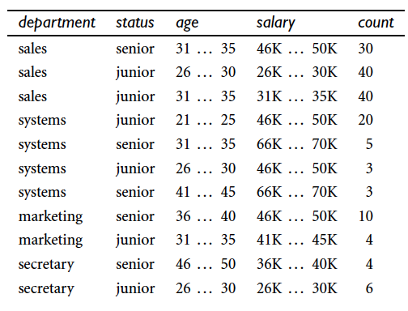
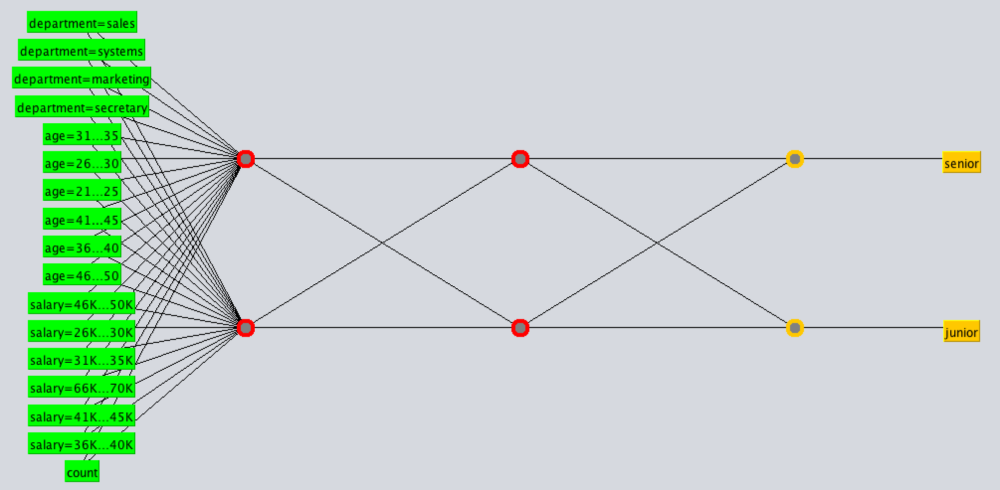
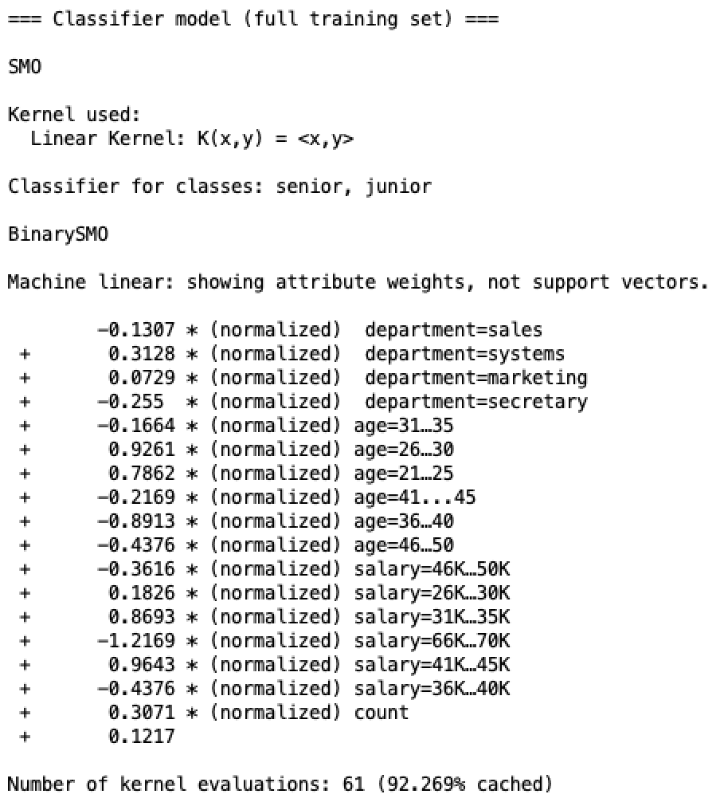
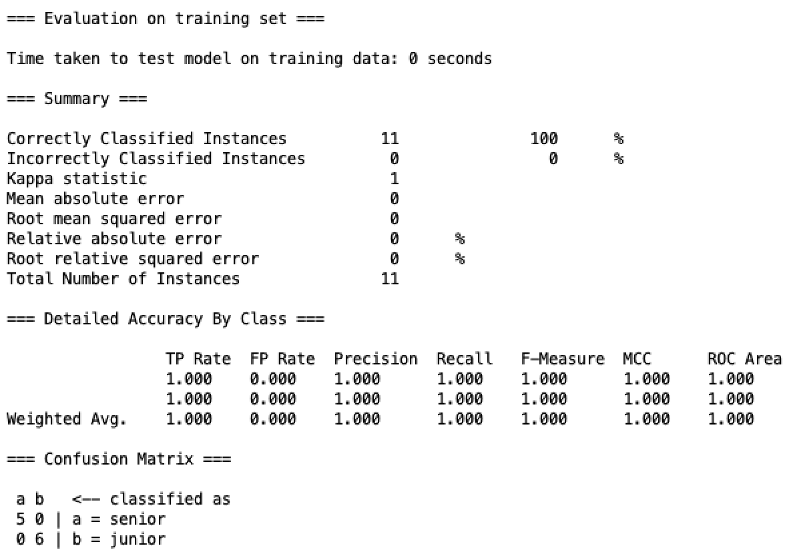
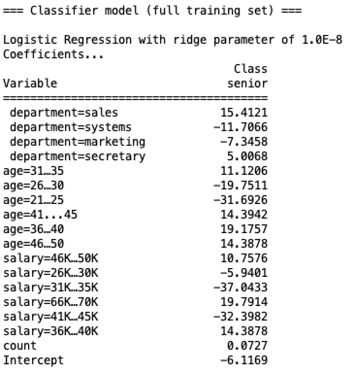
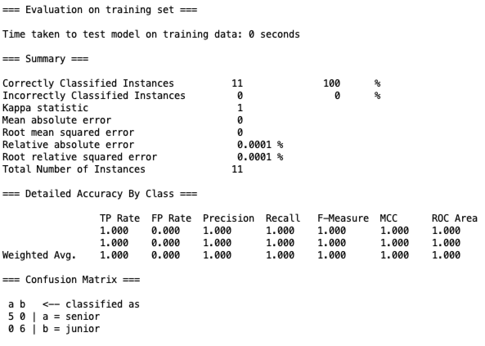
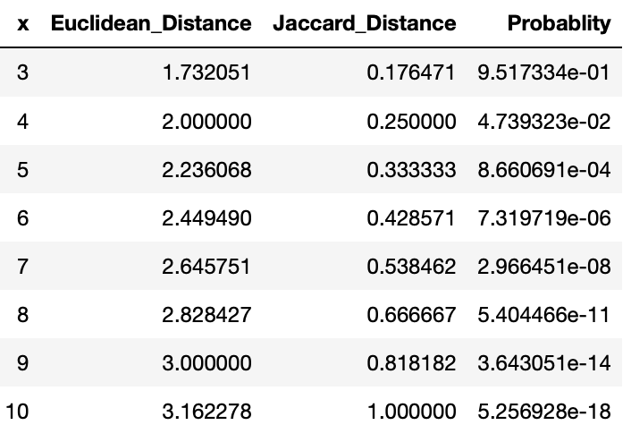
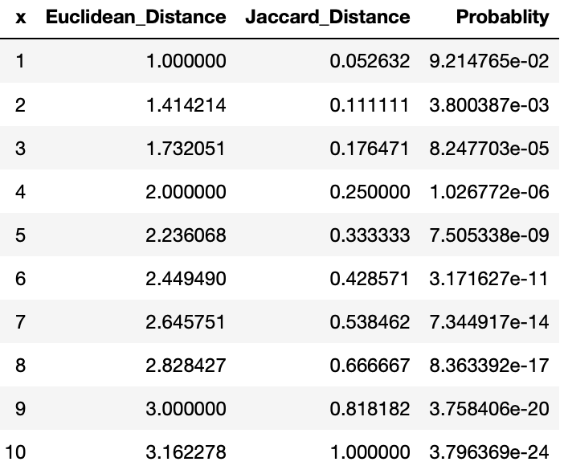

## DSC 440, HW5

### Kefu Zhu

#### 10.2

Suppose that the data mining task is to cluster points (with $(x,y)$ representing location) into three clusters, where the points are

<center>
$A_1(2,10), A_2(2,5), A_3(8,4), B_1(5,8), B_2(7,5), B_3(6,4), C_1(1,2), C_2(4,9)$
</center>

The distance function is Euclidean distance. Suppose initially we assgin $A_1, B_1,$ and $C_1$ as the center of each cluster, respectively. Use the $k-means$ algorithm to show *only*

```
# Import library
import numpy as np
from sklearn.cluster import KMeans
seed = 0
```

**(a) The three cluster centers after the first round of execution**

**Answer**:

```python
data = np.array([[2,10],[2,5],[8,4],[5,8],[7,5],[6,4],[1,2],[4,9]])
fix_init = np.array([[2,10],[5,8],[1,2]])
my_kmeans = KMeans(n_clusters=3, init=fix_init, random_state=seed, max_iter=1).fit(data)
```

The cluster centers after the first round of execution are `(2,10)`, `(6,6)` and `(1.5,3.5)`


**(b) The final three clusters**

**Answer**:

```python
my_kmeans = KMeans(n_clusters=3, init=fix_init, random_state=seed).fit(data)
my_kmeans.predict(data)
```

The final three clusters are

- Cluster 1: $A_1(2,10), B_1(5,8), C_2(4,9)$
- Cluster 2: $A_3(8,4), B_2(7,5), B_3(6,4)$
- Cluster 3: $A_2(2,5), C_1(1,2)$

#### 10.4

For the $k-means$ algorithm, it is interesting to note that by choosing the initial cluster centers carefully, we may be able to not only speed up the algorithm’s convergence, but also guarantee the quality of the final clustering. The $k-means++$ algorithm is a variant of $k-means$, which chooses the initial centers as follows. 

First, it selects one center uniformly at random from the objects in the data set. Iteratively, for each object $p$ other than the chosen center, it chooses an object as the new center. This object is chosen at random with probability proportional to $dist(p)^2$, where $dist(p)$ is the distance from $p$ to the closest center that has already been chosen. The iteration continues until $k$ centers are selected.

Explain why this method will not only speed up the convergence of the $k-means$ algorithm, but also guarantee the quality of the final clustering results.

**Answer**:

By using $k-means++$, we will end up with initial cluster centers that are far apart from each other, because data points that are far away from the closest center that has already been chosen will have higher value for $dist(p)$, hence have higher chance of being selected as the next center.

As a result, we will be able to avoid initializations where the initial clusters are really close to each other, which will makes the computation time needed to reach convergence much longer.


#### 10.6

Both $k-means$ and $k-medoids$ algorithms can perform effective clustering.

**(a) Illustrate the strength and weakness of $k-means$ in comparison with $k-medoids$.**

**Answer**:

$k-means$ suffers from issue in the data such as outliers, which will have higher influence on deciding the center of the clusters because we compute the average distance. However, by using $k-medoids$, intead of taking the mean value of the data points in a cluster as the proposing new cluster center, we choose the most centrally located data point (medoid). Hence, $k-medoids$ is more robust to outliers and extreme values in the data.

On the other hand, $k-means$ is faster than $k-medoid$ because it takes less time when computing the new centroid for the cluster in each iteration.

**(b) Illustrate the strength and weakness of these schemes in comparison with a hierarchical clustering scheme (e.g., AGNES).**

**Answer**:

Both $k-means$ and $k-medoids$ are partition clustering methods, which work well for small to medium sized dataset, and are also capable of undoing previous partition decision when needed. But partition clustering methods need to specify the number of clusters to partition beforehand, which is often an unknown information and require parameter testing.

In hierarchical clustering, user does not need to specify the number of clusters when executing the algorithm. Instead, the user can look at the result and choose to merge to certain degree that the clustering result can be representative enough for the data situation. The disadvantage is that in hierarchicaal clustering, you cannot undo the merging steps.

#### 9.1

The following table consists of training data from an employee database. The data have been generalized. For example, $“31 ... 35”$ for age represents the age range of $31$ to $35$. For a given row entry, count represents the number of data tuples having the values for department, status, age, and salary given in that row.

<center>

</center>

Let status be the class-label attribute

##### 1. Multiplayer Neural Network

**(a) Design a multilayer feed-forward neural network for the given data. Label the nodes in the input and output layers.**

To make the weight report shorter for the next question, I only build a 2-hidden-layer neural network with two nodes in each layer. The network structure looks like this

<center>

</center>

**(b) Using the multilayer feed-forward neural network obtained in (a), show the weight values after one iteration of the backpropagation algorithm, given the training instance “(sales, senior, 31 . . . 35, 46K . . . 50K)”. Indicate your initial weight values and
biases and the learning rate used.**

Initial weight values are listed below:

```
Sigmoid Node 0
    Inputs    Weights
    Threshold    -0.04782492348275749
    Node 4    0.005556492623585749
    Node 5    0.013255808378373977
Sigmoid Node 1
    Inputs    Weights
    Threshold    0.01896096065774131
    Node 4    -0.013518839455665444
    Node 5    0.05924433310607999
Sigmoid Node 2
    Inputs    Weights
    Threshold    0.04853427033674249
    Attrib department=sales    0.04639244145814951
    Attrib department=systems    0.012469314924797645
    Attrib department=marketing    0.02763931692278499
    Attrib department=secretary    -0.001283469694506863
    Attrib age=31…35    0.02331020671184633
    Attrib age=26…30    0.0337543072231283
    Attrib age=21…25    0.039882833413158854
    Attrib age=41...45    -0.041730516774105594
    Attrib age=36…40    0.02225629052556144
    Attrib age=46…50    -0.03567185290984911
    Attrib salary=46K…50K    -0.049554069739043166
    Attrib salary=26K…30K    -0.015249614021838465
    Attrib salary=31K…35K    0.03588763460477099
    Attrib salary=66K…70K    0.03657290881144306
    Attrib salary=41K…45K    -0.0321638086752647
    Attrib salary=36K…40K    0.03545482526432028
    Attrib count    0.01918268996741153
Sigmoid Node 3
    Inputs    Weights
    Threshold    0.03794543897280069
    Attrib department=sales    -0.03956932422620263
    Attrib department=systems    -0.008946692228383638
    Attrib department=marketing    0.04907020560307811
    Attrib department=secretary    0.024616543758317507
    Attrib age=31…35    0.03172500991655066
    Attrib age=26…30    0.0026316265744914754
    Attrib age=21…25    -0.036623188301218
    Attrib age=41...45    0.04782599251552038
    Attrib age=36…40    0.021497500662934352
    Attrib age=46…50    -0.003715738208307521
    Attrib salary=46K…50K    -0.0428554290490922
    Attrib salary=26K…30K    -0.01615025480150633
    Attrib salary=31K…35K    0.04713884018973529
    Attrib salary=66K…70K    0.011232880598765002
    Attrib salary=41K…45K    -0.02826661821087119
    Attrib salary=36K…40K    -0.04904417032045238
    Attrib count    0.027122377396842694
Sigmoid Node 4
    Inputs    Weights
    Threshold    0.04083304025416515
    Node 2    -0.024111078095310264
    Node 3    -0.038797461052745556
Sigmoid Node 5
    Inputs    Weights
    Threshold    -0.03802364374401687
    Node 2    -0.04894292789271556
    Node 3    0.0032603429362751206
```

The learning rate is $0.3$, and the weight after first iteration on the first data sample is

```
Sigmoid Node 0
    Inputs    Weights
    Threshold    -0.04782492348275749
    Node 4    0.005556492623585749
    Node 5    0.013255808378373977
Sigmoid Node 1
    Inputs    Weights
    Threshold    0.01896096065774131
    Node 4    -0.013518839455665444
    Node 5    0.05924433310607999
Sigmoid Node 2
    Inputs    Weights
    Threshold    0.04853427033674249
    Attrib department=sales    0.04639244145814951
    Attrib department=systems    0.012469314924797645
    Attrib department=marketing    0.02763931692278499
    Attrib department=secretary    -0.001283469694506863
    Attrib age=31…35    0.02331020671184633
    Attrib age=26…30    0.0337543072231283
    Attrib age=21…25    0.039882833413158854
    Attrib age=41...45    -0.041730516774105594
    Attrib age=36…40    0.02225629052556144
    Attrib age=46…50    -0.03567185290984911
    Attrib salary=46K…50K    -0.049554069739043166
    Attrib salary=26K…30K    -0.015249614021838465
    Attrib salary=31K…35K    0.03588763460477099
    Attrib salary=66K…70K    0.03657290881144306
    Attrib salary=41K…45K    -0.0321638086752647
    Attrib salary=36K…40K    0.03545482526432028
    Attrib count    0.01918268996741153
Sigmoid Node 3
    Inputs    Weights
    Threshold    0.03794543897280069
    Attrib department=sales    -0.03956932422620263
    Attrib department=systems    -0.008946692228383638
    Attrib department=marketing    0.04907020560307811
    Attrib department=secretary    0.024616543758317507
    Attrib age=31…35    0.03172500991655066
    Attrib age=26…30    0.0026316265744914754
    Attrib age=21…25    -0.036623188301218
    Attrib age=41...45    0.04782599251552038
    Attrib age=36…40    0.021497500662934352
    Attrib age=46…50    -0.003715738208307521
    Attrib salary=46K…50K    -0.0428554290490922
    Attrib salary=26K…30K    -0.01615025480150633
    Attrib salary=31K…35K    0.04713884018973529
    Attrib salary=66K…70K    0.011232880598765002
    Attrib salary=41K…45K    -0.02826661821087119
    Attrib salary=36K…40K    -0.04904417032045238
    Attrib count    0.027122377396842694
Sigmoid Node 4
    Inputs    Weights
    Threshold    0.04083304025416515
    Node 2    -0.023111078095310264
    Node 3    -0.039797461052745556
Sigmoid Node 5
    Inputs    Weights
    Threshold    -0.03802364374401687
    Node 2    -0.04694292789271556
    Node 3    0.0034603429362751206
```

##### 2. SVM

The coefficients of SVM model after training looks like this

<center>

</center>

The model performance is shown as below

<center>

</center>

##### 3. Logistic Regression

The coefficients of Logistic Regression after training looks like this

<center>

</center>

The model performance is shown as below

<center>

</center>

#### 11.2

AllElectronics carries $1000$ products, $P_1$, . . . , $P_{1000}$. Consider customers Ada, Bob, and Cathy such that Ada and Bob purchase three products in common, $P_1$,$P_2$, and $P_3$. For
the other $997$ products, Ada and Bob independently purchase seven of them randomly. Cathy purchases $10$ products, randomly selected from the $1000$ products. 

(1) In Euclidean distance, what is the probability that $dist(Ada,Bob) > dist(Ada,Cathy)$? 

**Answer**:

Suppose Ada and Bob have $x$ products purchased in common, the probability that happened can be computed as the following for different $x$:

<center>
$P(x) = \frac{{997 \choose 7} \times {7 \choose x-3} \times {990 \choose 10-x}}{{997 \choose 7}^2} = \frac{{7 \choose x-3} \times {990 \choose 10-x}}{{997 \choose 7}}$
</center>

Similarly, for Ada and Cathy, the probability can be computed as

<center>
$P(x) = \frac{{997 \choose 7} \times {10 \choose x} \times {990 \choose 10-x}}{{997 \choose 7}{1000 \choose 10}} = \frac{{10 \choose x} \times {990 \choose 10-x}}{{1000 \choose 10}}$
</center>

The formular to compute Jaccard similarity for both $Jaccard(Ada,Bob)$ and $Jaccaard(Ada,Cathy)$ is the same, given $x$ purchases are the same:

<center>
$Jaccard(Ada,Bob) = Jaccard(Ada,Cathy) = \frac{x}{20-x}$
</center>


Use a little help from Python

```python
from scipy.special import comb
import pandas as pd
import numpy as np

def Euclidean_Ada_Bob(x):
    numerator = comb(N=7,k=x-3)*comb(N=990,k=10-x)
    denominator = comb(N=997,k=7)
    return(numerator/denominator)
    
def Euclidean_Ada_Cathy(x):
    numerator = comb(N=10,k=x)*comb(N=990,k=10-x)
    denominator = comb(N=1000,k=10)
    return(numerator/denominator)
```

For $dist(Ada,Bob)$, we have

```python
Ada_Bob = pd.DataFrame({'x':[x for x in range(3,11)],
                        'Euclidean_Distance':[np.sqrt(x) for x in range(3,11)],
                        'Jaccard_Distance':[x/(20-x) for x in range(3,11)],
                        'Probablity':[Euclidean_Ada_Bob(x) for x in range(3,11)]})
Ada_Bob
```

<center>

</center>

Similarly, for $dist(Ada,Cathy)$, we have

```python
Ada_Cathy = pd.DataFrame({'x':[x for x in range(1,11)],
                          'Euclidean_Distance':[np.sqrt(x) for x in range(1,11)],
                          'Jaccard_Distance':[x/(20-x) for x in range(1,11)],
                          'Probablity':[Euclidean_Ada_Cathy(x) for x in range(1,11)]})
Ada_Cathy
```

<center>

</center>

The probability of $dist(Ada,Bob) > dist(Ada,Cathy)$ can be computed as

<center>
$\sum_{x=3}^9 (P_{AdaBob}(x) \sum_{y=x+1}^{10}P_{AdaCathy}(y))$
</center>

```python
prob = 0
for x in range(3,10):
    AddCathy_probsum = 0
    for y in range(x+1,11):
        AddCathy_probsum += np.unwrap(Ada_Cathy.Probablity[Ada_Cathy.x == y])
    prob += np.unwrap(Ada_Bob.Probablity[Ada_Bob.x == x])*AddCathy_probsum
prob
```

<center>
$\sum_{x=3}^9 (P_{AdaBob}(x) \sum_{y=x+1}^{10}P_{AdaCathy}(y)) \approx 9.85\times10^{-7}$
</center>


(2) What if Jaccard similarity (Chapter 2) is used?

**Answer**: 

Similar to part 1

```python
prob = 0
for x in range(3,10):
    AddCathy_probsum = 0
    for y in range(x+1,11):
        AddCathy_probsum += np.unwrap(Ada_Cathy.Probablity[Ada_Cathy.x == y])
    prob += np.unwrap(Ada_Bob.Probablity[Ada_Bob.x == x])*AddCathy_probsum
prob
```

For Jaccard similarity, the probability of $dist(Ada,Bob) > dist(Ada,Cathy)$ is computed to be

<center>
$\sum_{x=3}^{10} (P_{AdaBob}(x) \sum_{y=1}^{x-1}P_{AdaCathy}(y)) \approx 0.096$
</center>


(3) What can you learn from this example?

**Answer**:

- The larger the Euclidean distance is, the more dissimilar two objects are. But if measured in Jaccard similarity, the smaller the value is, the more dissimilar two objects are.