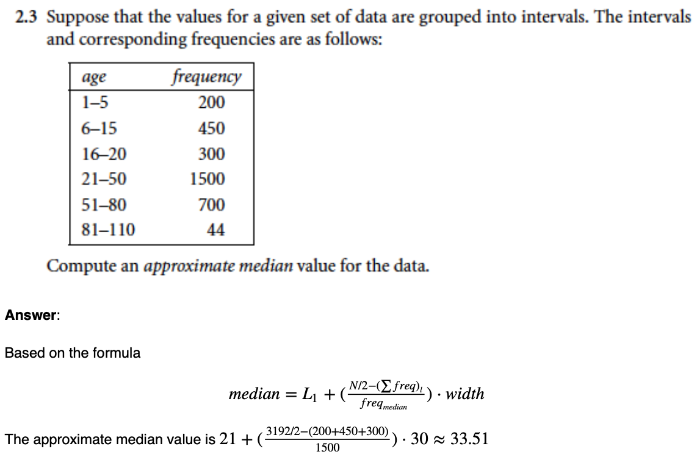
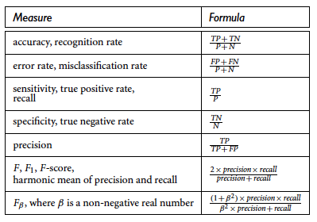

## Formulas

### 1. Approximate Median Value

$median = L_1 + (\frac{N/2 - (\sum freq)_l}{freq_{median}}) \cdot width$

### 2. Min-Max Normalization

$v_i^{'} = \frac{v_i -\min(A)}{max(A) - min(A)} (new\_max_A - new\_min_A) + new\_min_A$

### 3. Model Evaluation

### 4. Gini Index

$Gini(D) = 1 - \sum_{i=1}^m p_i^2,\ Gini_A(D) = \frac{|D_1|}{|D|} Gini(D_1) + \frac{|D_2|}{|D|} Gini(D_2)$

### 5. Information Entropy

$Info(D) = -\sum_{i=1}^m p_i log_2(p_i),\ Info_A(D) = \sum_{j=1}^v \frac{|D_j|}{|D|} \times Info(D_j)$

- **Gain Ratio**:

	$SplitInfo_A(D) = - \sum_{j=1}^v \frac{|D_j|}{|D|} \times log_2(\frac{|D_j|}{|D|})$
	
	$GainRatio(A) = \frac{Gain(A)}{SplitInfo_A(D)}$

### 6. Correlation

$r_{A,B} = \frac{Cov(A,B)}{\sigma_A \sigma_B},\ Cov(A,B) = E(A\dot{}B) - E(A)E(B)$

## Concepts

**1. Data Quality**:

- Accuracy
- Completeness
- Consistency
- Timelines
- Believability
- Interpretability

