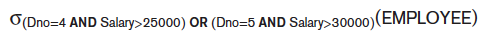
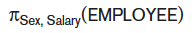
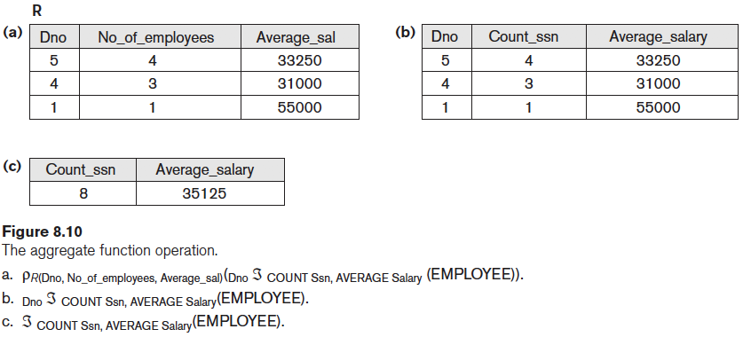
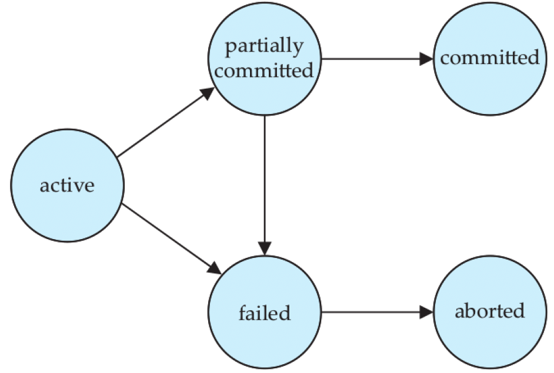
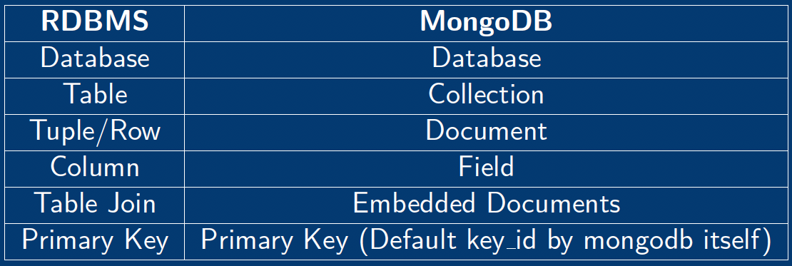

# REVIEW

1. **(P547)** Determine whether a decomposition is a loseless join
2. **(P550)** Decomposition into 3NF with Dependency Preservation and Nonadditive (Lossless) Join Property
3. **(P553)** Decomposition into BCNF with Nonadditive Join Property 

# Database Design

**1. Armstrong Rules**

(1) Reflexive: If $Y \subseteq X$, then $X \rightarrow Y$

(2) Augmentation: If $X \rightarrow Y$, then $XZ \rightarrow YZ$

(3) Transitive: If $X \rightarrow Y$ and $Y \rightarrow Z$, then $X \rightarrow Z$

**Other inferences**: 

- Decomposition: If $X \rightarrow YZ$, then $X \rightarrow Y$ and $X \rightarrow Z$
- Union: If $X \rightarrow Y$ and $X \rightarrow Z$, then $X \rightarrow YZ$
- Pseudotransitivity: If $X \rightarrow Y$ and $WY \rightarrow Z$, then $WX \rightarrow Z$

**2. Closure**

- Closure of a set $F$ of FDs is the set $F^+$ of all FDs that can be inferred from $F$
- Closure of a set of attributes $X$ with respect to $F$ is the set $X^+$ of all attributes that are functionally determined by $X$

**3. Equivalent Sets of FDs**: Two sets of FDs $F$ and $G$ are equivalent both of the followings are met

- Every FD in $F$ can be inferred from $G$ 
- Every FD in $G$ can be inferred from $F$ 

# Relational Algebra

**1. Select**: Filter rows

**2. Project**: Select certain columns (Remove duplicate tuples for nonkey attributes)

**3. Rename**

**4. Union $\cup$, Intersect $\cap$, Difference $-$**: Union eliminate duplicate tuples. Two relations have to be type compatible 

**5. Cartesian Product $\times$**

**6. Join**

- **Natural Join**

**7. Aggregate Functions (SUM, AVERAGE, MAXIMUM, MINIMUM, COUNT)**

# Indexing

**1. Types of indexes**

- **Ordered indices**: Based on a sorted ordering of the values
	- **Dense index**：an index entry appears for every search-key value in the file
	- **Sparse index**: an index entry appears for only some of the search-key values
- **Hash indices**: Based on a distribution of values across a range of buckets. The bucket is assigned by a hash function

**2. Search key**: An attribute or set of attributes used to look up records in a file

**3. Index Structure**: 

- **ordered index**: stores the search key in sorted order, and associates with each search key the records that contain it
- **clustered index**: follows the order of the rows on the disk in the same order as the index
- **nonclustered index**: specifies an order different from the sequential order of the file

**4. Hashing Indexes**:

- **Disadvantage** of sequential file organization
	- must access an index structure to locate data
	- must use binary search, and that results in more I/0 operations
- **Hashing** avoids accessing an index structure
- Hashing can be used for two different purposes
	- In a hash file organization, obtain the address of the disk block through a function
	- In a hash index keys are organized into a hash file structure
- **Overflows**: bucket overflow can occur for
	- **Insufficient buckets**
	- **Skew**. Some buckets are assigned more records than are others
- **Open Hashing** do not have overflaw chains. Apply **linear probing**. But not flexible and can waste space

# Query Processing and Optimization

**1. Purpose of Query Processing**

**2. Basic Steps in Query Processing**

(1) Parsing and translation

- translate the query into its internal form. This is then translated into relational algebra
- Parser checks syntax, verifies relations 

(2) Optimization

- A relational algebra expression may have many equivalent expression 
	- e.g. $\sigma_{salary < 75000}$($\prod_{salary}$(instructor)) is equivalent to $\prod_{salary}$($\sigma_{salary < 75000}$ (instructor))
- Each relational algebra operation can be evaluated using one of several different algorithms
- An relational algebra operation annotated with instructions on how to evaluate it is called an **evaluation primitive**
- Annotated expression specifying detailed evaluation strategy is called an **evaluation-plan**
	- e.g. can use an index on salary to find instructors with salary < 75000
	- e.g. or can perform complete relation scan and discard instructors with salary $\ge$ 75000

(3) Evaluation

- The query-execution engine takes a query-evaluation plan, executes that plan, and returns the answers to the query

**3. Optimization**

- Goal: select best available strategy for executing query based on information available
- General transformation rules
	- **R1 Cascade of σ**: A conjunctive selection condition can be
broken up into a cascade of individual σ operations
		- $\sigma_{c_1\ AND\ c_2\ AND\ ...\ AND\ c_n}(R) \equiv \sigma_{c_1}(\sigma_{c_2}(...(\sigma_{c_n}(R))...))$
	- **R2 Commutativity of $\sigma$**: The σ operation is commutative
$\sigma_{c_1}$($\sigma_{c_2}$(R)) $\equiv \sigma_{c_2}$($\sigma_{c_1}$(R))
	- **R3 Cascade of $\pi$**: In a cascade (sequence) of $\pi$ operations, all
but the last one can be ignored
	- **R4 Commuting σ with π**: If the selection condition c involves
only attributes in the projection list, operations can be
commuted
		- $\pi_{A_1,A_2,...,A_n}(\sigma_c(R)) \equiv \sigma_c(\pi_{A_1,A_2,...,A_n}(R))$
	- **R5 Commutativity of join**: The join operation is commutative $R \times S = S \times R$
	- **R6 Commuting σ with join**: 
		- $\sigma_c(R \Join S) \equiv \sigma_c(R) \Join S$
		- $\sigma_c(R \Join S) \equiv \sigma_{c_1}(R) \Join \sigma_{c_2}S$
	- **R7 Commuting π with join**
		- $\pi_L(R \Join_c S) \equiv \pi_{A_1,A_2,...,A_n}(R) \Join_c \pi_{B_1,B_2,...,B_n}(S)$
	- **R8 Commutativity of set operations**: The set operations $\cap$ and $\cup$ are commutative, but $-$ is not
	- **R9 Associativity of join, $\times$, $\cup$ and $\cap$**
	- **R10 Commuting $\sigma$ with set operations**: The $\sigma$ operation commutes with $\cup$, $\cap$ and $-$
	- **R11 The $\pi$ operation commutes with $\cup$**: $\pi_L(R \cup S) \equiv \pi_L(R) \cup \pi_L(S)$
	- **R12 Converting a ($\sigma, \times$) sequence into join**: $\sigma_c(R \times S) \equiv R \Join_c S$
	- **R13 Pushing $\sigma$ in conjunction with set difference**: $\sigma_c(R-S) \equiv \sigma_c(R) - \sigma_c(S)$
	- **R14 Pushing $\sigma$ to only one argument in $\cap$**: $\sigma_c(R \cap S) \equiv \sigma_c(R) \cap S$
	- **R15 Some trivial transformations**
		- If $S$ is empty, then $R \cup S \equiv R$
		- If the condition $c$ in $\sigma_c$ is true for the entire $R$, then $\sigma_c(R) \equiv R$

**4. Measures of Query Cost**

- Cost is generally measured as total elapsed time for answering query (many factors contribute to time cost)
	- Disk accesses
	- CPU
	- Network communication 
- Typically disk access is the predominant cost, and is also relatively easy to estimate
	- Number of seeks
	- Number of blocks read
	- Number of blocks written 
		- Cost to write a block is greater than cost to read a block: data is read back after being written to ensure that the write was successful

**5. Sorting**

- We may build an index on the relation, and then use the index to read the relation in sorted order. May lead to one disk block access for each tuple
- For relations that fit in memory, techniques like **quicksort** can be used. For relations that don't fit in memory, **external sort-merge** is a good choice

# Transactions

**1. Transaction Concept**: The statement in a transaction will be executed as an atomic unit of work in the database. Either all of the statements will be executed successfully, or none of the statements will be executed

- **Multiuser Transactions**: when two or more users concurrently access a database
	-  recover properly from system failures or errors
	-  ensure that the users' actions do not interfere with one another
	-  each user accesses the database as if he or she had exclusive access to it, without worrying about the actions of other users

**2. Transaction States**:

- **Active**: the initial state; the transaction states in this state while it is executing
- **Partially committed**: after the final statement has been executed
- **Failed**: after the recovery that normal execution can no longer proceed
- **Aborted**: after the transaction has been rolled back and the database has been restored to its state prior to the start of the transaction
- **Committed**: after successful completion

**3. ACID Properties of Transaction**:

- **Atomicity**: Either all operations of the transaction are reflected properly in the database, or none
- **Consistency**: Execution of a transaction in isolation preserves the consistency of the database
- **Isolation**: Isolate the execution of different transactions. Concurrent transaction
- **Durability**: Changes from successful transaction persist in the database, even if failures happen

**4. Locking Levels**:

- **Database Level**:
	- lock the entire database for each transaction 
	- only one transaction at a time
	- slow performance
	- suitable when modifying the structure of the database or scanning many large tables
- **Table Level**:
	- DBMS locks only tables accessed by a transaction
	- other transactions can access other tables
	- slow performance when many users must share access to the same table
- **Page Level**:
	- DBMS locks individual blocks of data (pages) from the disk for each transaction
	- other transactions cannot access locked pages
	- other transactions can access other pages of data
	- Page size of 2KB, 4KB and 16KB are commonly used
	- two transactions can proceed in parallel if they access rows in different pages
- **Row Level**:
	- allows two concurrent transactions that access two different rows of a table to proceed in parallel
	- provides a high degree of parallel transaction execution
	- keeping track of locks is a much more complex task and it increases overhead 

# NOSQL

**1. Characteristics**:

- **Scalability**: 
	- horizontal: the distributed system is expanded by adding more nodes for data storage and processing as the volume of the data grows
	- vertical: expanding the storage and computing power of existing nodes
- **Availability**: Many applications that use NOSQL systems require continuous system availablity
- **Replication**: Data is replicated over two or more nodes, so that if one node fails, the data is still available on other nodes
- **Sharding of Files**:
	- files can have many millions of records (or documents or objects)
	- records can be accessed concurrently by thousands of users
	- it is not practical to store the whole file in one node
	- Sharding is a method for partitioning data across multiple machines
	- This serves to distribute the load of accessing the file records to multiple nodes
- **No Schema Required**:
	- storing semi-structured, self-describing data
	- users can specify a partial schema, but it is not required
	- any constraints on the data are coded 
- **Less Powerful Query Language**
	- queries often locate single objects in a single file based on keys
	- a set of functions and operations as API
	- operations are called (S)CRUD, for (Search), Create, Read, Update, and Delete
	- a high-level query language, but less power than SQL
	- joins implemented in code 

