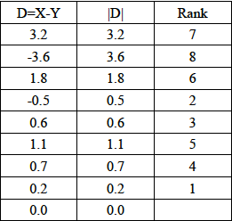
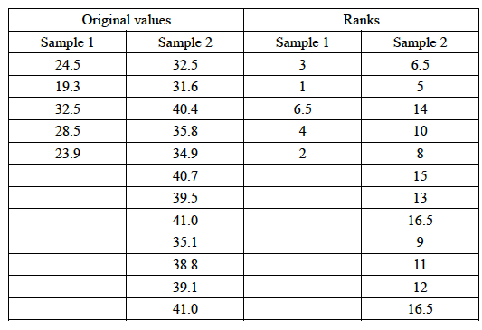

# DSC 462, HW#5, Kefu Zhu

## Question 1

### (a)

By normal approximation, the success probablity is estimated as

$\widehat{p}\ \pm\ z \cdot \sqrt{\frac{\widehat{p}(1-\widehat{p})}{n}}$

Since $\widehat{p} = \frac{150}{235} = \frac{30}{47}$ and $z_{0.975} = 1.96$, 

we have the confidence interval for $p$ approximately as: $\frac{30}{47} \pm 0.06$ 

### (b)

**Without continuity correction**

$z_{obs} = \frac{\widehat{p} - p_0}{\sqrt{\frac{p_0(1-p_0)}{n}}} = \frac{30/47 - 0.65}{\sqrt{\frac{0.65\cdot0.35}{235}}} \approx -0.39$

$\because z_{obs} < z_{0.95} = 1.645\ \therefore$ Reject $H_0$, and the p-value is approximately 0.6466

**With continuity correction**

$z_{obs} = \frac{X + 0.5 - np_0}{\sqrt{np_0(1-p_0)}} = \frac{150 + 0.5 - 235\cdot0.65}{\sqrt{235\cdot0.65\cdot0.35}} \approx -0.31$

$\because z_{obs} < z_{0.95} = 1.645\ \therefore$ Reject $H_0$, and the p-value is approximately 0.6209

## Question 2

### (a)

$\because s^2 = \frac{\sum (X_i - \bar{X})^2}{n-1} \approx 7.09,\ \chi_{7,\ 0.95}^2 = 2.167$

$\therefore \sigma^2 < \frac{s^2}{(\chi_{n-1, 1 - \alpha}^2)/(n-1)} = \frac{7.09}{2.167/7} \approx 22.90 \rightarrow 95$% upper confidence bound for $\sigma$ is $4.79$

### (b)

$\because n = (z_{\alpha/2} \cdot \frac{\sigma}{E_0})^2,\ \sigma \approx 4.79,\ E_0 = 0.5,\ \alpha = 0.01$

$\therefore n \approx (2.58 \cdot \frac{4.79}{0.5})^2 \approx 610.9 \approx 611$

Therefore, a sample size of $611$ is needed

## Question 3

$F_{obs} = \frac{S_1^2}{S_2^2} = \frac{5.476}{39.942} \approx 0.1371$

We reject the null jhypothesis if $F_{obs} \le F_{n_1-1,n_2-1,1-\alpha/2} \approx 0.5277$ or $F_{obs} \ge F_{n_1-1,n_2-1,\alpha/2} \approx 1.7668$ 

$\Rightarrow$ the rejection region is $(0, 0.5277)\ \cup\ (1.7668, \infty)$

Based on an $\alpha = 0.1$ significance level, we reject $H_0$: $\sigma_1^2 = \sigma_2^2$ because $F_{obs} \le F_{n_1-1,n_2-1,1-\alpha/2}$

$\because P(F_{obs} \ge F) \approx 1,\ P(F_{obs} \le F) \approx 1.66\times10^{-6}$

$\therefore \alpha_{obs} = 2\min(P(F_{obs} \ge F), P(F_{obs} \le F)) \approx 3.32 \times 10^{-6}$

## Question 4

### (a)

$\because \hat{p_1} = \frac{154}{178} \approx 0.8652,\ \hat{p_2} = \frac{53}{79} \approx 0.6709 \rightarrow \hat{p_0} = \frac{n_1\hat{p_1} + n_2\hat{p_2}}{n_1 n_2} = \frac{154 + 53}{178+79} \approx 0.8054$

$\therefore z_{obs} = \frac{\hat{p_1} - \hat{p_2}}{\sqrt{\hat{p_0}(1-\hat{p_0})(\frac{1}{n_1} + \frac{1}{n_2})}} = \frac{0.1943}{\sqrt{0.8054 \cdot 0.1946 \cdot (\frac{1}{178} + \frac{1}{79})}} \approx 3.63$

Because $z_{obs} > z_{0.975} \approx 1.96$, we reject the null hypothesis at a significance level of $\alpha = 0.05$, and the p-value, $2 \cdot P(Z \le -|z_{obs}|)$, is approximately 0.0003.

### (b)

$\because \hat{OR} = \frac{154 \cdot 26}{24 \cdot 53} \approx 3.1478,\ SE(log(OR)) = \sqrt{\frac{1}{154} + \frac{1}{24} + \frac{1}{53} + \frac{1}{26}} \approx 0.3248$

$\therefore CI_{0.95} = log(\hat{OR}) \pm z_{0.025} \cdot SE(log(OR)) = log(3.1478) \pm (-1.96) \cdot 0.3248 = 1.1467 \pm 0.64$

Since the 95% confidence interval DOES NOT contain $0$, 

Reject the null hypothesis of $H_o: OR = 1 \Leftrightarrow H_o:log(OR) = 0$

### (c)

Define $R_i = $ Total counts in row $i$, $C_j = $ Total counts in column $j$,

$O_{ij} =$ the count in the cell given by row $i$ and columns $j$

$\Rightarrow E_{11} = \frac{R_1C_1}{N} = \frac{207 \cdot 178}{257} \approx 143.37 \\ E_{12} = \frac{R_1C_2}{N} = \frac{207 \cdot 79}{257} \approx 63.63 \\E_{21} = \frac{R_1C_1}{N} = \frac{50 \cdot 178}{257} \approx 34.63 \\ E_{22} = \frac{R_1C_2}{N} = \frac{50 \cdot 79}{257} \approx 15.37$

$X^2 = \sum_i \sum_j \frac{(O_{ij} - E_{ij})^2}{E_{ij}} = \frac{(154 - 143.37)^2}{143.37} + \frac{(53 - 63.63)^2}{63.63} + \frac{(24 - 34.63)^2}{34.63} + \frac{(26 - 15.37)^2}{15.37} \approx 13.18$

$\because X^2 > \chi_{1,0.05}^2 = 3.841\ \therefore$ Reject null hypothesis $H_o: p_{i,j} = r_ic_j$, the row and column are not independence, at significance level $\alpha = 0.05$

### (d)

(a) $H_o: p_1 = p_2$

(b) $H_o: OR = \frac{n_{11}n_{22}}{n_{12}n_{21}} = 1$

(c) $H_o: p_{i,j} = r_ic_j$

$\because p_1 = p_2$ can also be written as $\frac{n_{11}}{n_{11} + n_{21}} = \frac{n_{12}}{n_{12} + n_{22}} \rightarrow \frac{n_{11}n_{22}}{n_{12}n_{21}} = 1$

$\therefore$ The null hypothesis for part(a) and part(b) is the same

Also, because $p_{ij} = \frac{n_{ij}}{n},\ r_i = \frac{n_{i1} + n_{i2}}{n},\ c_j = \frac{n_{1j} + n_{2j}}{n}$

We can derive $n_{ij} = \frac{(n_{i1} + n_{i2})(n_{1j} + n_{2j})}{n}$ from $p_{i,j} = r_ic_j$ in the hypothesis of part(c)

By substitue $i,j$ with $1,2$, we have $\frac{n_{11}n_{22}}{n_{12}n_{21}} = 1$

$\therefore$ The null hypothesis for part(c) and part(b) is the same

In summary, the null hypothesis for part (a), (b) and (c) are the same
## Question 5

Define $O_i = $ Observed count for category $i,\ E_i = $ Expected count for category $i$

Then we have, $E_1 = np_1 = \frac{78}{16},\ E_2 = np_2 = \frac{234}{16},\ E_3 = np_3 = \frac{234}{16},\ E_4 = np_4 = \frac{702}{16}$

$X_{Yate}^2 = \sum_i \frac{(|O_i - E_i| - 0.5)^2}{E_i} \approx 45.3$

$\because X_{Yate}^2 > \chi_{3,0.05}^2 = 7.815,\ \therefore$ Reject the null hypothesis $H_o: p_i$ are the true population frequencies

## Question 6

### (a)

**Normal Approximation**

$\because T_{obs} = \min\{T_-, T_+\} = 10,\ \mu_T = n(n+1)/4 = \frac{45}{2},\ \sigma_T = \sqrt{n(n+1)(2n+1)/24} \approx 8.44$

$\therefore z_{obs} = \frac{T_{obs} - \mu_T}{\sigma_T} = \frac{10 - 45/2}{8.44} \approx -1.48 \rightarrow P(Z \le z_{obs}) \approx 0.069$

Reject null hypothesis at a significant level $\alpha = 0.05$

**Exact Method**

$\because \alpha_{obs} = P(T < T_{obs}) = 0.082$, given $n = 8$ and $T_{obs} = 10$

$\therefore$ Fail to reject null hypothesis at a significant level $\alpha = 0.05$

### (b)

$\because \alpha_{obs} = P(X \le 2) \approx 0.0890$, where $X$ ~ $bin(9,0.5)$

$\therefore$ Fail to reject null hypothesis at a significant level $\alpha = 0.05$

## Question 7

**Note**: $n_1 < n_2$

$\because T_1 = 3+1+6.5+4+2 = 16.5,\ \mu_1 = \frac{1}{2} \cdot n_1(n_1+n_2+1) = 45,\\\sigma_W^2 = \frac{1}{12} \cdot n_1n_2(n_1+n_2+1) = 90$

$\therefore z_{obs} = \frac{T_1 - \mu_1}{\sigma_W} = \frac{16.5-45}{\sqrt{90}} \approx -3 \rightarrow \alpha_{obs} = 2 \cdot P(Z \le z_{obs}) \approx 2 \cdot 0.001 = 0.002$

Therefore, reject null hypothesis at a significant level $\alpha = 0.01$
~~====~~