## ANOVA

**Assumptions**

- Response variable residuals are normally distributed, $N$ ~ $(\mu_i, \sigma^2)$
- Equal variances between different groups
- Responses for a given group are independent and identically distributed (i.i.d)

Given a total of $n$ samples from $k$ different groups, where $n = n_1 + n_2 + ... n_k$

A **balanced design** refers to the situation where the sample sizes for all groups are equal ($n_1 = n_2 = ... = n_k$)

- **SST/SS(B)** $= \sum_{i=1}^k n_i(\bar{y_i} - \bar{y})^2$ 
- **SSE/SS(W)** $= \sum_{i=1}^k \sum_{j=1}^{n_i} (y_{ij} - \bar{y_i})^2 = \sum_{i=1}^k (n_i - 1)S_i^2$
- **SSTO/SS(T)** $= \sum_{i=1}^k \sum_{j=1}^{n_i} (y_{ij} - \bar{y})^2$

$SSTO = SST + SSE$

$F_{obs} = \frac{SST/(k-1)}{SSE/(n-k)}$

$\alpha_{obs} = P(F_{k-1,n-k} > F_{obs})$

**ANOVA Table**

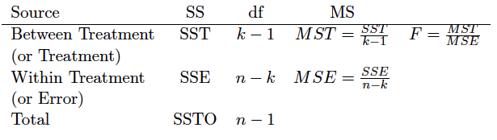

### Equality of Variance

The test for equality of variance between $k$ samples can be calculated using **Bartlett's Test**

### Bonferroni Correction

Suppose we wish to report $m$ confidence intervals with confidence level of $(1-\alpha)$, recall Boole's inequality

$P(\cup_{i=1}^m E_i) \le \sum_{i=1}^m P(E_i)$

If we denote $E_i =$ $\{$the $i$th confidence interval is incorrect$\}$, then $P(E_i) = \alpha$ and we have

$P(\cup_{i=1}^m E_i) \le m\alpha$

In order to achieve $\alpha_{FWE}$, each confidence level need to be $(1-\alpha_{FWE}/m)$

### Post hoc Analysis

- **BCP**

$\bar{y_i} - \bar{y_j}\ \pm t_{\alpha/(m2), n-k} \sqrt{MSE (\frac{1}{n_i} + \frac{1}{n_J})}$ 

- **Tukey's pairwaise**

$\bar{y_i} - \bar{y_j}\ \pm q_{\alpha} \sqrt{\frac{MSE}{2} (\frac{1}{n_i} + \frac{1}{n_J})}$ 

**Question**: Difference between BCP and Tukey

### Nonparametric

Non-parametric model does not assume normal distribution of residuals. Usually used when data is ordinal 

**1. Two sample**: Two sample t-test $\rightarrow$ Wilcoxon rank sum test

**2. K samples**: ANVOA $\rightarrow$ Kruskal-Wallis test

## Linear Regression

**Assumptions**

- Linearity
- Residuals are i.i.d $N$ ~ $(0,\sigma^2)$
	- Mean of residuals is zero 
	- Homoscedasticity: variance of error terms are similar across values of independent variables
	- Independence of residuals
- No multicollinearity

For simple linear regression, we have

$Y_i = \beta_0 + \beta_1 X_i + \epsilon_i$, $i = 1,...,n$

The **linear least squares coefficients** are given by

$
\begin{cases}
\hat{\beta_1} = \frac{\sum_{i=1}^n (X_i - \bar{X})(Y_i - \bar{Y})}{\sum_{i=1}^n (X_i - \bar{X})^2} \\
\\
\hat{\beta_0} = \bar{Y} - \hat{\beta_1}\bar{X}
\end{cases}
$

**Use residuals to check assumptions**

1. Draw a scatter plot of the points $(\epsilon_i, \hat{Y_i})$. If the assumptions are satisfied, there should be no pattern

	- **Homoscedasticity**: The variation of the residuals **SHOULD NOT** appears to increase or decrease systematically.
	- **Independence of residuals**: **SHOULD NOT** observe large groups of residuals located next to each other appear to be all above or all below zero (This is a frequent occurrence when $X_i$'s represent sequential points in time)
	- **Linearity**: Residuals **SHOULD NOT** appear to suggest some functional form

2. Construct a normal probability plot of the residuals (Q-Q plot)

	- **Normality of residuals**: **SHOULD NOT** observe departures from linearity

### ANOVA in Linear Regression

For a fiited linear regression on $n$ data points with $k$ parameters $(\beta_0, \beta_1, ..., \beta_{k-1})$

$SSR = \sum_{i=1}^n (Y_i - \bar{Y})^2 \rightarrow MSR = \frac{SSR}{k-1}$

$SSE = \sum_{i=1}^n e_i^2 = \sum_{i=1}^n (Y_i - \hat{Y_i})^2 \rightarrow MSE = \frac{SSE}{n-k}$

$SSTO = SSE + SSR$

**Note**: $MSE$ functions as an estimate of the variance $\sigma^2$ in $\epsilon_i$ ~ $N(0,\sigma^2)$

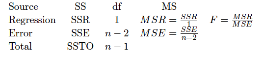

**Coefficient of determination $(R^2)$**

$R^2 = 1 - \frac{SSE}{SSTO} = \frac{SSR}{SSTO}$

- $R^2 \ge 0.25$ indicates predictor $X$ has significant explanatory power

### Linear Regression and Correlation

Assume that $X$ and $Y$ together posses a bivariate normal distribution

$\because \hat{\beta_1} = \frac{\sum_{i=1}^n (X_i - \bar{X})(Y_i - \bar{Y})}{\sum_{i=1}^n (X_i - \bar{X})^2},\ \rho = \frac{cov(X,Y)}{\sqrt{var(X)var(Y)}} = \frac{E[(X - \mu_X)(Y - \mu_Y)]}{\sqrt{var(X)var(Y)}} = \frac{\sum_{i=1}^n (X_i - \bar{X})(Y_i - \bar{Y})}{\sqrt{\sum_{i=1}^n (X_i - \bar{X})^2} \sqrt{\sum_{i=1}^n (Y_i - \bar{Y})^2}}$

$\therefore \rho = \rho_{XY} = \beta_1 \frac{\sigma_x}{\sigma_Y}$

### Inference of Regression Parameters

Given $\hat{Y_i} = \hat{\beta_0} + \hat{\beta_1}X_i$, $i = 1,...,n$, residuals follow noraml distribution $N(0,\sigma^2)$

**Standard errors**

$S_{\hat{\beta_0}} = \widehat{\sigma}\sqrt{\frac{1}{n} + \frac{\bar{X}^2}{\sqrt{\sum_{i=1}^n (X_i - \bar{X})^2}}},\ S_{\hat{\beta_1}} = \frac{\widehat{\sigma}}{\sqrt{\sum_{i=1}^n (X_i - \bar{X})^2}},\ S_{\hat{\mu_x}} = \widehat{\sigma}\sqrt{\frac{1}{n} + \frac{(x-\bar{X})^2}{\sqrt{\sum_{i=1}^n (X_i - \bar{X})^2}}}$

### Hypothesis Tests for Simple Linear Regression

$T_{obs} = \frac{\hat{\beta_1}}{S_{\hat{\beta_1}}}$ with $n-2$ degree of freedom

### Prediction Intervals for Simple Linear Regression

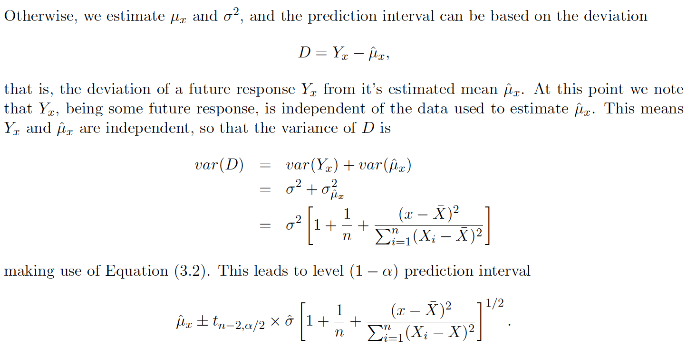

### Computations Based on Sums of Squares

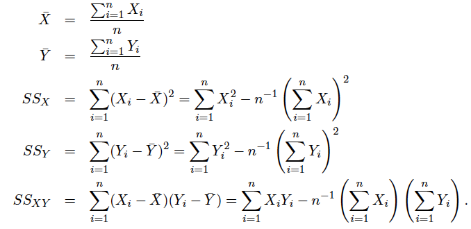

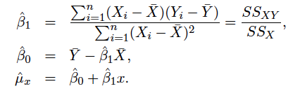

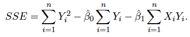

$SSTO = SS_Y$

### Multiple Linear Regression

#### ANOVA

For a fiited linear regression on $n$ data points with $q$ predictors $(\beta_0, \beta_1, ..., \beta_q)$

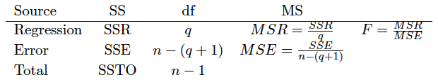

#### Full and Reduced Model

**Full model**: $Y = \beta_0 + \beta_1X_1 + ... + \beta_qX_q + \epsilon$

**Reduced model**: $Y = \beta_0 + \beta_1X_1 + ... + \beta_pX_p + \epsilon$

$H_o: \beta_{p+1} = \beta_{p+2} = ... = \beta_q = 0$

$H_a:$ at least one of $\beta_{p+1}, \beta_{p+2}, ..., \beta_q$ is not zero

$F = \frac{(SSE_{reduced} - SSE_{full})/(q-p)}{SSE_{full}/(n-(q+1))}$ with degree of freedom of $q-p$ and $n-(q+1)$

Reject null hypothesis if $F_{obs} \ge F_{q-p, n-(q+1), \alpha}$

For interpretation of $R^2$, because larger model will always have higher value of $R^2$ compared to its reduced nested model, we use **adjusted $R^2$**

$R_{adj}^2 = 1 - \frac{SSE/(n-(q+1))}{SSTO/(n-1)}$

### Linear Regression - Matrix

$y = \beta_1x_1 + ... + \beta_qx_q + \epsilon \Rightarrow X\beta + \epsilon$

- $\widehat{\beta} = (X^TX)^{-1}X^Ty$, $\ \Sigma_{\widehat{\beta}} = \sigma^2(X^TX)^{-1}$, $\ S_{\widehat{\beta}}^2 = MSE \times (X^TX)^{-1}$

#### Fitted values $\widehat{y}$

$\widehat{y} = X\widehat{\beta} = X(X^TX)^{-1}X^Ty = Hy$, where $H = X(X^TX)^{-1}X^T$

- $\Sigma_{\widehat{y}} = \sigma^2 H$, $\ S_{\widehat{y}}^2 = MSE \times H$

- $\sigma_{\hat{y_i}}^2 = \sigma^2 H_{ii}$,\  $S_{hat{y_i}}^2 = MSE \times H_{ii}$

#### Residual $e$

$e = y - \widehat{y} = [I_n - H]y$, where $I_n$ is the $n \times n$ identity matrix

- $\Sigma_e = \sigma^2[I_n - H]$, $\ S_e^2 = MSE \times (I_n - H)$, $\ S_{e_i}^2 = MSE \times (1 - H_{ii})$

## Bayesian Inference 

$\pi(\theta|x) = \frac{f(x|\theta)\pi(\theta)}{f(x)} = \frac{f(x|\theta)\pi(\theta)}{\int_{\theta} f(x|\theta)\pi(\theta)\ \mathrm{d}\theta}$

**Example**: For a uniform prior $p$ ~ $beta(1,1)$, if $X$ has a binomial distribution conditional on $p$, which is  $P(X = x|p) = {n \choose x}p^x(1-p)^{n-x}$

Then the posterior distribution can be written as

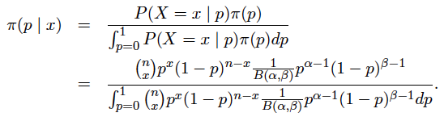

## Survival Analysis

### Example 1

Suppose we observe survival times $105, 107.5, 107.5, 107.5_+, 110_+, 115, 115, 120$, where $T_+$ is a right-censored survival time

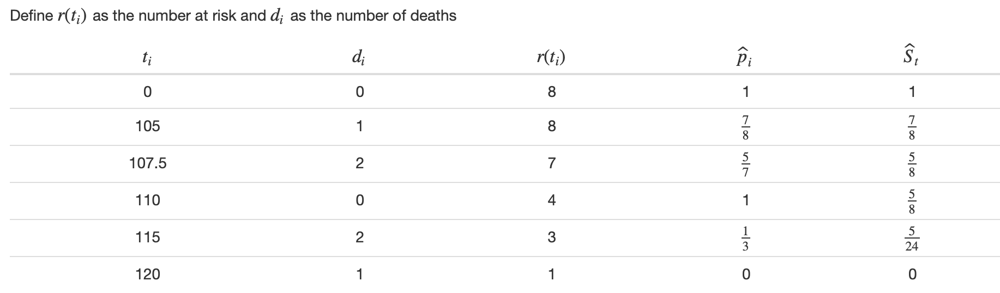

## Classification

### Odds

- **prior odds**: $Odds(A) = \frac{P(A)}{1-P(A)}$

- **posterior odds**: $Odds(A|E) = LR \times Odds(A)$, where $LR = \frac{P(E|A)}{P(E|A^c)}$

### Odds Ratio

$O_- =\ \{$the patient does not have the condition$\}$  
$O_+ =\ \{$the patient has the condition$\}$  
$G_1 =\ \{$the patient is in Group 1$\}$  
$G_2 =\ \{$the patient is in Group 2$\}$

- **relative risk**: $RR = \frac{P(O_+|G_1)}{P(O_+|G_2)}$

- **odds ratio**: $OR = \frac{Odds(O_+|G_1)}{Odds(O_+|G_2)} = \frac{P(O_+|G_1)/(1-P(O_+|G_1))}{P(O_+|G_2)/(1-P(O_+|G_2))}$

**Note**: If $G_1^c = G_2$, then $OR = \frac{Odds(O_+|G_1)}{Odds(O_+|G_2)} = \frac{Odds(G_1|O_+)}{Odds(G_1|O_-)}$

### Dignostic Testing

Define

$O_- =\ \{$the patient does not have the condition$\}$  
$O_+ =\ \{$the patient has the condition$\}$  
$T_- =\ \{$the test is negative$\}$  
$T_+ =\ \{$the test is positive$\}$

- sensitivity $(sens) = P(T_+|O_+) \Leftrightarrow$ true discovery rate $(TDR)$ 

- specificity $(spec) = P(T_-|O_-) \Rightarrow$ false discovery rate $(FDR) = P(T_+|O_-) = 1 - spec$

- positive predictive value $(PPV) = P(O_+|T_+) = \frac{sens\ \times\ prev}{sens\ \times\ prev\ +\ (1-spec)\ \times\ (1-prev)}$

- negative predictive value $(NPV) = P(O_-|T_-) = \frac{sens\ \times\ (1-prev)}{sens\ \times\ (1-prev)\ +\ (1-sens)\ \times\ prev}$
- prevalance $(prev) = P(O_+)$

**Note:** $PPV$ and $NPV$ depend on prevalance, while $sens$ and $spec$ do not depend on prevalance

- $prev = 0 \rightarrow PPV = 0$

### Contingency Table

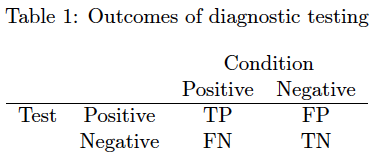

- $prev = \frac{TP + FN}{N} = P(O_+)$

- $sens = \frac{TP}{TP+FN} = P(T_+|O_+)$

- $spec = \frac{TN}{TN+FP} = P(T_-|O_-)$

- $PPV = \frac{TP}{TP+FP} = P(O_+|T_+)$

- $NPV = \frac{TN}{TN+FN} = P(O_-|T_-)$

### Bayes Classifier

Suppose there are $m$ classes for $y$, denote as $M = \{1,2,...,m\}$

$\widehat{y} = \widehat{f}(x) = \mathrm{argmax}_{y \in M} P(y=j|x) =  \mathrm{argmax}_{y \in M}\ f(x|y = j) \pi_y$

- **Naive Bayes**: Independence between features $x_1,x_2,...,x_p$

	$f(x|y = j) = \prod_{i=1}^p f_i(x_i|y=j)$

### Logistic Regression

- $P(y = 1) \approx \frac{e^{\beta x}}{1 + e^{\beta x}} = \frac{1}{1+e^{-\beta x}}$

- $Odds(y = 1) \approx e^{\beta x}$

- $L(\beta; y) = \sum_{i=1}^n y_ilog(\pi_i) + (1-y_i)log(1-\pi_i)$, where $\pi_i = P(y_i = 1)$

### LDA/QDA

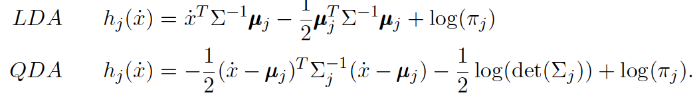

$s_{pooled}^2 = \frac{(n_1-1)s_1^2\ +\ (n_2-1)s_2^2}{n_1+n_2-2}$

## Examples

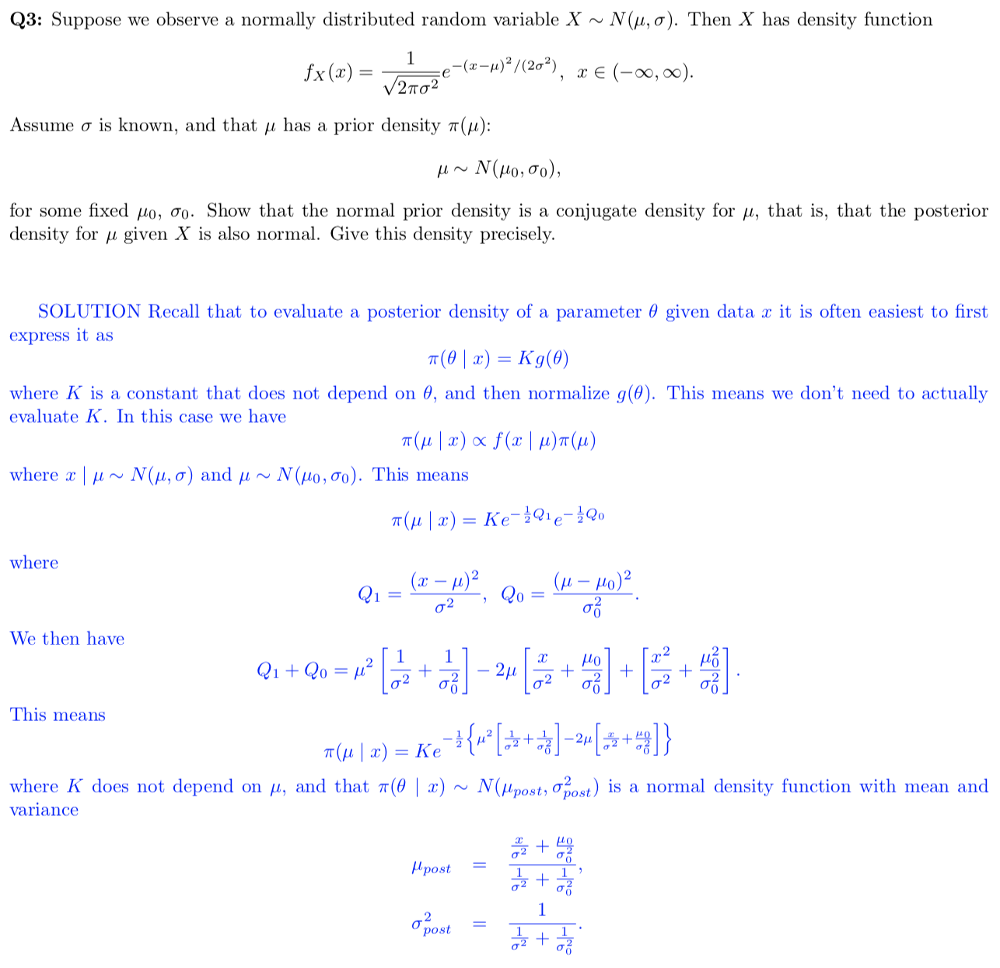
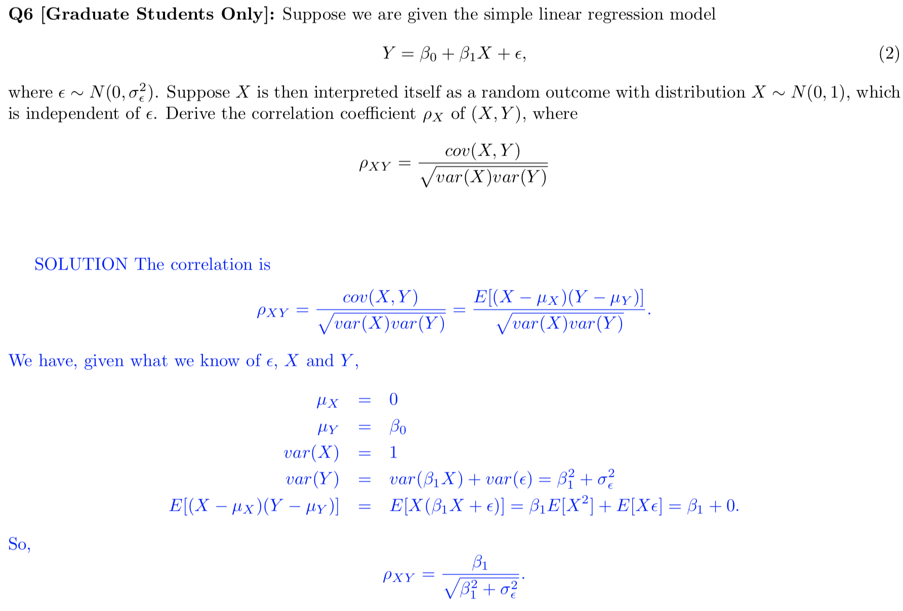
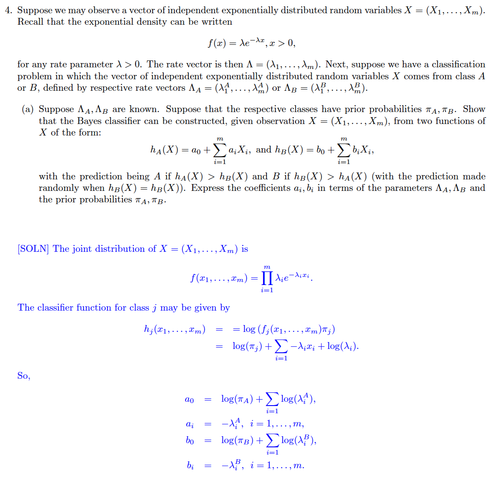
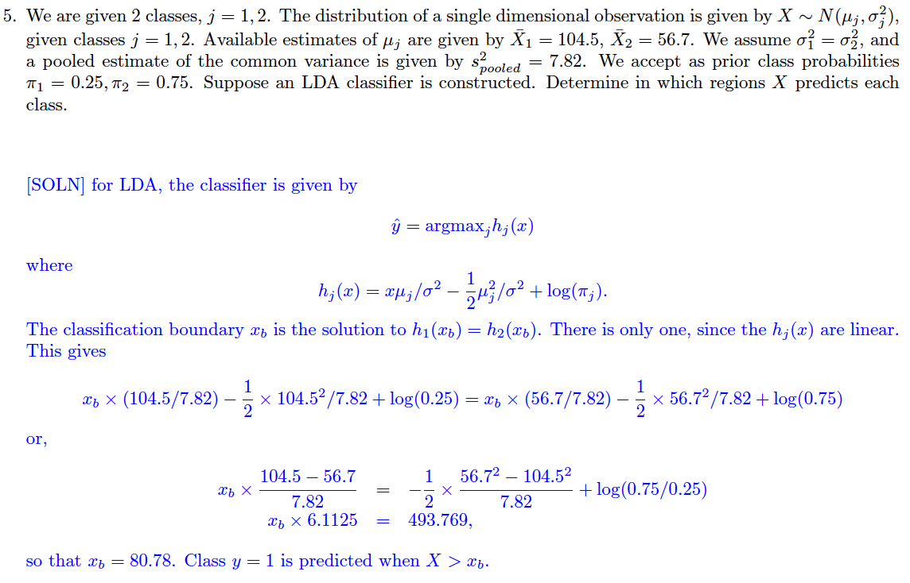
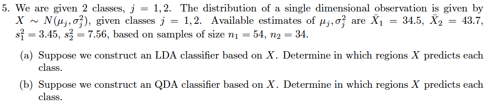
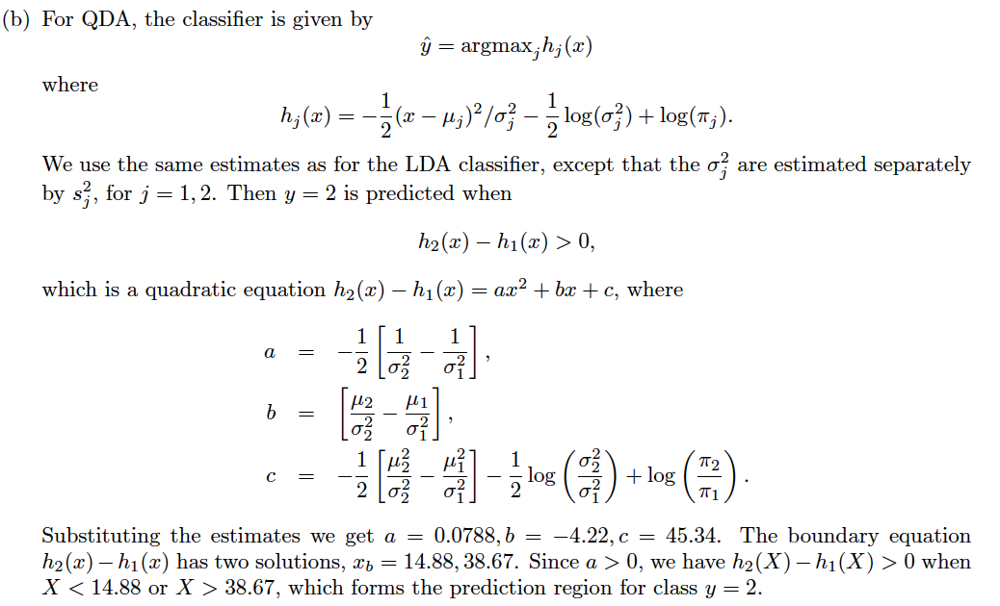

